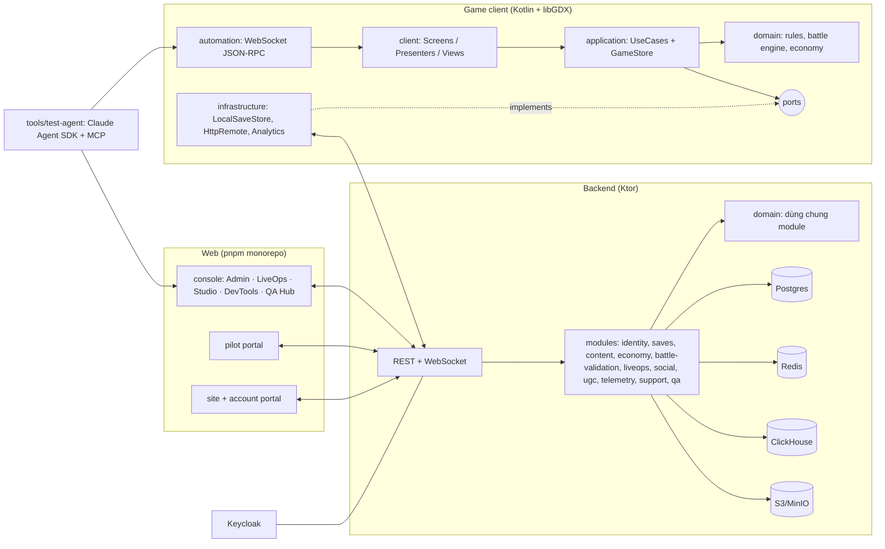

# PXWORLD (codename LVpxW) — Master Plan tái cấu trúc toàn diện

> Phiên bản 2.0 · 2026-09-24 · Nguồn sự thật cho việc viết lại dự án.
> v2.0: nhân đôi mọi chỉ số quy mô bằng 4 mùa mở rộng. Xem [§18](#18-mở-rộng-2-mùa-14). Mọi sáng tạo mới đều chạy trên kiến trúc §4, không cần công nghệ lõi mới.
> Danh mục màn hình chi tiết: [docs/screens/SCREEN_CATALOG.md](screens/SCREEN_CATALOG.md) (sinh từ [tools/screen-catalog/catalog.mjs](../tools/screen-catalog/catalog.mjs) + [expansion.mjs](../tools/screen-catalog/expansion.mjs)).

---

## 0. Quyết định cốt lõi (đọc phần này là đủ để bắt đầu)

| # | Quyết định | Lý do ngắn |
|---|---|---|
| D1 | **Viết lại bằng Kotlin, giữ libGDX**, thay Ashley bằng **Fleks** (ECS Kotlin). Dùng **KTX** cho scene2d/async/assets. | Giữ được toàn bộ pipeline libGDX (atlas, Tiled, Android, desktop) đã chạy; Kotlin cho code ngắn, null-safe, dùng chung được với backend. Ashley 1.7.4 không còn phát triển. |
| D2 | **Clean/Hexagonal architecture 4 tầng**: `domain` (Kotlin thuần, không phụ thuộc libGDX) → `application` (use case + port) → `infrastructure` (adapter) → `client` (libGDX). | 80% lỗi hiện tại do luật game nằm trong popup UI. Domain thuần test được bằng JVM, chạy được trên server. |
| D3 | **Battle engine tất định (deterministic), tính bằng số nguyên**, nhận `Command`, phát `BattleEvent`. Client chỉ phát lại sự kiện. Trận **tương tác** (người chơi chọn kỹ năng/mục tiêu), có auto. | Hiện tại trận tự mô phỏng hết rồi chiếu lại, người chơi không điều khiển. Tất định + số nguyên ⇒ replay, anti-cheat server, test golden giống hệt trên JVM/Android/iOS/Web. |
| D4 | **Một trạng thái game duy nhất** (`GameState` bất biến) + **một bản lưu duy nhất mỗi slot** (`save.json` có `schemaVersion`, ghi nguyên tử, có migrator v1→v2). | Hiện có ~50 field public trong `GameSessionManager`, 8 file lưu rời, lưu rải rác ở widget, nhiều thay đổi không bao giờ được lưu. |
| D5 | **Nội dung data-driven có JSON Schema**, tách **ID nội dung** khỏi **khóa asset** (bỏ việc dùng `nameRegion` làm khóa ngoại cho mọi thứ). Content compiler kiểm tra tham chiếu, sinh content pack có version. | Hiện có file JSON hỏng (comment, dấu phẩy thừa), khóa treo (`reward_00x`, `Archer`), 2 file dữ liệu không ai đọc. |
| D6 | **Tách nguồn art (`art/`, Git LFS) khỏi asset build (`assets/`, sinh tự động)**. | 38 MB nền battle, 6052×5837 px tileset vượt giới hạn texture mobile/web, 3 cặp file trùng byte, không có file nguồn thiết kế. |
| D7 | **Backend Ktor (Kotlin) dùng chung module `domain`**; Postgres + Redis + ClickHouse + S3 (MinIO). Keycloak cho định danh + RBAC. | Mở rộng cloud save, LiveOps, anti-cheat (mô phỏng lại trận ở server bằng cùng engine), analytics. |
| D8 | **Một monorepo web (pnpm)**: `console` (Admin + LiveOps + Creator Studio + Dev Tools + QA Hub, phân quyền theo route), `pilot`, `site`. React 19 + TypeScript + Vite; `site` dùng Astro. API client sinh từ OpenAPI. | Dashboard React hiện có được nâng cấp thành Creator Studio thay vì bỏ đi. |
| D9 | **Web game build bằng TeaVM (gdx-teavm)**, bỏ GWT. | GWT hiện không build được (Gson, freetype, ghi file local). TeaVM dịch bytecode, hỗ trợ Kotlin. |
| D10 | **Screen Catalog là registry có kiểm chứng**: 1.029 màn hình, mỗi màn có `ScreenId`. Code sinh `enum ScreenId` từ catalog; test agent đo độ phủ theo catalog. | Biến yêu cầu "hơn 1000 màn hình" thành con số đếm được và kiểm tra tự động được. |
| D11 | **Test agent 3 lớp**: bot mô phỏng headless (cân bằng), automation protocol trong client (WebSocket JSON-RPC), agent khám phá dựa trên Claude Agent SDK qua MCP. | Agent thao tác thật trên sản phẩm, đo được độ phủ màn hình, tự báo lỗi vào QA Hub. |
| D12 | **Mở rộng theo mùa sau launch** (4 mùa, mỗi mùa 12 tuần). Mỗi tính năng mùa nằm sau `FeatureFlag` + content pack của mùa + gói asset tải từ xa. | Nhân đôi quy mô mà không phình bản launch; tắt được từng tính năng khi có sự cố. |
| D13 | **Mod chỉ ở dạng dữ liệu** (content pack đã ký, qua content-compiler), không chạy mã của bên thứ ba. | Mở workshop cộng đồng mà không mở lỗ hổng thực thi mã trên client/server. |

**Diễn giải yêu cầu:** "polit" được hiểu là **pilot** (người chơi thử nghiệm beta/pilot program). "creater level" gồm cả **nhân viên thiết kế nội dung** và **người chơi tự tạo level (UGC)**. Nếu hiểu sai, chỉ phần §3 và các module `pilot`/`ugc` trong catalog cần đổi.

---

## 1. Hiện trạng — kết quả audit (2026-09-24)

### 1.1 Số liệu
- 241 file Java, ~14.3k LOC trong `core/`; 6 file test (~45 test).
- 67 MB `assets/`; 17 map Tiled; 10 atlas nhân vật; 218 region vật phẩm; 2 nhạc, 7 SFX.
- Dữ liệu: 6 lớp nhân vật, 6 bộ skill lớp, 166 trang bị, 52 vật phẩm, 5 nhiệm vụ, 6 thành tựu, 30 quà điểm danh, 8 trận địch.
- Nền tảng: lwjgl3 chạy được; Android cấu hình được (chưa verify); iOS template chưa build; HTML/GWT hỏng.
- Dashboard React/Vite/Express sửa JSON trong `assets/data` (7 tab).

### 1.2 Lỗi chức năng đã xác nhận
| Mảng | Lỗi |
|---|---|
| Battle | Không tương tác; không bao giờ chí mạng (`critRate` = 0); kỹ năng 2/3 gần như không dùng (MP khởi đầu 0, `mpCost` không được đọc); sát thương hiển thị được random *sau khi* đã trừ HP; chí mạng trừ thanh máu 2 lần; mất sao sau mô phỏng (`loadStat`); `BattleLogger` sửa chỉ số; hòa = thua; thứ tự lượt cố định từ đầu trận |
| Trang bị | Không bao giờ cộng vào chỉ số (hero lưu `equip.id`, `Stat` tra theo `nameRegion`) và không đi vào battle |
| Kinh tế | Điểm danh không cộng quà; mua hàng không lưu profile (tiền quay lại khi load); thưởng item/equip từ battle không lưu; coin/gem trên HUD click là cộng 100 (cheat), click gem ghi vào nhãn coin |
| Lưu trữ | Thay đổi túi đồ không lưu; `loadProfile` đọc `energyTime` từ key `energy`; save desktop ghi vào thư mục repo; loader crash khi thiếu file |
| Âm thanh | Không phát nhạc/âm thanh (2 manager trùng nhau, không ai gọi); cờ bật/tắt trong cài đặt không được lưu |
| Kiến trúc | Event bus 46 lớp nhưng 0 subscriber; ECS gọi thẳng UI tĩnh (`WorldMapScreen.showBtn*`); `BattleScreen.instance`; mọi popup `*PP` giữ state tĩnh; 3 công thức chỉ số, 3 công thức sát thương |
| Dữ liệu | 3 file JSON có comment, 1 file có dấu phẩy thừa; `characterId` luôn rỗng; `weakAgainst` dùng "Archer" nhưng lớp tên "Ranger"; `wasteland2` có quái nhưng không có file trận; `village_0_1` không có quái trên map |
| Asset | 10Knight.atlas trỏ tới `01Knight.png`; `Map.tsx` trỏ ra ngoài repo; `village copy.png` có dấu cách; 29 MB nền battle không dùng; font Arial Unicode MS (bản quyền Monotype) |
| Repo | Luật `.gitignore` `data/` chặn luôn `assets/data/` (file nội dung mới bị bỏ qua âm thầm); `*.classv` gõ sai; file rác `$PROFILE.txt` |

### 1.3 Thứ đáng giữ
- Pipeline asset libGDX + Tiled (map, object layer `wall/line/teleport/enemies/player/npc`).
- Mô hình lưới 3×3, 6 lớp, vòng khắc chế, sao/cấp, chiêu mộ, ghép sao, điểm danh, cửa hàng, nhiệm vụ, thành tựu.
- Toàn bộ art hiện có (sau khi dọn), 218 icon vật phẩm, VFX 5 màu × 5 trạng thái.
- `AgentControlSystem` (ý tưởng agent tự chơi) → nâng cấp thành automation protocol.
- Dashboard (Level Editor 3×3, editor dữ liệu) → nâng cấp thành Creator Studio.
- Các test hiện có → chuyển thành test golden cho domain mới.

---

## 2. Tầm nhìn sản phẩm & nội dung sáng tạo

### 2.1 Định vị
**PXWORLD: Cổ Vật Hoàng Hôn** — RPG theo lượt 2D pixel-art, đội hình 3×3, khám phá bản đồ Tiled, offline-first; online mở rộng (cloud save, sự kiện, PvP bất đồng bộ, bang hội, UGC).
Thời lượng cốt truyện: 12–15 giờ (6 chương), sau đó là vòng lặp endgame (Tháp, Vực Thẳm, sự kiện, đấu trường).

### 2.2 Thế giới — 6 vùng (3 vùng dùng map hiện có, 3 vùng mới)
| Region ID | Tên | Nguồn map | Chương | Chủ đề / cơ chế |
|---|---|---|---|---|
| `dawnvillage` | Làng Bình Minh | `village_0..4` | 1 | Hub; phục hồi làng; tutorial |
| `mistgarden` | Vườn Sương | `garden0..5` | 2 | Sương giảm tầm nhìn; quái né cao |
| `ashwaste` | Hoang Mạc Tro | `wasteland1..6` | 3 | Bão cát gây "Bỏng"; boss Bọ Cạp Tro |
| `crystalwood` | Rừng Thạch Anh | mới | 4 | Tinh thể phản sát thương |
| `echomines` | Hầm Mỏ Vọng | mới | 5 | Câu đố trình tự; quái giáp dày |
| `duskcitadel` | Thành Hoàng Hôn | mới | 6 | Dark Lord 3 pha; 3 kết thúc |

### 2.3 Cốt truyện (khung)
Người chơi là người giữ đèn cuối cùng của Làng Bình Minh. Dark Lord Vesper phá vỡ "Cổ Vật Bình Minh" thành 6 mảnh để giữ thế giới ở mãi hoàng hôn. Mỗi vùng giữ một mảnh và một anh hùng bị trói bởi lời nguyền. Ở chương 6, lựa chọn trong các hội thoại quan trọng (ghi nhận bằng biến `karma_mercy`, `karma_order`) dẫn tới 3 kết thúc: **Bình Minh** (tha Vesper), **Vĩnh Dạ** (người chơi kế vị), **Tro Tàn** (phá hủy cổ vật). Sau khi phá đảo mở NG+.

### 2.4 Lớp nhân vật và vòng khắc chế
6 lớp giữ nguyên: Warrior, Assassin, Mage, Ranger, Support, Tank. Vòng khắc chế chuẩn hóa (lưu trong `content/hero_classes/*.json`; bên khắc chế gây ×1.25, bên bị khắc gây ×0.85):
`Warrior ▶ Assassin ▶ Mage ▶ Tank ▶ Ranger ▶ Warrior`; Support không khắc và không bị khắc, đổi lại có hồi máu/buff.

Roster ra mắt: 18 anh hùng (3/lớp). 6 anh hùng dùng atlas `*_Knight` hiện có; 4 atlas `02/04/08/10Knight` thành quái; 12 anh hùng còn lại cần art mới (xem §9.5).

### 2.5 Vòng lặp chơi
- **Ngắn (5 phút):** khám phá → trận → thưởng → nâng anh hùng.
- **Trung (1 ngày):** nhiệm vụ ngày, điểm danh, thám hiểm, hầm ngục nguyên liệu, chiêu mộ.
- **Dài (tuần/mùa):** chương truyện, Tháp, Vực Thẳm, Battle Pass, chiến tranh bang, giải đấu, level UGC.

### 2.6 Tiền tệ (định nghĩa lại, không trùng lặp)
| ID | Tên | Nguồn | Chi |
|---|---|---|---|
| `currency.gold` | Vàng | trận, bán đồ, thưởng treo máy | cửa hàng thường, cường hóa |
| `currency.gem` | Ngọc | nhiệm vụ, thành tựu, IAP | chiêu mộ, cửa hàng ngọc |
| `currency.energy` | Năng lượng | hồi theo thời gian | vào trận ngoài cốt truyện |
| `currency.guild_token` | Huy hiệu bang | hoạt động bang | cửa hàng bang |
| `currency.event_token` | Token sự kiện | sự kiện | cửa hàng sự kiện |

`gem_pink` hiện tại → `currency.gem`; `coin` → `currency.gold`. Mọi thay đổi tiền tệ đi qua `Wallet` + ghi `LedgerEntry` (nguồn, lý do, số dư sau).

---

## 3. Đối tượng sử dụng (7 vai trò) và bề mặt sản phẩm

| Vai trò | Họ cần gì | Bề mặt chính | Launch | Sau 4 mùa |
|---|---|---|---:|---:|
| **Gamer** | Chơi, tiến triển, cạnh tranh, sáng tạo, xem/stream | Game client, Companion, Site, Viewer extension | 363 | 733 |
| **User** | Tài khoản, bảo mật, thanh toán, gia đình, quyền riêng tư | Game client, Account Portal, Companion | 106 | 214 |
| **Pilot** | Build sớm, nhiệm vụ test, nghiên cứu UX, săn lỗi | Pilot tools trong client, Pilot Portal | 130 | 377 |
| **Creator** | Nội dung, map, hội thoại, cân bằng, dịch, art; UGC, mod, stream, đối tác | Creator Studio, Workshop, Loc Portal, Partner Portal, Stream Suite | 312 | 708 |
| **QA** | Kế hoạch test, thực thi, lỗi, test agent, chất lượng vận hành | QA Hub, Debug menu | 59 | 121 |
| **Dev** | Build, CI, crash, hiệu năng, dữ liệu, SDK, tất định đa nền tảng | Dev Tools, Debug menu | 82 | 169 |
| **Admin** | Người chơi, kiểm duyệt, LiveOps, tài chính, anti-cheat, GM trực tiếp, esports | Web Console, GM Console, Observer | 245 | 502 |

Tổng catalog: **1.029 màn hình ở launch → 2.094 màn hình sau Mùa 4** (một màn có thể phục vụ nhiều vai trò nên các cột cộng lại lớn hơn tổng).

**Phân quyền (RBAC, Keycloak), 24 vai trò kỹ thuật:**
- Launch (12): `player`, `pilot`, `ugc_creator`, `staff_creator`, `staff_translator`, `staff_qa`, `staff_dev`, `staff_support`, `staff_moderator`, `staff_liveops`, `staff_finance`, `staff_admin`.
- Mở rộng (12): `mod_creator`, `community_translator`, `translation_reviewer`, `streamer`, `viewer`, `partner`, `esports_caster`, `esports_referee`, `game_master`, `game_master_approver`, `family_guardian`, `mentor`. Quyền theo cú pháp `resource:action` (ví dụ `player.grant:write`). Mọi thao tác ghi của staff đều vào `audit_log`, và thao tác cấp phát tài nguyên bắt buộc ghi lý do.

---

## 4. Kiến trúc tổng thể



### 4.1 Luật phụ thuộc (kiểm tra tự động bằng test kiến trúc, dùng Konsist)
1. `domain` không import `com.badlogic.*`, `ktx.*`, `io.ktor.*` hay I/O.
2. `application` chỉ phụ thuộc `domain`.
3. `client` không gọi `infrastructure` trực tiếp; mọi thứ đi qua use case.
4. View không chứa luật game. Presenter không vẽ.
5. Không có `object`/singleton mang state có thể thay đổi, ngoại trừ `GameApp` composition root.
6. Giao tiếp giữa các tính năng đi qua `DomainEvent`, không gọi chéo tính năng.

### 4.2 Luồng dữ liệu một chiều (client)
`View` → `Intent` → `Presenter` → `UseCase` → `GameStore.dispatch` → reducer thuần trong domain → `GameState` mới + `List<DomainEvent>` → `StateFlow` → Presenter map sang `ViewState` → View render.
`DomainEvent` (ví dụ `EnemyDefeated`, `ItemPurchased`, `HeroStarRaised`) được `QuestTracker`, `AchievementTracker`, `AnalyticsSink`, `AudioDirector` và `SaveScheduler` lắng nghe. Đây là event bus thật, thay thế 46 lớp event rỗng.

### 4.3 Hệ thống màn hình
- `ScreenId` (enum sinh từ catalog) → `ScreenSpec(id, presentation = FULL|MODAL|OVERLAY, assets: AssetBundle, fixture: FixtureId?)`.
- `Navigator` quản lý stack; modal và overlay cũng là screen (bỏ static state trong các popup `*PP`).
- Mỗi màn gồm 3 lớp: `XxxScreen` (lifecycle), `XxxPresenter` (state + intent), `XxxView` (scene2d qua ktx-scene2d).
- Mọi actor tương tác có `testId = "<screenId>/<element>"`. Debug build kiểm tra khi runtime; CI kiểm tra bằng test.
- Asset theo màn: `AssetBundle` khai báo cạnh `ScreenSpec`; loader đếm tham chiếu và không unload asset đang dùng chung (sửa lỗi `BattleScreen.dispose`).

### 4.4 ECS (Fleks) chỉ dùng cho phần mô phỏng/hiển thị thế giới
- **World:** `Transform`, `Velocity`, `Collider`, `Sprite`, `Animator`, `PlayerControlled`, `AgentControlled`, `Trigger(kind)`, `CameraTarget`.
- **Systems:** `InputSystem`, `AgentSystem`, `MovementSystem` (theo `deltaTime`), `CollisionSystem` (collider tĩnh dựng một lần mỗi map, spatial hash), `TriggerSystem` (phát `DomainEvent`, không gọi UI), `AnimationSystem`, `CameraSystem`, `RenderSystem` (một `SpriteBatch` dùng chung).
- **Battle presentation:** `BattleEventPlayer` đọc `BattleEvent` → tạo tween/VFX/label. Chỉ số thật lấy từ `BattleState` của domain, không giữ bản sao HP riêng.
- Mỗi màn có một `World` Fleks riêng (bỏ engine toàn cục).

### 4.5 Battle engine (domain)
- **Input:** `BattleSetup(seed, allies, enemies, rules)`; mỗi lượt nhận `Command.UseSkill(unit, skill, target)` từ người chơi hoặc `AutoPolicy`.
- **Output:** `List<BattleEvent>` (`TurnStarted`, `SkillUsed`, `DamageDealt`, `Healed`, `StatusApplied`, `StatusExpired`, `UnitDefeated`, `EnergyChanged`, `BattleEnded`).
- **Tất định:** RNG `Pcg32(seed)`; toàn bộ phép tính dùng `Int`/`Long` theo đơn vị ‰ (permille). Không dùng `Float`, vì float có thể lệch giữa JVM, ART, RoboVM và TeaVM.
- **Thứ tự lượt:** Conditional Turn Based: `actionValue = 10000 / SPD`, tính lại khi SPD thay đổi.
- **Chỉ số:** `HP, ATK, DEF, SPD, CRIT_RATE‰, CRIT_DMG‰, ACC‰, EVA‰, EFFECT_HIT‰, EFFECT_RES‰`.
- **Một công thức chỉ số duy nhất** (thay cho 3 công thức hiện có):
  `stat = base × (1000 + 80×(level−1)) / 1000 × STAR[star] / 1000 + equipFlat`, sau đó `× (1000 + Σbonus‰) / 1000`, với `STAR = [1000, 1150, 1320, 1520, 1750, 2010]`.
- **Sát thương:**
  `raw = ATK × skillPower‰ / 1000`; `mitigated = raw × K / (K + DEF)` với `K = 100 + 10×attackerLevel`; nhân khắc chế (1250/850/1000), nhân chí mạng (`CRIT_DMG`, mặc định 1500‰), nhân vị trí hàng (trước 1000, giữa 900, sau 800), dao động ±5% từ RNG; tối thiểu 1.
- **Trúng/né:** `hit‰ = clamp(950 + (ACC − EVA)/2, 600, 1000)`.
- **Năng lượng:** khởi đầu 25; +20 mỗi hành động; +10 khi bị đánh. Kỹ năng 2 tốn 40, tuyệt kỹ tốn 100.
- **Trạng thái:** `stun, silence, taunt, shield, burn, poison, bleed, regen, atk_up, atk_down, def_up, def_down, spd_up, spd_down, crit_up, evasion_up, reflect, immune`. Mỗi trạng thái có `duration`, `stacks`, `dispellable`.
- **Nhắm mục tiêu:** kỹ năng khai báo `targeting = FRONT_ROW | ROW | COLUMN | ALL | LOWEST_HP_ALLY | SELF | RANDOM(n)`.
- **Kết thúc:** một phe hết quân, hoặc sau 30 lượt thì xử **hòa**, là kết quả riêng, không phải thua.
- **Replay:** `seed + commands` → phát lại y hệt; server chạy lại để xác thực kết quả trận có thưởng.

### 4.6 Lưu trữ
- `SaveGame v2` (một file mỗi slot) gồm `schemaVersion`, `profile`, `wallet`, `ledgerTail`, `heroes`, `lineups`, `inventory`, `equipment`, `quests`, `achievements`, `checkin`, `world` (map, vị trí, cờ), `settings`, `stats`.
- **Ghi nguyên tử:** ghi `save.json.tmp`, fsync, rồi rename; giữ 3 bản xoay vòng; có checksum SHA-256.
- **Vị trí:** desktop dùng `~/.pxworld/<env>/saves/`, không bao giờ ghi vào repo. Android/iOS dùng `Gdx.files.local`. Web dùng IndexedDB qua adapter.
- **Migrator `LegacyV1Importer`:** đọc thư mục `data/select/<name>/*.json` cũ, chuyển `nameRegion` sang ID mới và tạo `SaveGame v2`. Đi kèm test với save mẫu trong `data/` và `lwjgl3/data/`.
- **Cloud:** server lưu bản mới nhất có `revision`; khi xung đột thì hiện màn `game.boot.save_conflict`.

---

## 5. Cấu trúc repo mới

```text
pxworld/
├── build-logic/                  # Gradle convention plugins (kotlin, libgdx, android, test, detekt)
├── gradle/libs.versions.toml     # Version catalog duy nhất
├── game/
│   ├── domain/                   # Kotlin thuần: model, rules, battle, economy, progression, quests
│   ├── application/              # UseCases, GameStore, ports
│   ├── infrastructure/           # LocalSaveStore, CloudSaveClient, ContentPackLoader, Telemetry
│   ├── client/                   # libGDX: screens/<feature>/, ui/kit, world(ECS), battle(presentation), assets
│   ├── automation/               # Automation server (chỉ có trong flavor dev/qa/pilot)
│   ├── platform-desktop/         # LWJGL3 + Construo packaging (win/mac/linux)
│   ├── platform-android/
│   ├── platform-ios/             # RoboVM
│   └── platform-web/             # TeaVM
├── server/
│   ├── app/                      # Ktor entrypoint, DI (Koin)
│   ├── modules/<name>/           # identity, saves, content, economy, battle, liveops, social, ugc, telemetry, support, moderation, qa, pilot
│   └── migrations/               # Flyway
├── web/                          # pnpm workspace
│   ├── apps/console/             # Admin + LiveOps + Studio + DevTools + QA Hub
│   ├── apps/pilot/
│   ├── apps/site/                # Astro
│   └── packages/{ui, api-client, design-tokens, screen-catalog}
├── content/                      # Nguồn sự thật nội dung (JSON + schemas/)
├── art/                          # Nguồn art (Git LFS): aseprite, tiled project, psd, wav, ttf
├── assets/                       # SINH TỰ ĐỘNG từ art/ + content/ (gitignored, chỉ commit manifest)
├── tools/
│   ├── asset-pipeline/           # Pack atlas, cắt map, nén nền, kiểm tra kích thước
│   ├── content-compiler/         # Validate schema + tham chiếu, sinh content pack
│   ├── screen-catalog/           # Catalog + codegen ScreenId
│   ├── sim-cli/                  # Mô phỏng hàng loạt trận/kinh tế
│   └── test-agent/               # Agent QA tự động (TypeScript, Claude Agent SDK, MCP)
├── infra/                        # docker-compose (local), Helm (staging/prod), Terraform
└── docs/                         # MASTER_PLAN, ADR, screens/, runbooks/
```

Package client theo tính năng, không theo tầng kỹ thuật: `client/screens/heroes/{HeroRosterScreen, HeroRosterPresenter, HeroRosterView}`.

---

## 6. Mô hình đối tượng mới — giữ / đổi tên / xóa / tạo mới

### 6.1 Ánh xạ lớp cũ → mới
| Cũ | Hành động | Mới |
|---|---|---|
| `MainGame` (service locator tĩnh) | Thay | `GameApp` (composition root, DI thủ công) |
| `GameSessionManager` | Xóa | `GameState` + `GameStore` |
| `ScreenManager`, `ScreenType`, `BaseScreen` | Thay | `Navigator`, `ScreenId` (sinh từ catalog), `ScreenSpec`, `GameScreen` |
| `GAssetManager`, `AnimationCache` | Thay | `AssetService` + `AssetBundle` + `AnimationLibrary` (không static) |
| `BattleSimulator`, `TurnExecution`, `TurnProcessor`, `StatCalculator`, `BattleState`, `BattleConfig`, `SkillSystem` | Hợp nhất | `domain.battle.BattleEngine`, `DamageFormula`, `StatFormula`, `TurnQueue`, `BattleRules` |
| `TurnActionSystem`, `ActionQueueComponent` | Thay | `BattleEventPlayer` |
| `BattleController` | Thay | `ClaimBattleRewardsUseCase` + `QuestTracker` + `AchievementTracker` (qua `DomainEvent`) |
| `Hero`, `CharacterBase`, `Lineup` | Đổi | `OwnedHero`, `HeroDefinition`, `Lineup(Map<GridCell, HeroInstanceId>)` |
| `Equip`/`EquipBase`, `Item`/`ItemBase`, `Bag` | Đổi | `EquipmentInstance`/`EquipmentDefinition`, `ItemStack`/`ItemDefinition`, `Inventory` |
| `Mission`, `Achievement`, `DailyReward` | Đổi | `QuestDefinition`/`QuestProgress`, `AchievementDefinition`/`AchievementProgress`, `CheckinTable`/`CheckinProgress` |
| `Profile`, `Account` | Tách | `PlayerProfile`, `Wallet`, `SaveSlot` |
| `Stat`, `TempStat`, `CalculateHelper` | Xóa | `StatFormula` + `StatBlock` |
| `JsonSaver` (Gson), `JsonUtil`, `utils/data/*Loader`, `DataHelper`, `JsonAccess` | Xóa | `ContentRepository` (kotlinx.serialization) + `SaveStore` |
| `HerosPP` / `BagPP` / `ShopPP` / `RolePP` / `PotentialPP` / `RecruitPP` / `DailyPP` / `SettingPP` | Thay | Các screen `game.heroes.*`, `game.inventory.*`, `game.economy.*`, `game.social.profile_self`, `game.settings.*` |
| `BattleDetailPP`, `NotificationPP`, `TagPP`, `OverlayUI` | Thay | `game.world.encounter_preview`, `Toast`, `Tag`, `ModalScrim` trong `ui/kit` |
| `UIButton`/`UILabel`/`UITable`/... | Thay | `ui/kit` (ktx-scene2d + skin sinh từ design tokens) |
| `WorldMapScreen` + `WorldMapEntityBuilder` + các system world | Thay | `WorldExploreScreen` + `MapLoader` + các system Fleks ở §4.4 |
| `AgentControlSystem`/`Component` | Nâng cấp | `AgentSystem` + `automation` module |
| `CheckRegionScreen` | Đổi | `game.debug.debug_atlas_browser` |
| `DebugConfig` | Thay | `BuildFlavor` + `FeatureFlags` |
| `utils.Color` | Xóa | `DesignTokens.colors` |
| `EventManager` + 46 event rỗng | Xóa | `DomainEvent` sealed hierarchy + `EventBus` có subscriber thật |

### 6.2 Xóa hẳn (code chết, không port)
`AudioManager` và `SoundManager` (viết lại thành `AudioDirector`), `PartySetupSystem`, `ActionQueueSystem`, `AnimationSystem`, `CollisionUpdateSystem`, `TeleportTrigger`, `TriggerComponent`, `ActorComponent`, `ActionSkillComponent`, `BattlePlaybackComponent`, `HealthComponent`, `InputComponent`, `ItemComponent`, `NameComponent`, `VelocityComponent`, `WarehouseComponent`, `Label{Critical,Damage,Miss}Component`, `PlayerSelectedComponent`, `EquipComponent`, `InfoComponent.Equipment`, `BattleCharacterComponent`, `BattleButtonInput`, `HeroFact`, `ClickLoggerInputProcessor`, `TimeISO8601`, `CheckMap`, `BattleLogger` (thay bằng `BattleEvent` log), mọi screen stub (`CharacterScreen`, `InventoryScreen`, `MapScreen`, `PauseScreen`, `SplashScreen`), mọi widget stub (`EquipComparePP`, `HeroDetailPP`, `QuestPP`, `ShopDetailPayPP`, `SmithyPP`, `LimitedTaskPP`, `EquipDetailPP`), `DemoDecktopLaucher`.

### 6.3 Đối tượng mới
`Wallet`, `LedgerEntry`, `Reward`/`RewardBundle` (thống nhất cho mọi nguồn thưởng), `LootTable`, `RecruitPool` + `PityCounter`, `StatusEffect`, `Passive`, `EquipmentSet`, `Gem`, `Recipe`, `Region`, `MapDefinition`, `NpcDefinition`, `Dialogue` (graph), `Cutscene`, `QuestChain`, `Title`, `Pet`, `Building`, `Encounter` (thay `MapBattle`, có `waves`), `Boss` + `BossPhase`, `GameMode`, `FeatureFlag`, `RemoteConfig`, `LocKey`, `AudioCue`, `VfxDefinition`, `SpriteSet`, `UiTheme`, `SaveSlot`, `SaveGame`, `ReplayRecord`, `TelemetryEvent`.

---

## 7. Nội dung & dữ liệu

### 7.1 Quy ước ID
- **ID nội dung:** `<loại>.<slug>` dạng ASCII, snake_case, không bao giờ đổi sau khi phát hành. Ví dụ: `hero.aldric`, `class.warrior`, `skill.aldric.s1`, `item.food.bread_t1`, `equip.sword.iron_blade`, `enemy.ashwaste.scorpion`, `encounter.ashwaste_01.e0`, `map.ashwaste_01`, `quest.main.ch1_03`, `currency.gold`.
- **Khóa asset:** `sprite:hero/aldric`, `icon:item/bread_t1`, `vfx:orange/attack`, `bg:battle/ashwaste_summer`, `sfx:ui/click`, `music:region/ashwaste`.
- Nội dung tham chiếu asset qua trường `visual`/`icon`/`audio`, không bao giờ dùng asset key làm ID.
- **Văn bản:** mọi chuỗi hiển thị là `LocKey` (`hero.aldric.name`). Bản dịch nằm ở `content/localization/<locale>.json` (vi, en ngay từ đầu; khung sẵn cho ja/ko/th/zh).

### 7.2 Thư mục `content/`
```text
content/
├── schemas/*.schema.json         # JSON Schema cho mọi loại
├── hero_classes/  heroes/  skills/  statuses/  passives/
├── items/  equipment/  equipment_sets/  gems/  recipes/  loot_tables/  currencies/  shop_catalogs/  recruit_pools/
├── enemies/  bosses/  encounters/
├── regions/  maps/  npcs/  dialogues/  cutscenes/
├── quests/  quest_chains/  achievements/  titles/  checkin_tables/
├── pets/  buildings/  game_modes/  tutorials/
├── audio_cues/  vfx/  ui_themes/
├── balance/                      # stat_curves.json, battle_rules.json (thay battle_config.json)
└── localization/{vi,en}.json
```
Quy tắc: một bản ghi một file khi bản ghi phức tạp (hero, encounter, dialogue, quest); một file mỗi nhóm khi bản ghi đơn giản (items, equipment). Content compiler chấp nhận cả hai.

### 7.3 Content compiler (`tools/content-compiler`, Kotlin CLI dùng `domain`)
1. Parse chặt (không chấp nhận comment hay dấu phẩy thừa).
2. Validate JSON Schema.
3. Kiểm tra tham chiếu (mọi ID trỏ tới bản ghi có thật; mọi asset key có trong manifest asset).
4. Kiểm tra luật thiết kế: tổng tỉ lệ loot = 100%, encounter có ≥1 quái, teleport trỏ tới map và spawn có thật, quest không có chu trình.
5. Chạy `sim-cli` smoke: mỗi encounter mô phỏng 200 trận với đội chuẩn của tiến trình, cảnh báo nếu tỉ lệ thắng nằm ngoài khoảng mục tiêu.
6. Xuất `content-pack-<hash>.json.gz` + `manifest.json` (version, hash, `minClientVersion`).

### 7.4 Di chuyển dữ liệu hiện có
| Nguồn | Đích | Ghi chú |
|---|---|---|
| `base/character_base.json` (6) | `hero_classes/` + `heroes/` | tạo ID; sửa `Archer`→`Ranger`; tên kỹ năng tự do → tham chiếu `skill.*` |
| `base/skill_base.json` | `skills/` | đọc mọi effect (hiện chỉ đọc effect đầu); thêm `energyCost`, `targeting` |
| `skill_data.json` (20, chưa dùng) | `vfx/` + `statuses/` | nhóm màu thành VFX; effect % thành status |
| `enemies_data.json` (15, chưa dùng) | `enemies/` | chỉ nhập những con có atlas; còn lại đánh dấu `art_pending` |
| `base/equip_base.json` (166) | `equipment/` | sửa dấu phẩy thừa; `gem_pink` → `currency.gem` |
| `base/items_base.json` (52) + `config/itemConfig.json` | `items/` | gộp hiệu ứng theo tier vào item |
| `base/mission_base.json` | `quests/` | `reward_00x` treo → `RewardBundle` thật |
| `base/achievement.json`, `daily_rewards.json` | `achievements/`, `checkin_tables/` | trường `dec` → `description` |
| `config/battle_config.json` | `balance/battle_rules.json` | theo công thức §4.5 |
| `enemy/*.json` (8) | `encounters/` | tạo `wasteland2_e1`, `wasteland2_e2` còn thiếu; bỏ `village_0_1` hoặc thêm quái vào map |
| `assets/data/select/*`, `assets/data/maininfo.json`, `desc` | Xóa khỏi assets | save mẫu chuyển sang `tools/test-agent/fixtures/legacy_saves/`; `desc` chuyển sang `docs/lore/` |

---

## 8. Nền tảng & môi trường

### 8.1 Nền tảng
| Nền tảng | Công nghệ | Trạng thái mục tiêu | Ghi chú |
|---|---|---|---|
| Windows / macOS / Linux | LWJGL3 + Construo (JDK 17 đóng gói kèm) | Tier 1 | Steam build ở phase 8 |
| Android | AGP 8, minSdk 24, targetSdk 35 | Tier 1 | Bỏ quyền `READ/WRITE_EXTERNAL_STORAGE`; Play Billing |
| iOS | RoboVM 2.3.x | Tier 2 | Cần máy macOS; khóa landscape đồng bộ với Android; StoreKit |
| Web | TeaVM (gdx-teavm) | Tier 2 | Save vào IndexedDB; không có IAP; dùng cho demo và UGC trên web |
| Server | Ktor trên JVM 21, Docker | Tier 1 | |
| Web tools | React/Vite/Astro | Tier 1 | |

Java/Kotlin: Kotlin 2.x, JVM target 17 cho desktop/android/server/web; module chung nhắm bytecode tương thích RoboVM (JVM 1.8 target) cho `domain`, `application`, `client`.

### 8.2 Môi trường
| Env | Mục đích | Dữ liệu | Client flavor |
|---|---|---|---|
| `local` | Dev trên máy, docker-compose | giả | `dev` (debug menu + automation) |
| `dev` | Tích hợp liên tục mỗi merge | giả | `dev` |
| `qa` | QA thủ công + test agent | fixture | `qa` (automation, không cheat phá kinh tế) |
| `staging` | Bản sao prod để duyệt release | ẩn danh từ prod | `release` |
| `pilot` | Chương trình pilot, hạ tầng như prod, dữ liệu tách | pilot thật | `pilot` (công cụ góp ý/chụp lỗi) |
| `prod` | Người chơi thật | thật | `release` |

Content pack được đẩy tuần tự `dev → qa → staging → pilot → prod` qua màn `studio.content_entities.*.promote` và `console.operations.content_release_diff`.

### 8.3 CI/CD (GitHub Actions — repo `nt-nam/turn-base-rpg`)
- **PR:** ktlint + detekt + Konsist (luật kiến trúc) → unit test domain/application → content-compiler validate → screen-catalog codegen check → build desktop + android debug → test agent smoke (xvfb, 60 ScreenId trọng yếu).
- **main:** toàn bộ test + build tất cả nền tảng + deploy `dev`.
- **Nightly:** test agent khám phá toàn catalog trên `qa` + mô phỏng cân bằng 1 triệu trận + benchmark hiệu năng.
- **Release:** tag → staging → ký duyệt QA (`qa.quality.release_signoff`) → pilot → prod (staged rollout 5%/25%/100%).

### 8.4 Hạ tầng backend
Local dùng docker-compose (Postgres 16, Redis 7, ClickHouse, MinIO, Keycloak, Grafana/Loki/Tempo). Staging/prod dùng Kubernetes (Helm) với Terraform. Quan sát hệ thống bằng OpenTelemetry → Grafana; crash client → Sentry.

---

## 9. Tái cấu trúc tài nguyên hình ảnh, âm thanh & file thiết kế

### 9.1 Quy ước đặt tên
ASCII, chữ thường, snake_case, không dấu cách, không tiếng Việt trong tên file. Mẫu: `<nhóm>/<đối_tượng>/<biến_thể>_<trạng_thái>_<frame>`. Tên region trong atlas = đường dẫn tương đối không có đuôi (`hero/aldric/attack_03`).

### 9.2 Cấu trúc nguồn `art/` (Git LFS)
```text
art/
├── characters/<hero_or_enemy_id>/<id>.aseprite     # tag = idle/walk/run/attack/jump/hurt/die
├── items/<category>/<item_slug>.png
├── ui/{icons,panels,buttons,bars,frames}/...       # 9-patch đặt hậu tố .9.png
├── vfx/<color>/<state>/*.png                       # blue|green|orange|pink|yellow × attack|attack_big|explode|heal|ultimate
├── vfx/laser/*.png  vfx/fire/*.png  vfx/boom/*.png
├── maps/pxworld.tiled-project  maps/tilesets/*.tsx  maps/<region>/<map_id>.tmx
├── backgrounds/battle/<region>_<season>.psd
├── audio/music/*.wav  audio/sfx/<group>/*.wav
└── fonts/*.ttf   (Be Vietnam Pro, Noto Sans CJK/Thai — giấy phép OFL)
```

### 9.3 Ánh xạ cũ → mới
| Cũ | Mới | Hành động |
|---|---|---|
| `atlas/characters/{warrior,assassin,mage,ranger,support,tank}_Knight.*` | `art/characters/hero.<id>/` | đổi tên theo ID anh hùng |
| `atlas/characters/{02,04,08,10}Knight.*` | `art/characters/enemy.<id>/` | sửa trang atlas `10Knight` trỏ sai `01Knight.png` |
| `atlas/characters/animation` (file text) | Xóa | thay bằng tag Aseprite |
| `atlas/inventory/item.*` (218 region) | `art/items/<category>/` | tách từng icon; `itemname.txt` chuyển thành loc keys |
| `atlas/skill/{skill,fire,boom,laze}` | `art/vfx/...` | `laze` → `laser`; bỏ trùng `texture/LaserSprites/` |
| `atlas/ui/{icon,popup,wood}` | `art/ui/...` | sửa `select3_down` trùng; `tru/hoi/dola/boad/btn_scoll/shadow_necklet` → `minus/help/currency/board/btn_scroll/shadow_necklace` |
| `ui/uiskin.*`, `ui/default.fnt` | Xóa | thay bằng skin sinh từ design tokens |
| `font/arial_uni_30.*` | Xóa | Arial Unicode MS có bản quyền; thay bằng freetype runtime với Be Vietnam Pro + Noto |
| `texture/battle/{spring,summer,autumn,winter}.png` (38 MB) | `bg:battle/<region>_<season>` | xuất JPG 1920×1080 chất lượng 85 (~0.5 MB mỗi ảnh); 4 mùa dùng cho hệ thống thời tiết/mùa |
| `texture/default.png` = `loading.png` = `android/default.png` | Giữ 1 bản | `bg:loading/default` |
| `libgdx.png` ×2, `default2.png` | Xóa | |
| `texture/npc/npc1..3.png`, `atlas/npc/charactor.png` | `art/characters/npc.<id>/` | sửa lỗi chính tả |
| `tilemap/map/fullmap.png` (6052×5837) | Cắt thành ô 1024×1024 | vượt giới hạn 4096 của nhiều GPU mobile/WebGL |
| `tilemap/map/{garden,wasteland}N.png` | `art/maps/<region>/<map_id>_bg.png` | ảnh nền vẽ sẵn + collider giữ trong tmx |
| `tilemap/map/house1..6.png`, `village.png`, `village copy.png`, `Map.tsx` | Kiểm tra, rồi xóa | không được tham chiếu; `Map.tsx` trỏ ra ngoài repo |
| `tilemap/character/*` | Xóa | tmx trỏ tới tsx không tồn tại |
| `music/*.mp3` | `art/audio/music/` → xuất MP3 128 kbps | thêm nhạc mỗi vùng + battle + boss |
| `sound/bubble_*` (7) | Xóa 5 file không dùng | cần bộ SFX RPG mới (ui, hit, crit, heal, level_up, coin…) |

### 9.4 Asset pipeline (`tools/asset-pipeline`, Gradle task `:tools:asset-pipeline:build`)
Aseprite CLI xuất frame → TexturePacker của libGDX đóng atlas theo nhóm (`characters`, `items`, `ui`, `vfx`) với page tối đa 2048 → cắt ảnh map lớn → nén nền → sinh `assets/manifest.json` (key → file/region, kích thước, hash) → sinh `AssetKeys.kt`. CI thất bại khi có asset > 2048 px, file trùng hash, hoặc asset không được nội dung nào tham chiếu.

### 9.5 Kiểm tra giấy phép (bắt buộc trước khi phát hành thương mại)
Nguồn gốc của sprite Knight, LaserSprites, âm thanh `bubble_*`, `world1.mp3`, `battle.mp3` và tileset map chưa được ghi lại trong repo. Lập `art/LICENSES.md` ghi nguồn và giấy phép từng gói; gói nào không rõ nguồn thì thay thế.

### 9.6 File thiết kế đa nền tảng
- Design tokens (`web/packages/design-tokens/tokens.json`) là nguồn chung: sinh skin libGDX, CSS variables cho web và Figma Variables.
- Figma: 1 file "PXWORLD UI Kit" (component + tokens) và 1 file mỗi bề mặt (Game, Console, Studio, Pilot, Site). Tên frame bằng `ScreenId` để tra ngược từ catalog.
- Bố cục game hỗ trợ 3 tỉ lệ: 16:9 (chuẩn), 19.5:9 (điện thoại), 4:3 (tablet), dùng `ExtendViewport` và safe area.

---

## 10. Backend — module và API

| Module | Trách nhiệm | Dữ liệu |
|---|---|---|
| identity | Đăng nhập người chơi (guest/email/Google/Apple), staff SSO, RBAC | Keycloak + Postgres |
| saves | Cloud save có revision, lịch sử 30 bản, khôi phục | Postgres (JSONB) + S3 |
| content | Phát content pack, manifest theo env, rollback | S3 + CDN |
| economy | Ledger tiền tệ cao cấp, xác nhận IAP (Apple/Google), hoàn tiền | Postgres |
| battle | Xác thực replay (chạy lại `BattleEngine`), lưu replay | Postgres + S3 |
| liveops | Sự kiện, banner, offer, thư, push, flag, remote config, A/B, phân khúc | Postgres + Redis |
| social | Bạn bè, bang, chat, xếp hạng, đấu trường, giải đấu, chợ | Postgres + Redis |
| ugc | Level người chơi: đăng, duyệt, đánh giá, nổi bật | Postgres + S3 |
| telemetry | Nhận sự kiện, pipeline vào ClickHouse | ClickHouse |
| support / moderation | Ticket, tố cáo, xử phạt, kháng nghị | Postgres |
| qa / pilot | Test run, bug, agent run, cohort pilot, khảo sát | Postgres + S3 (video/ảnh) |

API: REST dùng OpenAPI 3.1 (sinh client TS cho web và Kotlin cho game), WebSocket cho chat/live feed. Header version `X-Client-Version`; server trả `426` khi client quá cũ, dẫn tới màn `game.boot.force_update`.

---

## 11. Web — Console, Studio, QA Hub, Pilot, Site

- **Console** (một app, shell chung, menu theo quyền): các nhóm route `console.*`, `studio.*`, `devtools.*`, `qa.*` đúng như catalog.
- **Studio** kế thừa dashboard hiện tại: Level Editor 3×3 thành `studio.editors.encounter_grid`; 6 tab dữ liệu thành các `studio.content_entities.*`. Bỏ ghi file trực tiếp: Studio ghi qua API `content`, có branch, review, promote. Chế độ offline cục bộ vẫn giữ (ghi vào `content/` qua dev server) để làm việc không cần backend.
- **Editor đặc thù:** dialogue và quest dùng React Flow; map editor kết hợp Tiled (chỉnh object/trigger trên web, chỉnh nền trong Tiled desktop); simulator gọi `sim-cli` qua API.
- **Stack:** React 19, TypeScript strict, Vite, TanStack Router + Query, Zod (sinh từ JSON Schema), Monaco, React Flow, ECharts; test bằng Vitest + Playwright.
- **Pilot:** app riêng cho người ngoài công ty, chỉ đăng nhập bằng role `pilot`.
- **Site:** Astro SSG + cổng tài khoản (React island).

---

## 12. Screen Catalog — 1.029 màn hình

**Định nghĩa "một màn hình":** một route/trạng thái điều hướng được, có mục đích và hợp đồng tương tác riêng, có `ScreenId` riêng. Không tính: biến thể responsive, trạng thái loading/rỗng/lỗi, tham số (map 1 và map 2 là cùng một màn `game.world.world_explore`).

| Bề mặt | Launch | Sau 4 mùa (unique + matrix) |
|---|---:|---:|
| Game client | 357 | 600 |
| Web Console | 245 | 440 (165 + 275) |
| Creator Studio | 291 | 589 (91 + 498) |
| Dev Tools | 40 | 92 |
| QA Hub | 40 | 82 |
| Pilot Portal | 27 | 49 |
| Site + Account | 29 | 68 |
| Companion App (PWA) | — | 40 |
| Stream Suite | — | 26 |
| Esports Observer | — | 20 |
| Workshop | — | 28 |
| Community Translation Portal | — | 18 |
| Partner Portal | — | 18 |
| Live GM Console | — | 24 |
| **Tổng** | **1.029** (644 + 385) | **2.094** (1.321 + 773) |

- **Unique:** màn thiết kế riêng.
- **Matrix:** màn quản trị thực thể. Launch có 29 thực thể vận hành × 5 view và 40 thực thể nội dung × 6 view (gồm cả "đẩy môi trường"). Sau 4 mùa có 55 thực thể vận hành và 83 thực thể nội dung. Các màn này dùng chung layout nhưng khác schema, quyền và hành động, và đều cần QA kiểm tra riêng.
- **Theo mùa (lũy kế):** Launch 1.029 → Mùa 1 1.483 → Mùa 2 1.790 → Mùa 3 1.953 → Mùa 4 2.094.

**Nguồn sự thật:** [tools/screen-catalog/catalog.mjs](../tools/screen-catalog/catalog.mjs) (launch) + [expansion.mjs](../tools/screen-catalog/expansion.mjs) (4 mùa, mỗi màn có trường `season`) → `docs/screens/{SCREEN_CATALOG.md, screens.csv, screens.json}`. Phase 0 bổ sung codegen `ScreenId.kt` và `screenIds.ts`; CI thất bại khi code có màn hình không nằm trong catalog, hoặc catalog có màn đã phát hành mà không có code.

**Mốc phủ catalog theo phase:** P2 = 110 màn (lõi chơi offline) · P4 = 330 · P5 = 620 · P6 = 760 · P7 = 1.029 · S1 = 1.483 · S2 = 1.790 · S3 = 1.953 · S4 = 2.094.

---

## 13. Chiến lược test & Test Agent

### 13.1 Kim tự tháp test
| Lớp | Công cụ | Mục tiêu |
|---|---|---|
| Domain unit + property-based | JUnit 5 + Kotest property | ≥ 90% line coverage `domain` |
| Golden battle | seed + commands → event log so với file `.golden` | 200 kịch bản; mọi thay đổi công thức phải cập nhật golden có review |
| Contract API | OpenAPI + Schemathesis | 100% endpoint |
| Content | content-compiler + sim-cli | 0 lỗi tham chiếu; tỉ lệ thắng trong khoảng mục tiêu |
| Save migration | fixture save v1 → v2 | mọi save mẫu import không mất dữ liệu |
| UI game | automation protocol + screenshot diff | ≥ 95% ScreenId game đã phát hành |
| UI web | Playwright | ≥ 95% ScreenId web đã phát hành |
| Hiệu năng | benchmark trên thiết bị | 60 FPS trên Android tầm trung 2022; tải màn < 1.5 s; RAM < 400 MB |

### 13.2 Automation protocol trong client (`game/automation`)
Chỉ có trong flavor `dev`, `qa`, `pilot`. Là WebSocket JSON-RPC ở `127.0.0.1:47017` (web build dùng `postMessage`).

| Method | Chức năng |
|---|---|
| `session.info` | build, env, seed, locale, kích thước màn |
| `screen.current` / `screen.tree` | ScreenId hiện tại; cây UI (testId, loại, text, bounds, enabled, visible) |
| `screen.open(screenId, fixture?)` | mở thẳng một màn với dữ liệu mẫu |
| `ui.tap(testId)`, `ui.type(testId, text)`, `ui.drag(from, to)`, `input.key(code)` | thao tác |
| `world.moveTo(x, y)`, `world.interact()` | điều khiển nhân vật (thay `AgentControlSystem`) |
| `battle.state()`, `battle.command(unit, skill, target)`, `battle.auto(on)` | điều khiển trận |
| `state.get(path)`, `state.loadFixture(name)`, `state.snapshot()` | đọc/nạp trạng thái |
| `time.advance(ms)`, `rng.seed(n)` | thời gian và RNG tất định |
| `capture.screenshot()`, `log.tail(n)`, `invariants.check()` | quan sát và oracle |

### 13.3 Test agent (`tools/test-agent`, TypeScript)
1. **MCP server `pxworld-automation`:** bọc protocol trên thành tool MCP. Dùng kèm Playwright MCP cho web.
2. **Scenario runner (tất định, chạy trong CI):** kịch bản YAML (`goal`, `steps`, `assert`) cho luồng lõi: tạo nhân vật → tutorial → trận đầu → mua hàng → nâng sao → lưu/khôi phục.
3. **Explorer agent (Claude Agent SDK, model `claude-sonnet-5`; triage lỗi dùng `claude-opus-5-5`):** mục tiêu "ghé mọi ScreenId chưa phủ". Agent đọc `screens.json`, dùng `screen.tree` để hành động, ghi lại đường đi. Nó báo lỗi khi gặp crash, kẹt (không đổi màn sau N hành động), key dịch thiếu, chữ tràn khung, vi phạm invariant (tiền âm, ledger lệch, save round-trip sai) hoặc quá ngân sách hiệu năng.
4. **Balance bot:** `sim-cli` chạy headless, không cần UI.
5. **Báo cáo:** đẩy về QA Hub (`qa.quality.agent_runs`, `agent_coverage`, `agent_failure_clusters`), có ảnh, log và replay seed để tái hiện.
6. **Ngân sách:** mỗi lượt nightly có giới hạn token/chi phí (`qa.insights.agent_budget`). Scenario runner không tốn token.

### 13.4 Invariant bắt buộc (oracle)
Tổng ledger = số dư ví · không có ID treo trong save · HP ∈ [0, maxHP] · một hero chỉ ở tối đa một ô trong mỗi lineup · một trang bị gắn tối đa một hero · replay(seed, commands) cho kết quả trùng khớp · save → load → save cho ra byte giống hệt.

---

## 14. Quy ước code

- Kotlin official style; ktlint + detekt (chặn `!!`, `lateinit` ngoài lifecycle, magic number trong domain).
- **Không comment.** Tên phải tự giải thích; lý do thiết kế ghi vào ADR (`docs/adr/NNNN-*.md`). Detekt rule chặn comment trong `game/**` và `server/**`, trừ tiêu đề giấy phép.
- **Không viết tắt:** không dùng `PP`, `GAsM`, `ScM`, `al()`, `warp()`. Hậu tố cố định: `Screen`, `Presenter`, `View`, `UseCase`, `Repository`, `Store`, `System`, `Component`, `Definition`, `Instance`, `Formula`.
- Toàn bộ code và ID bằng tiếng Anh; văn bản hiển thị qua LocKey (vi/en).
- Không `println`; dùng logger có tag. Không `static`/`object` mang state có thể thay đổi.
- Commit theo Conventional Commits; nhánh `main` ← `feature/*`; PR bắt buộc CI xanh + 1 review.
- `.gitignore`: neo `/data/` và `/lwjgl3/data/` (thay cho `data/`); sửa `*.classv`; bỏ boilerplate module không tồn tại; `assets/` là thư mục sinh ra nên ignore, trừ `assets/manifest.json`.

---

## 15. Lộ trình

Giả định đội 7 người: 2 client, 1 backend, 1 web, 1 game designer/creator, 1 artist, 1 QA. Thời lượng tỉ lệ nghịch gần tuyến tính với số người ở P4–P7; P1 thì không (phụ thuộc thiết kế domain).

| Phase | Tuần | Nội dung | Tiêu chí hoàn thành (kiểm chứng được) |
|---|---|---|---|
| **P0 Nền móng** | 2 | Tạo cấu trúc §5, version catalog, build-logic, Kotlin, CI PR pipeline, codegen `ScreenId`, sửa `.gitignore`, xóa rác, ADR 0001–0011 cho D1–D11 | `./gradlew check` xanh trên CI; `ScreenId.kt` sinh ra 1.029 giá trị |
| **P1 Domain + nội dung** | 4 | Domain model §6, BattleEngine §4.5, StatFormula, Wallet/Ledger, QuestTracker; schemas + migrate dữ liệu §7.4; content-compiler; sim-cli | 200 golden battle xanh; content compile 0 lỗi; 45 test cũ được port hoặc thay thế |
| **P2 Vertical slice client** | 6 | GameApp, Navigator, ui/kit, world ECS, battle presentation, save v2 + LegacyV1Importer, 110 màn lõi (boot, onboarding, world, battle, heroes, inventory, economy lõi, progression lõi, settings, debug); automation protocol + scenario runner | Chơi được từ tạo nhân vật đến hết chương 1 trên desktop + Android; scenario lõi xanh trong CI; save cũ import được |
| **P3 Asset pipeline** (song song P2) | 3 | `art/` + LFS, pipeline §9.4, font OFL, nén nền, cắt tileset, dọn trùng, `LICENSES.md` | `assets/` sinh hoàn toàn từ `art/`; APK giảm ≥ 40 MB; 0 texture > 2048 px |
| **P4 Backend + Console v1** | 6 | identity, saves, content, telemetry, economy (IAP sandbox); Console: auth, dashboards, players, support; Studio port dashboard + content entities; QA Hub agent runs | Cloud save hoạt động; Studio đẩy content pack dev→qa; phủ 330 màn |
| **P5 Nội dung + chế độ chơi** | 8 | Chương 2–4, làng, thân thiết, thú cưng, lò rèn, tháp, hầm ngục, sự kiện, Battle Pass, LiveOps console, explorer agent nightly | Phủ 620 màn; tỉ lệ thắng mọi encounter trong khoảng mục tiêu; agent phủ ≥ 95% màn game đã phát hành |
| **P6 Đa nền tảng + Pilot** | 4 | TeaVM web, iOS, Pilot Portal, pilot tools trong client, môi trường `pilot` | 4 nền tảng client pass smoke; cohort pilot đầu tiên 100 người; phủ 760 màn |
| **P7 Online mở rộng** | 8 | Bạn bè, bang, chiến tranh bang, đấu trường, giải đấu, chợ, UGC, Vực Thẳm, chương 5–6, anti-cheat, tài chính, tuân thủ | Phủ 1.029 màn; replay server xác thực 100% trận có thưởng |
| **P8 Soft launch** | 4 | Staging → pilot → prod theo staged rollout, runbook, trực sự cố | Crash-free ≥ 99.5%; D1 retention ≥ 35% trong pilot |

| **S1 Lễ Hội Đèn Lồng** | 12 | Lễ hội âm lịch, 12 lớp nâng cao, học viện thiên phú, tủ đồ/nhuộm, nghiên cứu quái, câu đố chiến thuật, mùa/thời tiết, trợ năng+, bảo tàng/kho báu, tặng quà, Companion PWA, tài khoản gia đình | Phủ 1.483 màn; solver xác minh 100% câu đố phát hành; Companion đồng bộ < 5 s |
| **S2 Biên Niên Sử** | 12 | Biên niên + Bard AI, tua ngược/rẽ nhánh replay, nhà hát highlight, bỏ phiếu cốt truyện, mục tiêu thế giới, dấu ấn, Stream Suite, Observer, GM Console, data platform | Phủ 1.790 màn; Bard có tỉ lệ vi phạm < 0,1% trên tập đánh giá; chi phí Bard ≤ ngân sách/DAU |
| **S3 Vết Nứt Thời Gian** | 12 | Vết Nứt sinh thủ tục, giấc mơ anh hùng, Thẻ Linh Hồn, boss liên hoàn/speedrun/Thiết Nhân, Workshop mod, SDK, trust ops | Phủ 1.953 màn; 100% seed phát hành qua `rift_seed_audit`; mod qua quét an ninh |
| **S4 Bên Kia Bình Minh** | 12 | Hồi II (6 vùng, chương 7–12, 3 kết thúc mới), hai thế giới, đoàn buôn, nghề, raid, sảnh bang, thú cưỡi, sư phụ, đời sống NPC, chơi chéo, Loc Portal, Partner Portal | Phủ 2.094 màn; 12 vùng, 36 anh hùng, 6 kết thúc chơi được từ đầu đến cuối |

**Tổng launch ≈ 41 tuần** với đội 7 người (P3 song song P2). **4 mùa mở rộng ≈ 48 tuần** với đội 12 người (thêm 2 client, 1 backend, 1 web, 1 artist). **Tổng ≈ 89 tuần.**

**Chiến lược chuyển đổi:** dựng module mới song song trong cùng repo. Code cũ `core/` và `lwjgl3/` vẫn chạy được cho đến khi P2 đạt tiêu chí; sau đó xóa `core/` trong một PR riêng có tag `legacy-final` để giữ lịch sử.

---

## 16. Rủi ro & đánh đổi

| Rủi ro | Mức | Giảm thiểu |
|---|---|---|
| Phạm vi 1.029 màn quá lớn so với đội | Cao | Catalog có phase; màn matrix sinh từ schema (1 generic editor + schema ⇒ nhiều màn) |
| Art mới (12 anh hùng, 3 vùng, SFX) là nút cổ chai | Cao | Phase P5/P7 có thể chạy với placeholder `art_pending`; outsource theo `studio.production.art_requests` |
| TeaVM + Fleks + KTX chưa được kiểm chứng trong repo này | Trung bình | Spike 3 ngày ở P0; nếu thất bại thì web chỉ còn demo |
| Tất định giữa các nền tảng | Trung bình | Chỉ dùng số nguyên trong domain; golden test chạy trên cả JVM và TeaVM trong CI |
| Giấy phép asset/font không rõ | Trung bình | §9.5 trước P8 |
| Viết lại làm mất hành vi cũ đang đúng | Thấp | Test cũ port sang domain; save cũ có importer; tiêu chí P2 yêu cầu chơi hết chương 1 |

---

## 17. Việc làm ngay (tuần đầu)

1. Commit phần refactor đang dở (18 file sửa + file mới) thành tag `legacy-baseline` để có điểm quay lại.
2. Xóa `$PROFILE.txt`; sửa `.gitignore` (`/data/`, `/lwjgl3/data/`, `*.class`).
3. Tạo ADR 0001–0011 từ bảng §0.
4. Tạo skeleton §5 + `libs.versions.toml` + CI PR pipeline.
5. Spike TeaVM + Fleks + KTX (3 ngày).
6. Viết `BattleEngine` + 20 golden test đầu tiên; mở rộng `catalog.mjs` để sinh `ScreenId.kt`.

---

## 18. Mở rộng ×2 (Mùa 1–4)

### 18.1 Chỉ số quy mô: launch → sau Mùa 4
| Chỉ số | Launch | Sau Mùa 4 | Hệ số |
|---|---:|---:|---:|
| Màn hình (tổng) | 1.029 | 2.094 | ×2,03 |
| Màn hình thiết kế riêng | 644 | 1.321 | ×2,05 |
| Màn hình quản trị thực thể | 385 | 773 | ×2,01 |
| Bề mặt sản phẩm | 7 | 14 | ×2 |
| Số màn theo vai trò (hệ số thấp nhất: User 106 → 214, Gamer 363 → 733) | — | — | ≥ ×2,02 mọi vai trò |
| Vai trò RBAC | 12 | 24 | ×2 |
| Vùng đất | 6 | 12 | ×2 |
| Bản đồ thủ công | ~32 | ~64 (+ Vết Nứt sinh vô hạn) | ×2 |
| Chương cốt truyện | 6 | 12 | ×2 |
| Kết thúc | 3 | 6 | ×2 |
| Lớp nhân vật | 6 | 18 (6 gốc + 12 nâng cao) | ×3 |
| Anh hùng | 18 | 36 | ×2 |
| Trạng thái (buff/debuff) | 18 | 36 | ×2 |
| Chế độ chơi | 12 | 24 | ×2 |
| Loại thực thể nội dung | 40 | 83 | ×2,08 |
| Loại thực thể vận hành | 29 | 55 | ×1,9 (bù bằng màn unique vận hành: 100 → 165) |
| Tiền tệ | 5 | 10 | ×2 |
| Module backend | 11 | 23 | ×2,1 |

**12 chế độ launch:** cốt truyện, tháp, hầm ngục, boss thế giới, sự kiện, đấu trường, co-op, giải đấu, thám hiểm, Vực Thẳm, chiến tranh bang, UGC.
**12 chế độ mới:** câu đố chiến thuật, câu đố ngày, Vết Nứt, giấc mơ anh hùng, Thẻ Linh Hồn (ladder), Thẻ Linh Hồn (draft), boss liên hoàn, speedrun, Thiết Nhân, raid, đoàn buôn, minigame lễ hội.
**5 tiền tệ mới:** `currency.time_sand` (tua ngược), `currency.soul_dust` (chế thẻ), `currency.creator_token` (workshop), `currency.rift_shard` (chỉ trong một lượt Vết Nứt, reset sau lượt), `currency.mentor_merit` (sư phụ). Tất cả đi qua `Wallet` + `LedgerEntry` như 5 tiền tệ cũ.
**12 module backend mới:** narrator, world-state, procgen-seeds, market, caravan-sim, stream, observer, workshop, companion-sync (Web Push), gm, partner, loc-community.

### 18.2 Hệ thống sáng tạo và thành phần kiến trúc tương ứng
Mỗi hệ thống dưới đây dùng lại thành phần đã có ở §4. Cột "Phần thêm" chỉ gồm module mới cùng loại, không phải công nghệ lõi mới.

| Hệ thống (mùa) | Ý tưởng | Dựa trên | Phần thêm |
|---|---|---|---|
| **Tua ngược & rẽ nhánh thời gian** (S2) | Dùng Cát Thời Gian quay lại 1 lượt; từ một lượt bất kỳ trong replay mở nhánh "Nếu như"; chạy song song lời giải người khác ("bóng ma") | BattleEngine tất định: `state + command → state`; snapshot mỗi lượt; replay = seed + commands | `RewindUseCase`; server ghi nhận số lần rewind và cấm rewind ở chế độ xếp hạng |
| **Biên niên sử + Bard AI** (S2) | Hành trình của người chơi thành cuốn biên niên; Bard (Claude API) viết lại thành truyện theo văn phong thế giới | `DomainEvent` stream đã có; telemetry | Module `narrator`: input là sự kiện có cấu trúc, output qua rào chắn (lore bắt buộc, từ cấm, độ dài), cache, có văn bản mẫu thay thế khi lỗi, bật theo lựa chọn người chơi, có trần chi phí; model `claude-sonnet-5` |
| **Nhà hát highlight** (S2) | Tự nhận ra khoảnh khắc đẹp (lật kèo, one-shot, combo chí mạng) và cắt clip | `BattleEvent` log + `highlight_rules` (data) | Renderer replay offscreen xuất GIF/MP4 trên desktop/Android; web chia sẻ mã replay |
| **Tiếng nói thế giới** (S2) | Cả server bỏ phiếu hướng đi sự kiện; góp tài nguyên đẩy lùi bóng tối trên bản đồ thật; khắc dấu ấn gợi ý kiểu Souls với từ vựng giới hạn | LiveOps + remote config + content pack | `world-state` (bộ đếm Redis → Postgres); từ vựng giới hạn giúp kiểm duyệt khả thi |
| **Lễ hội âm lịch** (S1) | Tết, Trung Thu, Hội Đèn, Đoan Ngọ; thả đèn lồng mang lời chúc bay sang map người khác; múa lân, đua thuyền rồng | Content pack theo mùa + `FeatureFlag` + Fleks systems cho minigame | Lịch âm ↔ dương theo khu vực; input minigame lượng tử hóa theo tick để tất định |
| **12 lớp nâng cao + học viện thiên phú** (S1) | Mỗi lớp gốc rẽ 2 nhánh; cây thiên phú; hình nộm DPS; bài học chiến thuật | `StatFormula` + `Passive` + `StatusEffect` (data) | Chỉ thêm dữ liệu + màn hình; vòng khắc chế mở rộng trong `hero_classes` |
| **Nhuộm & tủ đồ** (S1) | Đổi palette sprite, 1 sprite cho N biến thể màu | libGDX `ShaderProgram` + palette LUT | Shader palette-swap (chạy được trên WebGL/TeaVM) — giảm chi phí art |
| **Câu đố chiến thuật** (S1) | Thắng trong N lượt với đội cho sẵn; câu đố ngày chung toàn server | BattleEngine + `Encounter` + `rules` | `puzzle_solver` (tìm kiếm trên engine tất định) xác minh lời giải trước khi phát |
| **Mùa & thời tiết** (S1) | Mùa đổi theo tuần thật; mưa giảm lửa, sương tăng né | `BattleRules` modifiers + remote config | Dùng lại 4 nền battle xuân/hạ/thu/đông hiện có |
| **Vết Nứt sinh thủ tục** (S3) | Hầm ngục sinh từ seed ngày/tuần; biến đổi rủi ro; boss ghép pha | `Pcg32` + tileset thật (§9.2) + `Encounter` | `procgen` trong domain (tất định, cùng seed ⇒ cùng tầng trên mọi nền tảng); audit seed trên server |
| **Giấc mơ anh hùng** (S3) | Mỗi anh hùng có hầm ngục ký ức: map gốc đảo màu/đảo chiều, boss cũ phiên bản ác mộng | Map Tiled + shader + `BossPhase` | Luật biến đổi map (data) — không cần vẽ map mới |
| **Thẻ Linh Hồn** (S3) | Chế độ đấu thẻ: rút thẻ thay cho chọn kỹ năng; ladder, draft | BattleEngine: `Command.PlayCard` quy về `UseSkill` | Thẻ là data (`soul_cards`, `card_keywords`); cân bằng bằng `sim-cli` |
| **Thử thách** (S3) | Boss liên hoàn, speedrun xác minh bằng replay, Thiết Nhân (chết là mất vĩnh viễn) | Replay + ledger + save | Xác minh speedrun = chạy lại replay trên server |
| **Workshop mod** (S3) | Cộng đồng làm mod dữ liệu (anh hùng, trận, câu đố), kiếm creator token, game jam | content-compiler + content pack có chữ ký (D13) | `workshop` + quét an ninh; không thực thi mã |
| **Hồi II & hai thế giới** (S4) | 6 vùng "bên kia bình minh"; chuyển Bình Minh ↔ Hoàng Hôn trên cùng map, lối đi chỉ có ở một phía | Tiled object layers + collider tĩnh | Hồi II dùng lại ~40% hình học map Hồi I với tileset + ánh sáng mới ⇒ chi phí mỗi vùng ≈ 50% vùng mới |
| **Đoàn buôn & chợ** (S4) | Giá vùng theo cung cầu toàn server; phục kích thành trận | `Wallet`/`Ledger` + BattleEngine | `market`, `caravan-sim` (timer server); ngân hàng trung ương trong Console |
| **Nghề, raid, sảnh bang, thú cưỡi, sư phụ, đời sống NPC** (S4) | Chuỗi hệ thống sống cho endgame | Data + use case + Fleks (lịch NPC) | Raid bất đồng bộ 4 đội × 9: mỗi đội là một trận engine, server xác thực |
| **Companion PWA** (S1) | Quản lý thám hiểm, làng, chat, đội hình từ điện thoại | REST/WebSocket API sẵn có | App React trong web monorepo + Web Push |
| **Stream Suite & Observer** (S2) | Khán giả bỏ phiếu kỹ năng, tặng buff vui; caster có dự đoán thắng Monte Carlo | BattleEngine (mô phỏng từ trạng thái hiện tại) + event stream | Module `stream` (Twitch EventSub/YouTube), Twitch Extension (React), `observer` |
| **GM trực tiếp** (S2) | GM tạo sự kiện thế giới, điều khiển NPC nói trong lễ hội, bồi thường; mọi hành động lớn cần người thứ hai duyệt | LiveOps + audit log + RBAC | Module `gm`; trần phần thưởng GM được phát |
| **Cổng dịch cộng đồng & đối tác** (S4) | Người chơi dịch có ngữ cảnh ảnh ScreenId; chương trình đối tác/affiliate | LocKey + screenshot từ test agent | `loc-community`, `partner` |

### 18.3 Những gì KHÔNG làm vì vượt khả năng kiến trúc đã chọn
| Ý tưởng | Lý do loại |
|---|---|
| Chiến đấu hành động thời gian thực | Phá vỡ D3 (tất định theo lượt, replay, xác thực server) |
| Đồ họa 3D | libGDX làm được nhưng toàn bộ pipeline art/Tiled là 2D; chi phí gấp nhiều lần |
| MMO thế giới mở đồng bộ thời gian thực | Kiến trúc offline-first + bất đồng bộ; cần server trạng thái liên tục khác hẳn |
| Voice chat trong game | Hạ tầng media riêng, rủi ro kiểm duyệt cao; dùng Discord/stream thay thế |
| Mod chạy mã (script) | Vi phạm D13; lỗ hổng bảo mật trên mọi nền tảng |
| NFT/blockchain | Không phục vụ vai trò nào trong §3; rủi ro pháp lý/cửa hàng ứng dụng |

### 18.4 Nội dung cần sản xuất thêm (chi phí thật của việc ×2)
| Hạng mục | Launch | Thêm cho 4 mùa | Kỹ thuật giảm chi phí |
|---|---:|---:|---|
| Anh hùng có art | 18 | +18 | Sprite lớp nâng cao = sprite gốc + lớp phủ trang bị (modular layering) + nhuộm |
| Vùng/map | 6 / ~32 | +6 / ~32 | Hồi II dùng lại hình học map; Vết Nứt và giấc mơ không cần map vẽ tay |
| Chương/cutscene | 6 | +6 | Cutscene timeline dùng sprite sẵn có |
| Nhạc | ~10 | +10 | Biến thể lễ hội/mùa của theme vùng |
| Thẻ, câu đố, di vật | 0 | ~150 thẻ, ~120 câu đố, 24 di vật | Solver + sim-cli kiểm tra tự động; một phần lấy từ workshop cộng đồng |

### 18.5 Tác động lên test agent
- Persona agent: người mới, hardcore, chi tiêu, trợ năng (`qa.automation_lab.agent_personas`).
- Protocol thêm các method: `rewind.to(turn)`, `puzzle.load(id)`, `rift.seed(n)`, `festival.clock(date)`, `world.toggleDual()`, `cards.play(card, target)`. Cả 6 method đều gọi thẳng vào use case sẵn có.
- Oracle mới: câu đố có đúng số lời giải công bố; seed Vết Nứt thắng được; rewind rồi phát lại cho ra trạng thái giống hệt; tổng cung tiền không vượt dự báo ±10%.
- Mục tiêu độ phủ: ≥ 95% ScreenId của mùa trước khi mùa phát hành (`qa.expansion_qa.agent_expansion_coverage`).

---

## Phụ lục A — Liên kết
- Catalog: [docs/screens/SCREEN_CATALOG.md](screens/SCREEN_CATALOG.md) · [screens.csv](screens/screens.csv) · [screens.json](screens/screens.json)
- Kế hoạch refactor cũ (tham khảo lịch sử): [dashboard/REFACTOR_PLAN.md](../dashboard/REFACTOR_PLAN.md)
- Studio hiện tại: [dashboard/README.md](../dashboard/README.md)
