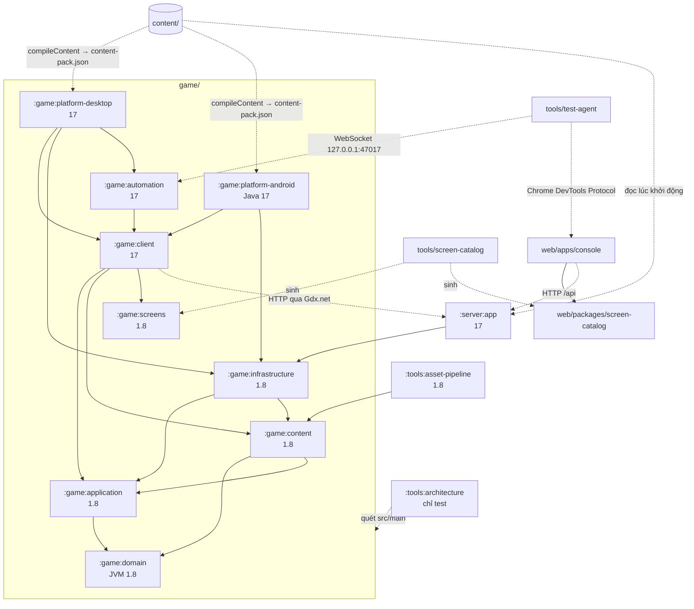
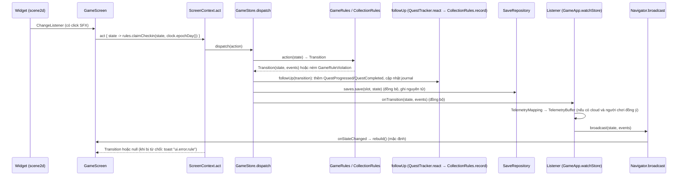

# 02 · Kiến trúc bắt buộc

> Cập nhật 2026-09-26 · Nhánh `rewrite` · Mô tả **code thật** tại commit `af8fd71`.
> Chỗ nào code khác [MASTER_PLAN.md](../MASTER_PLAN.md), tài liệu này ghi theo code và đánh dấu **Khác với MASTER_PLAN**. Việc chưa làm được đánh dấu *(chưa làm — xem [05-work-packages.md](05-work-packages.md))*.
> **BẮT BUỘC** / **CẤM** là luật. Mỗi luật có dòng *Kiểm tra bởi*. Nếu chỉ ghi "review" thì chưa có máy kiểm tra: người review phải chặn.

**Mục lục:** [1 Bản đồ module](#1-bản-đồ-module) · [2 Luật phụ thuộc được test](#2-luật-phụ-thuộc-được-test-tự-động) · [3 Domain](#3-domain-gamedomain) · [4 Application và luồng dữ liệu](#4-application-gameapplication-và-luồng-dữ-liệu) · [5 Content](#5-content) · [6 Infrastructure](#6-infrastructure-gameinfrastructure) · [7 Client](#7-client-gameclient) · [8 Automation](#8-automation) · [9 Screen catalog](#9-screen-catalog-registry) · [10 Server](#10-server-serverapp) · [11 Web Console](#11-web-console-webappsconsole) · [12 Invariant và tất định](#12-invariant-và-tất-định) · [13 ADR](#13-chỉ-mục-quyết-định-kiến-trúc-adr) · [14 Việc CẤM](#14-việc-cấm) · [15 Khi muốn phá luật](#15-khi-muốn-phá-luật) · [Phụ lục A](#phụ-lục-a--tổng-hợp-khác-với-master_plan)

---

## 1. Bản đồ module

### 1.1 Hai file settings

| File | Gồm | Dùng khi |
|---|---|---|
| [settings.gradle](../../settings.gradle) | legacy `lwjgl3, core, android, ios, html` + 12 module mới, có `:game:platform-android` | Build Android. Cần `local.properties` có `sdk.dir` |
| [settings-test.gradle](../../settings-test.gradle) | legacy `core, lwjgl3` + 11 module mới, **không** có `:game:platform-android` | Mọi build JVM: CI job `jvm`, `run-desktop.sh`, cổng test chung |

Plugin quy ước trong [build-logic](../../build-logic/src/main/kotlin/):
- `pxworld.kotlin-module`: `jvmToolchain(17)`, `jvmTarget = 1.8`, Java source/target 1.8, **`allWarningsAsErrors = true`**, JUnit 5 + `kotlin-test`.
- `pxworld.kotlin-serialization`: giống trên, thêm plugin serialization và `kotlinx-serialization-json`.
- Module cần bytecode 17 tự ghi đè `jvmTarget` và `JavaVersion` trong build file của nó.

Phiên bản ([libs.versions.toml](../../gradle/libs.versions.toml)): Kotlin 2.4.20 · libGDX 1.13.1 · KTX 1.13.1-rc1 · Fleks 2.15 · Ktor 3.6.0 · kotlinx-serialization 1.11.0 · Java-WebSocket 1.6.0 · JUnit 5.10.2 · H2 2.3.232 · PostgreSQL JDBC 42.7.13 · HikariCP 6.3.0 · Logback 1.5.18. Gradle wrapper 8.12.1. AGP 8.10.1 (khai báo ở [build.gradle](../../build.gradle) gốc).

### 1.2 Module Gradle

| Module | Package gốc | Vai trò | Bytecode | Phụ thuộc khai báo | Được import (theo test kiến trúc) |
|---|---|---|---|---|---|
| `:game:domain` | `com.pxworld.domain` | `GameState`, `Wallet`/ledger, `StatBlock`/`StatFormula`, `BattleEngine`, `Pcg32` | 1.8 | không | chỉ `kotlin.*`, `kotlinx.coroutines.*`, `com.pxworld.domain.*` |
| `:game:application` | `com.pxworld.application` | Luật game (`GameRules`, `CollectionRules`, `QuestTracker`, `NewGame`), `GameStore`, port, `GameEvent`, `CloudSync`, replay | 1.8 | `api(:game:domain)` | như domain, thêm `com.pxworld.application.*` |
| `:game:content` | `com.pxworld.content` | Record nội dung, `ContentLoader`, `ContentValidator`, `ContentBundleCatalog`, `BattleContentAssembler`, compiler CLI, xuất schema | 1.8 | `api(domain, application)`, kotlinx-serialization | như application, thêm `kotlinx.serialization.*`, `com.pxworld.content.*`. Riêng package `content.compiler` được thêm `java.io.*`, `java.security.*` |
| `:game:infrastructure` | `com.pxworld.infrastructure` | `FileSaveStore`/`SaveCodec`, `LegacyV1Importer`, `LegacySaveMigration`, `FileReplayStore`/`ReplayCodec` | 1.8 | `api(application, content)` | mọi thứ **trừ** `com.pxworld.client`, `com.pxworld.server`, `com.badlogic`, `io.ktor` |
| `:game:screens` | `com.pxworld.screens` | `GameScreenId` (file sinh từ catalog) | 1.8 | không | chỉ có luật package |
| `:game:client` | `com.pxworld.client` | libGDX: `GameApp`, điều hướng, 133 màn, UI kit, world ECS, trình phát trận, `StageAutomationDriver`, `HttpCloudGateway` | **17** | `api(application, content, screens, gdx)`; `implementation(ktx-actors, ktx-scene2d, ktx-graphics, ktx-assets, fleks, kotlinx-serialization-json)` | **cấm** `com.pxworld.infrastructure`, `com.pxworld.server`, `io.ktor`, `java.sql`, `java.net.http`, `java.io.File*`, `java.nio.file`, `java.lang.Thread*`, `java.util.concurrent.Executors*` |
| `:game:automation` | `com.pxworld.automation` | `AutomationProtocol` (JSON-RPC) và `AutomationServer` (WebSocket) | 17 | `api(client, Java-WebSocket)` | chỉ có luật package |
| `:game:platform-desktop` | `com.pxworld.desktop` | Launcher LWJGL3: đọc biến môi trường, dựng `GameServices`, bật automation | 17 | client, infrastructure, automation, backend lwjgl3, natives | luật package; tổng < 250 dòng |
| `:game:platform-android` | `com.pxworld.android` | Launcher Android viết bằng **Java**, lấy flavor/URL từ `BuildConfig` | Java 17 (minSdk 24, target/compile 35) | client, infrastructure, gdx-backend-android, natives, desugar | luật package; tổng < 250 dòng |
| `:server:app` | `com.pxworld.server` | Ktor: auth, cloud save, content release, xác thực trận, công cụ staff, Studio | 17 | infrastructure (kéo theo application, content, domain), Ktor, HikariCP, H2, PostgreSQL, Logback | **cấm** `com.pxworld.client`, `com.badlogic`, `com.github.quillraven` |
| `:tools:asset-pipeline` | `com.pxworld.assets` | Sinh asset runtime (task `buildAssets`) | 1.8 | content, gdx, freetype, gdx-tools | chỉ có luật package |
| `:tools:architecture` | `com.pxworld.architecture` | Chỉ chứa test kiến trúc | 1.8 | không | — |

Ghi chú đã kiểm: `ktx-*` được khai báo nhưng chưa file nào `import ktx.*`. Client dựng UI bằng scene2d thuần.

**Khác với MASTER_PLAN §5 và §8.1:**
- Có thêm `game/content` và `game/screens`. Compiler nằm trong `game/content` (package `compiler`, chạy bằng `:game:content:compileContent`), không có `tools/content-compiler`.
- Chưa có `tools/sim-cli` (WP-A2), `platform-ios`, `platform-web` (WP-A5, WP-D1), `server/modules/*`, `infra/`. Migration SQL nằm trong `server/app/src/main/resources/migrations`.
- `game/client` nhắm JVM 17 thay vì 1.8, vì Fleks 2.15 phát bytecode 17 (ADR 0001, mục cập nhật). Server nhắm JVM 17 (toolchain 17), không phải 21.

### 1.3 Thành phần không dùng Gradle

| Thư mục | Công nghệ | Vai trò |
|---|---|---|
| `web/` | npm workspaces ([web/package.json](../../web/package.json), `package-lock.json`) | Gom `apps/*` và `packages/*`. Script: `console:dev`, `console:build`, `typecheck` |
| `web/apps/console` (`@pxworld/console`) | React 19.1, TypeScript 5.9 `strict`, Vite 7.1 | Console staff (§11) |
| `web/packages/screen-catalog` (`@pxworld/screen-catalog`) | TypeScript nguồn, không build | `webScreens`, `WebScreenId`, **file sinh** |
| `tools/screen-catalog` | Node ESM | `catalog.mjs` (launch) + `expansion.mjs` (4 mùa) sinh `docs/screens/*`, `GameScreenId.kt`, `screenIds.ts` (§9) |
| `tools/test-agent` | Node ESM `.mjs` + bash | `run.mjs` (scenario/explore), `automation-client.mjs`, `scenarios/{core-loop,chapter1,cloud}.mjs`, `run-desktop.sh`, `console/{console-agent.mjs,run-console.sh}`, `fixtures/` |
| `tools/content-migrator` | Node ESM | `migrate-legacy.mjs` chạy một lần, từ chối chạy khi `content/` đã tồn tại (trừ `--force`). `ui-strings.mjs` + `ui-strings-extended.mjs` sinh `content/localization/{vi,en}.ui.json` |
| `content/` | JSON | Nguồn sự thật nội dung (§5) |
| `art/` | Nguồn art | Hiện chỉ có `fonts/` (Be Vietnam Pro, OFL) và `LICENSES.md`. Chưa cấu hình Git LFS *(chưa làm — WP-X6)* |
| `assets/` | Asset legacy, **có commit** | Là **nguồn** của asset pipeline. Output nằm ở `tools/asset-pipeline/build/assets` |

**Khác với MASTER_PLAN D8, §5, §13.3:** web dùng npm workspaces, không phải pnpm. Mới có console và screen-catalog; chưa có pilot, site, `ui`, `api-client`, `design-tokens`. Test agent viết bằng JavaScript thuần, không phải TypeScript, chưa có MCP server và Claude Agent SDK. `assets/` không phải thư mục sinh và không bị ignore.

### 1.4 Sơ đồ phụ thuộc

Nét liền: phụ thuộc Gradle (`api`/`implementation`). Nét đứt: sinh code, gọi mạng, nạp dữ liệu lúc chạy.

### 1.5 Module legacy

| Thư mục | Là gì | Còn được dùng ở đâu | Xoá khi |
|---|---|---|---|
| `core/` | Game Java/Ashley cũ, 46 test | CI job `jvm` chạy `:core:test`; có trong cả hai file settings | WP-A6 |
| `lwjgl3/` | Launcher desktop cũ | CI chạy `:lwjgl3:compileJava`. **`game/platform-desktop` lấy icon cửa sổ từ `lwjgl3/src/main/resources`** (phụ thuộc sống duy nhất) | WP-A6 (chuyển icon trước) |
| `android/` | Module Android cũ | Chỉ có trong `settings.gradle` | WP-A6 |
| `ios/` | Template RoboVM, chưa build | Chỉ có trong `settings.gradle` | WP-A6 |
| `html/` | GWT, không build được | Chỉ có trong `settings.gradle` | WP-A6 |
| `dashboard/` | React/Vite/Express sửa JSON cũ, không phải module Gradle | Tham khảo cho trình sửa lưới 3×3 | Sau WP-B1 |
| `README.md`, `INTERNAL_README.md` | Mô tả game Java cũ, **đã lỗi thời** | — | WP-A6 viết lại |

`data/` và `lwjgl3/data/` không phải module. Đó là vị trí save cũ của người chơi, `LegacySaveMigration` đọc ở đó (§6.2).

- **CẤM L-1:** sửa code trong `core/`, `lwjgl3/`, `android/`, `ios/`, `html/`, `dashboard/`, hoặc thêm phụ thuộc mới từ module mới vào chúng. Việc xoá được làm trong một commit riêng `chore: remove legacy core` (WP-A6). *Kiểm tra bởi:* review. Lệnh `git diff --stat rewrite...HEAD -- core lwjgl3 android ios html dashboard` phải rỗng.

### 1.6 Thêm module mới
- **BẮT BUỘC M-1:** module Kotlin mới áp dụng `pxworld.kotlin-module` hoặc `pxworld.kotlin-serialization`, được include ở **cả hai** file settings (trừ module Android), được thêm vào `MODULES` và bảng package trong `ArchitectureTest`, và test của nó được thêm vào lệnh CI job `jvm` cùng cổng test chung (05 §0.3). *Kiểm tra bởi:* `every module is scanned` (chỉ với module đã có trong danh sách) và review.

---

## 2. Luật phụ thuộc được test tự động

Nguồn: [ArchitectureTest.kt](../../tools/architecture/src/test/kotlin/com/pxworld/architecture/ArchitectureTest.kt). Chạy bằng `./gradlew --settings-file settings-test.gradle :tools:architecture:test`. Có trong CI job `jvm` và cổng test chung.

**Cách hoạt động:**
1. Duyệt `src/main/**` (`.kt`, `.java`) của 11 module: `game/{domain, application, content, infrastructure, screens, client, automation, platform-desktop, platform-android}`, `server/app`, `tools/asset-pipeline`.
2. Đọc dòng `package` và các dòng `import` dưới dạng **văn bản**, không phân tích cú pháp.
3. So `import` với danh sách tiền tố cho phép hoặc cấm. Luật tất định (số 11) tìm chuỗi con trong toàn bộ nội dung file.
4. Task khai báo input là `game/*/src/main/**`, `server/*/src/main/**`, `tools/asset-pipeline/src/main/**`, nên Gradle chạy lại khi nguồn đổi.

| # | Tên test | Luật | Vì sao | Sửa khi vi phạm |
|---|---|---|---|---|
| 1 | `every module is scanned` | Mỗi module trong `MODULES` có ít nhất một file nguồn | Đổi tên hoặc chuyển module mà quên sửa đường dẫn thì các test khác sẽ "xanh" giả | Sửa `MODULES` cho khớp đường dẫn mới |
| 2 | `domain is pure kotlin with no platform or io` | `game/domain` chỉ import `kotlin.`, `kotlinx.coroutines.`, `com.pxworld.domain.` | Domain phải chạy giống hệt trên client, server, sim, và sau này TeaVM/RoboVM (ADR 0002, 0003). Không libGDX, Ktor, I/O, và cả kotlinx-serialization | Đưa I/O sang infrastructure. Đưa `@Serializable` sang record ở content hoặc document ở infrastructure. Truyền dữ liệu vào bằng tham số |
| 3 | `application depends only on domain` | `game/application` chỉ import `kotlin.`, `kotlinx.coroutines.`, `com.pxworld.domain.`, `com.pxworld.application.` | Luật game test được bằng JVM thuần; adapter thay được | Khai báo **port** (interface) trong application, cài đặt ở content, infrastructure hoặc client |
| 4 | `content knows rules and data formats but no engine, storage or network` | `game/content` chỉ import kotlin, coroutines, `kotlinx.serialization.`, domain, application, content. Riêng file có package bắt đầu bằng `com.pxworld.content.compiler` được thêm `java.io.`, `java.security.` | Content được nạp ở client, server, tool. Chỉ CLI compiler được đọc/ghi file | Đọc file ở compiler, infrastructure hoặc launcher, rồi truyền `Map<String, String>` vào `ContentLoader.load` |
| 5 | `infrastructure never reaches up into client, server or the engine` | `game/infrastructure` không import `com.pxworld.client.`, `com.pxworld.server.`, `com.badlogic.`, `io.ktor.` | Server dùng chung infrastructure, nên nó không được kéo libGDX hay code client | Adapter nào cần libGDX (ví dụ `Gdx.net`, `Preferences`) thì đặt ở client (như `HttpCloudGateway`) |
| 6 | `client talks to storage only through application ports` | `game/client` không import `com.pxworld.infrastructure.`, `com.pxworld.server.`, `io.ktor.`, `java.sql.`, `java.net.http.` | Màn hình không được biết save nằm ở file, DB hay mạng | Gọi qua `GameServices.saves` (`SaveRepository`), `ReplayRepository`, `CloudSync`. Launcher mới là nơi chọn adapter |
| 7 | `client does not touch files or threads directly` | `game/client` không import tiền tố `java.io.File` (chặn luôn `FileInputStream`, `FileReader`…), `java.nio.file.`, `java.lang.Thread`, `java.util.concurrent.Executors` | File trên Android/web khác desktop. Mọi thay đổi scene2d phải chạy trên render thread | Dùng `Gdx.files`, `Gdx.net`, `Gdx.app.postRunnable`. `CompletableFuture` và `ConcurrentLinkedQueue` vẫn được phép |
| 8 | `server shares rules but never the game client or engine` | `server/app` không import `com.pxworld.client.`, `com.badlogic.`, `com.github.quillraven.` | Server headless, không có OpenGL | Luật dùng chung phải nằm ở domain, application hoặc content |
| 9 | `platform launchers only wire modules together` | Tổng số dòng mọi file trong `src/main` của `platform-desktop` < 250, của `platform-android` < 250 (`LAUNCHER_LINE_BUDGET`). Hiện desktop 92, Android 79 | Logic trong launcher không test được và bị lặp giữa các nền tảng | Chuyển logic vào client hoặc infrastructure; launcher chỉ nối module |
| 10 | `packages match their module` | Package bắt đầu bằng: domain → `com.pxworld.domain`, application → `com.pxworld.application`, content → `com.pxworld.content`, infrastructure → `com.pxworld.infrastructure`, client → `com.pxworld.client`, screens → `com.pxworld.screens`, automation → `com.pxworld.automation`, platform-desktop → `com.pxworld.desktop`, platform-android → `com.pxworld.android`, server/app → `com.pxworld.server`, asset-pipeline → `com.pxworld.assets` | Các luật import dựa vào tiền tố package | Đổi package cho khớp module |
| 11 | `domain randomness and time come from explicit inputs` | File trong domain và application không được chứa chuỗi `System.currentTimeMillis`, `System.nanoTime`, `Random()`, `kotlin.random.Random.Default`, `Math.random`, `LocalDate.now`, `Instant.now`, `UUID.randomUUID` | Tất định: replay, golden test, xác thực ở server (ADR 0003) | Nhận `seed: Long`, `nowMillis: Long`, `todayEpochDay: Long` làm tham số. Client lấy từ `GameClock` rồi truyền vào (ví dụ `rules.recruit(state, clock.nowMillis())`) |

Ngoài ra mọi module Kotlin build với `allWarningsAsErrors = true`: cảnh báo compiler là lỗi build.

**Lỗ hổng đã biết** (test không bắt được; người review phải chặn):
- Test chỉ đọc dòng `import`. Viết **tên đầy đủ** ngay trong code sẽ lọt. Đang có một chỗ: `java.nio.file.Paths` ở [StageAutomationDriver.kt](../../game/client/src/main/kotlin/com/pxworld/client/automation/StageAutomationDriver.kt) (hàm `screenshot`, dòng 250).
- Import wildcard (`import java.io.*`) không khớp tiền tố `java.io.File`.
- Luật tất định chỉ tìm đúng các chuỗi trên, nên các cách khác lọt: `Random.nextInt()`, `Random.Default` (không có tiền tố `kotlin.random.`), `SecureRandom`, `Clock`, `ZonedDateTime.now()`, `LocalDateTime.now()`.
- `game/automation`, `game/screens`, `tools/asset-pipeline` chỉ có luật package.
- `web/`, `tools/*.mjs`, và code legacy không bị quét.

**Luật trong MASTER_PLAN §4.1 chưa có máy kiểm tra** (chỉ review): View không chứa luật game; không có `object` mang state thay đổi được; tính năng giao tiếp qua sự kiện, không gọi chéo. Xem §14.

**Khác với MASTER_PLAN §4.1 và ADR 0002:** test kiến trúc là bộ quét import tự viết, không dùng Konsist.

---

## 3. Domain (`game/domain`)

### 3.1 `GameState`: trạng thái duy nhất, bất biến
Nguồn: [GameState.kt](../../game/domain/src/main/kotlin/com/pxworld/domain/progression/GameState.kt).

| Trường | Kiểu | Ghi chú |
|---|---|---|
| `profile` | `PlayerProfile(name, level, experience, starterHeroId)` | |
| `wallet` | `Wallet` | §3.2 |
| `ledgerTail` | `List<LedgerEntry>` | Giữ tối đa `LEDGER_TAIL_SIZE = 200` bút toán cuối |
| `heroes` | `List<OwnedHero(instanceId, heroId, level 1..60, star 0..5, experience, locked)>` | |
| `lineup` | `Lineup(cells: Map<GridCell, String>, capacity 1..9)` | **Một** đội hình |
| `inventory` | `Inventory(items: Map<String, Long>, equipment: List<EquipmentInstance>)` | `EquipmentInstance.equippedBy` là instanceId của hero hoặc `null` |
| `quests` | `List<QuestProgress>` | |
| `claimedAchievementTiers` | `Map<String, Int>` | Thành tựu tính từ bộ đếm `stats`, không lưu tiến độ riêng |
| `checkin` | `CheckinProgress(tableId, claimedDays, lastClaimEpochDay)` | |
| `position` | `WorldPosition(mapId, x, y, spawnIndex)` | |
| `settings` | `PlayerSettings` (nhạc, âm thanh, `locale = "vi"`, cỡ chữ %, giảm chuyển động, đồng ý analytics, tốc độ trận) | |
| `stats` | `LifetimeStats(counters)` | Tên bộ đếm nằm ở `Counters` trong application |
| `journal` | `PlayerJournal` | Map đã ghé, quái/item đã thấy, lịch sử chiêu mộ (50), preset đội hình (5), lần nhận thưởng treo máy, số giây chơi, tutorial đã xem |
| `nextInstanceNumber` | `Long` | `allocateInstanceId("hero")` trả `"hero-N"` và state mới |

Invariant kiểm trong `init` (vi phạm ném `IllegalArgumentException`): instanceId của hero không trùng; đội hình chỉ trỏ tới hero đang sở hữu; `equippedBy` chỉ trỏ tới hero đang sở hữu; mỗi cặp (hero, slot) gắn tối đa một trang bị; số lượng item > 0; số dư tiền tệ ≥ 0. `Lineup.init` kiểm: sức chứa 1..9, số hero ≤ sức chứa, một hero chỉ ở một ô. `ExperienceCurve`: `MAX_LEVEL = 60`, kinh nghiệm cần để lên cấp = `100 × level`.

**Khác với MASTER_PLAN §4.6:** chỉ có `lineup` (không có `lineups`); thành tựu là `claimedAchievementTiers` cộng bộ đếm; có thêm `journal`.

### 3.2 `Wallet` và ledger
Nguồn: [Wallet.kt](../../game/domain/src/main/kotlin/com/pxworld/domain/economy/Wallet.kt).
- `Wallet(balances: Map<String, Long>, nextSequence)`. `credit` và `debit` yêu cầu `amount > 0`. `debit` ném `InsufficientFunds` khi thiếu tiền. Cả hai trả `WalletChange(wallet, entry)` với `LedgerEntry(sequence, currency, delta, balanceAfter, reason)`.
- `LedgerReason(kind, reference)`. Các `kind` đang dùng: `new_game`, `shop_item`, `shop_equipment`, `checkin`, `recruit`, `battle`, `quest`, `achievement`, `sell_item`, `salvage`, `upgrade_equipment`, `dismiss`, `exchange`, `idle`, `tutorial`, `mail`, `debug_cheat`.
- Application nối `entry` vào `ledgerTail` (`takeLast(200)`) trong `GameRules.grant`/`spend` và `CollectionRules.upgradeEquipment`/`exchangeGems`.
- **BẮT BUỘC D-1:** mọi thay đổi số dư đi qua `Wallet.credit`/`debit` và nối `LedgerEntry` vào `ledgerTail`. Dùng `GameRules.grant(state, grants, reason)` thay vì tự `copy(wallet = …)`. Cheat debug cũng vậy (`LedgerReason("debug_cheat", key)`). *Kiểm tra bởi:* `GameRulesTest` (`shop purchase debits wallet, writes ledger and adds items`), automation `invariants.check`, review.

### 3.3 `StatBlock` và `StatFormula`
Nguồn: [StatBlock.kt](../../game/domain/src/main/kotlin/com/pxworld/domain/stats/StatBlock.kt), [StatFormula.kt](../../game/domain/src/main/kotlin/com/pxworld/domain/stats/StatFormula.kt).
- `StatKind`: `HP`, `ATTACK`, `DEFENSE` tăng theo cấp; `SPEED`, `CRIT_RATE`, `CRIT_DAMAGE`, `ACCURACY`, `EVASION`, `EFFECT_HIT`, `EFFECT_RESISTANCE` không tăng. Tỉ lệ tính bằng ‰.
- `StatBlock` bất biến (bọc `IntArray`, `with`/`plus`/`map` trả bản mới).
- `grow = base × (1000 + 80 × (level − 1)) / 1000 × STAR[star] / 1000`, chỉ áp cho chỉ số tăng theo cấp, `STAR = [1000, 1150, 1320, 1520, 1750, 2010]`.
- `finalStats = (grow + flatBonus) × (1000 + percentBonus) / 1000`, tính bằng `Long`.
- Cộng trang bị (application, `CollectionRules.equipmentBonus`): mỗi món cộng `stats × (1000 + 100 × (level − 1)) / 1000`. `GameRules.heroStats` hiện truyền `percentBonus = StatBlock.EMPTY`.

### 3.4 `BattleEngine`
Nguồn: thư mục [battle/](../../game/domain/src/main/kotlin/com/pxworld/domain/battle/). Quyết định: [ADR 0003](../adr/0003-deterministic-integer-battle-engine.md).

**API** (`object BattleEngine`, không giữ state):

| Hàm | Làm gì |
|---|---|
| `start(setup): BattleStep` | Tạo `BattleState`, phát `BattleStarted`, tiến tới đơn vị đầu tiên được hành động |
| `legalCommands(state)` | Mọi `BattleCommand(actor, skillId, target)` hợp lệ của đơn vị đang tới lượt |
| `apply(state, command): BattleStep` | Ném `IllegalBattleCommand` nếu lệnh không nằm trong `legalCommands`. Trả state mới và event |
| `autoCommand(state)` | `AutoPolicy.choose`: ưu tiên ULTIMATE > SKILL > BASIC. Kỹ năng `SingleAlly` chọn đồng đội có HP‰ thấp nhất rồi slot nhỏ nhất; loại khác chọn lệnh hợp lệ đầu tiên |
| `replay(setup, commands): BattleRecord` | Chạy lại từ seed và danh sách lệnh |
| `runAuto(setup): BattleRecord` | Tự đánh tới hết. Golden test và mô phỏng cân bằng dùng hàm này |

**Đầu vào:** `BattleSetup(seed, allies, enemies, rules)`. `CombatantSetup(name, classId, level, cell, stats, skills)` có đúng một kỹ năng `BASIC`. Hai đơn vị cùng phe không chung ô.

**Luật đã cài** (giá trị lấy từ `content/balance/battle_rules.json`, trùng mặc định của `BattleRules`):
- **Thứ tự lượt:** `turnDelay = timeUnitsPerRound (10 000) × referenceSpeed (100) / SPD hiệu dụng`. Đơn vị có `turnDelay` nhỏ nhất đi trước; bằng nhau thì xét thứ tự trong danh sách (phe ta trước, theo slot). `round = elapsedTime / 10 000 + 1`.
- **Kết thúc:** một phe hết người → `VICTORY`/`DEFEAT`. `round > maxRounds (30)` → `DRAW`, là kết quả riêng, không tính là thua.
- **Năng lượng:** khởi đầu 25, tối đa 100, +20 sau khi hành động (nếu còn sống), +10 khi bị trúng đòn (sát thương > 0 và còn sống). Chỉ `ULTIMATE` tốn năng lượng. `SKILL` có hồi chiêu, giảm 1 ở đầu mỗi lượt **của chính đơn vị** đó. Validator content ép hai luật này.
- **Trúng/né:** `hit‰ = clamp(950 + (ACC − EVA)/2, 600, 1000)`.
- **Chí mạng:** roll < `min(CRIT_RATE, 750)`. Hệ số chí mạng `max(CRIT_DAMAGE, 1000)`.
- **Sát thương:** `ATK × power / 1000 × K / (K + DEF)`, với `K = 100 + 10 × cấp người đánh`. Nhân tiếp: khắc chế (1250/1000/850, lấy từ `hero_classes.counters`), chí mạng, hàng của **người bị đánh** (1000/900/800 theo `depth` 0/1/2), dao động 950..1050. Tối thiểu 1.
- **Thứ tự rút RNG trong một đòn:** trúng → chí mạng → dao động. Roll trạng thái chỉ rút khi tỉ lệ < 1000. `RandomEnemies` rút khi chọn mục tiêu. **Thứ tự rút là một phần của hợp đồng golden.**
- **Trạng thái** (`StatusKind`): `StatModifier`, `StatBonus`, `Stun` (bỏ lượt), `Silence` (chỉ còn BASIC), `Taunt` (buộc đòn đơn mục tiêu vào đơn vị khiêu khích), `Shield` (điểm khiên = ATK người thi × hệ số, hút sát thương trước HP), `DamageOverTime`/`HealOverTime` (tick đầu lượt nạn nhân). Áp lại cùng trạng thái: làm mới thời lượng, +1 stack tới `maxStacks`, khiên cộng dồn. Thời lượng giảm ở cuối lượt của đơn vị mang trạng thái.
- **Chọn mục tiêu** (`Targeting`): `SingleEnemy`, `EnemyRow`, `EnemyLane`, `AllEnemies`, `SingleAlly`, `AllAllies`, `Self`, `LowestHpAllies(n)`, `RandomEnemies(n)`. Mục tiêu địch sắp theo hàng trước, khoảng cách làn, rồi slot.
- **Event** (`BattleEvent`, 13 loại): `BattleStarted`, `TurnStarted`, `TurnSkipped`, `SkillUsed`, `AttackMissed`, `DamageDealt`, `Healed`, `StatusApplied`, `StatusResisted`, `StatusExpired`, `EnergyChanged`, `UnitDefeated`, `BattleEnded`. `BattleEventLog.render` chuyển thành văn bản, dùng cho golden.
- **RNG:** `Pcg32` (PCG XSH-RR 32 bit), bất biến. `RandomCursor` là con trỏ thay đổi được, chỉ sống trong một bước `BattleWorkspace`.

**Golden test:** [BattleGoldenTest.kt](../../game/domain/src/test/kotlin/com/pxworld/domain/battle/BattleGoldenTest.kt), 6 kịch bản ghi ở `game/domain/src/test/resources/golden/*.txt`. Cập nhật bằng `./gradlew --settings-file settings-test.gradle :game:domain:test -DupdateGolden=true`, rồi review diff file golden trong cùng commit. Lưu ý: file golden **chưa có** thì test tự tạo và pass. Kịch bản mới phải commit file golden kèm theo.

**Khác với MASTER_PLAN §4.5:** công thức lượt là `10000 × 100 / SPD` (không phải `10000 / SPD`); tên kiểu chọn mục tiêu khác; chưa có `reflect`, `immune`, `dispel` *(chưa làm — WP-C3)*; có trần chí mạng 750‰; lệnh là `BattleCommand` chứ không phải `Command.UseSkill`; mới có 6 golden so với mục tiêu 200.

---

## 4. Application (`game/application`) và luồng dữ liệu

### 4.1 Port và adapter

| Port (application) | Adapter | Nơi dựng |
|---|---|---|
| `SaveRepository` (`slots`, `load`, `save`, `delete`, `export`, `decode`) | `FileSaveStore` (infrastructure) | Launcher |
| `ContentCatalog` | `ContentBundleCatalog` (content) | `GameServices` |
| `ReplayRepository` | `FileReplayStore` (infrastructure); mặc định `InMemoryReplays(20)` | Launcher |
| `CloudGateway` | `HttpCloudGateway` (client, dùng `Gdx.net`) | `GameApp.create` khi có `cloudUrl` |
| `CloudCredentialStore` | `PreferencesCredentialStore` (client, Preferences riêng cho từng URL) | `GameApp.create` |
| `GameStoreListener` | lambda trong `GameApp.watchStore` | `GameApp` |

`GameClock` (`epochDay()`, `nowMillis()`) và `BuildFlavor` được khai báo ở **client** ([GameServices.kt](../../game/client/src/main/kotlin/com/pxworld/client/core/GameServices.kt)), không nằm trong application. Cài đặt `SystemClock` nằm ở hai launcher.

### 4.2 Luật game
Mọi hàm luật có dạng thuần `(GameState, tham số) → Transition(state, events)`. Từ chối hợp lệ thì ném `GameRuleViolation`.

| Lớp | Nguồn | Hàm |
|---|---|---|
| `GameRules` | [GameRules.kt](../../game/application/src/main/kotlin/com/pxworld/application/GameRules.kt) | `heroStats`, `equip`, `unequip`, `useExperienceItem`, `buyItem`, `buyEquipment`, `claimCheckin(state, todayEpochDay)`, `recruit(state, seed)`, `raiseStar`, `placeInLineup`, `finishBattle`, `enterMap`, `talkTo`, `claimQuest`, `claimAchievementTier`, `grant` |
| `CollectionRules` | [Collection.kt](../../game/application/src/main/kotlin/com/pxworld/application/Collection.kt) | `equipmentBonus`, `sellItem`, `salvageEquipment`, `upgradeEquipment`, `dismissHero`, `toggleLock`, `exchangeGems`, `idleRewardPreview`/`claimIdleRewards(state, nowMillis)`, preset đội hình, `record` (journal), `fastTravel`, `markTutorial`, `addPlayTime` |
| `QuestTracker`, `NewGame`, `LineupCapacity` | [Progression.kt](../../game/application/src/main/kotlin/com/pxworld/application/Progression.kt) | `startAll`, `react(transition)`; `create(name, starterHeroId)`; sức chứa = `min(9, 3 + (level − 1) / 5)` |
| Hằng số | `Counters`, `Currencies`, `EconomyTuning` | Tên bộ đếm, ID tiền tệ, số liệu kinh tế |

`GameRuleViolation` là lỗi người chơi thấy (toast). `IllegalArgumentException`/`IllegalStateException` từ `require`/`check` là lỗi lập trình, **không** được `ScreenContext.act` bắt.

### 4.3 Luồng dữ liệu một chiều (đúng như code chạy)

1. Màn gọi `context.act(successMessage?) { state -> services.rules.xxx(state, …) }` ([ScreenContext.kt](../../game/client/src/main/kotlin/com/pxworld/client/navigation/ScreenContext.kt)). Giá trị thời gian và seed lấy từ `services.clock` rồi **truyền vào**.
2. `GameStore.dispatch` ([GameStore.kt](../../game/application/src/main/kotlin/com/pxworld/application/GameStore.kt)): `followUp(action(state))`. `followUp` được gắn ở `GameSession.start`: `collection.record(quests.react(t), clock.nowMillis())`.
3. Gán state mới, **lưu ngay** (`saves.save`), rồi gọi listener đồng bộ theo thứ tự đăng ký. `GameStore.update(change)` là `dispatch` không có event (dùng cho số giây chơi).
4. `GameApp.watchStore` đăng ký lại mỗi khi `GameSession.store` đổi instance (phát hiện trong `render()`).
5. Mỗi frame, `GameApp.render` làm các việc: cộng giờ chơi mỗi 60 s, cấu hình âm thanh theo `settings`, chọn nhạc theo **module của màn FULL đang hiển thị** (`battle` → `audio.music.battle`, còn lại → `audio.music.world`), gọi `navigator.update`/`renderWorld`, `stage.act`/`draw`, `automation.drainRenderThreadWork()`, gửi telemetry mỗi 30 s (lô 50).

**Ai nhận event:**

| Bên nhận | Cơ chế | Event |
|---|---|---|
| `QuestTracker.react` | `followUp` thuần, trước khi lưu | `BattleFinished`, `ItemsGained` (theo item hoặc nhóm item), `MapEntered`, `NpcTalked` |
| `CollectionRules.record` | `followUp` thuần | `MapEntered`, `ItemsGained`, `HeroRecruited`, `BattleFinished` → journal |
| Telemetry | listener → `TelemetryMapping.of` | `BattleFinished`, `QuestCompleted`, `HeroRecruited`, `ProfileLeveledUp`, `MapEntered`, `CheckinClaimed`, cùng `session.start` |
| Màn hình đang hiển thị | listener → `Navigator.broadcast` → `onStateChanged` | Tất cả. Mặc định dựng lại màn. `BattleMainScreen` bỏ qua; `WorldExploreScreen` tự xử lý |
| `AudioDirector` | **Không** nghe `GameEvent`. SFX click từ `Widgets.button`; `audio.sfx.hit`/`critical` do `BattleMainScreen` phát khi chiếu `BattleEvent.DamageDealt`; nhạc chọn mỗi frame | — |

**Trận đấu:** `BattleState` nằm trong `BattleMainScreen`, **không** nằm trong `GameStore`. Seed = seed của replay, hoặc `clock.nowMillis()`. Lệnh người chơi/auto/AI địch → `BattleEngine.apply` → event được đưa vào hàng đợi và chiếu có độ trễ. Khi trận kết thúc: lưu `ReplayRecord` (`replay-<seed>`) vào `services.replays`, `context.act { rules.finishBattle(...) }`, rồi `navigator.replaceFrom(this, <màn kết quả>)`.

**Khác với MASTER_PLAN §4.2:** không có Intent/Presenter/ViewState/`StateFlow`, không có reducer trong domain. Event là `GameEvent` của application, không phải `DomainEvent`. Không có `AchievementTracker` (thành tựu tính từ bộ đếm lúc nhận), không có `SaveScheduler` (lưu sau mỗi dispatch). `AudioDirector` không đăng ký nghe event.

### 4.4 `GameEvent` (19 loại)
`CurrencyChanged`, `ItemsGained`, `ItemsConsumed`, `EquipmentGained`, `EquipmentEquipped`, `EquipmentUnequipped`, `HeroRecruited`, `HeroLeveledUp`, `HeroStarRaised`, `LineupChanged`, `ProfileLeveledUp`, `CheckinClaimed`, `MapEntered`, `NpcTalked`, `QuestProgressed`, `QuestCompleted`, `QuestRewardClaimed`, `AchievementTierClaimed`, `BattleFinished`. Nguồn: [GameEvent.kt](../../game/application/src/main/kotlin/com/pxworld/application/GameEvent.kt).

### 4.5 Cloud
Nguồn: [Cloud.kt](../../game/application/src/main/kotlin/com/pxworld/application/Cloud.kt).
- `CloudResult`: `Ok(value)`, `Conflict(current: CloudSaveMeta)`, `Rejected(status, message)`, `Unreachable(message)`. Nối kết quả bằng `then`.
- `CloudSync(gateway, saves, store, deliver)`: `signInAsGuest`, `signIn`, `register`, `signOut`, `list`, `upload(slot)` (gửi kèm `expectedRevision = syncedRevision`), `keepLocal(slot, cloud)` (ghi đè bằng revision trên cloud), `preview`, `takeCloud` (tải về, ghi đè slot local, `markSynced`), `mail`, `claim(mailId, catalog)` (ID lạ bị bỏ), `report` (telemetry).
- Server trả 401 thì `CloudSync` xoá credentials (tự đăng xuất). Chưa đăng nhập thì trả `Rejected(401, "signed out")` ngay tại máy.
- `HttpCloudGateway` gửi callback về render thread bằng `Gdx.app.postRunnable`. 409 trên `/saves/` → `Conflict`, mở màn `game.boot.save_conflict`.
- Thư nhận về: client gọi `rules.grant(state, grants, CloudSync.mailReason(id))`. Kinh tế vẫn do client giữ (ADR 0007).
- `TelemetryBuffer(200)`: lô gửi lỗi được `restore` lại đầu hàng đợi theo đúng thứ tự.

### 4.6 Replay
`ReplayRecord(id, encounterId, seed, lineup: List<ReplaySlot>, commands, outcome, rounds, recordedAtMillis)`. `ReplaySlot` giữ `heroId, level, star, cell, bonus` (chỉ số cộng thêm từ trang bị). Xem lại bằng màn `game.battle.replay_viewer` (dùng lại `BattleMainScreen`).

---

## 5. Content

### 5.1 `content/` là nguồn sự thật
Mỗi file là **mảng JSON** các record cùng loại. Một loại có thể chia nhiều file (ví dụ `equipment/{armor,jewelry,support,weapon}.json`). Loader ghép theo thứ tự đường dẫn.

| Thư mục (`ContentKinds`) | Record | Tiền tố ID | File hiện có |
|---|---|---|---|
| `currencies` | `CurrencyRecord` | `currency.` | 1 |
| `hero_classes` | `HeroClassRecord` (`counters`) | `class.` | 1 |
| `statuses` | `StatusRecord` | `status.` | 1 (16 trạng thái) |
| `skills` | `SkillRecord` | `skill.` | 6 (theo lớp) |
| `heroes` | `HeroRecord` | `hero.` | 1 (6 anh hùng) |
| `enemies` | `EnemyRecord` | `enemy.` | 1 |
| `encounters` | `EncounterRecord` (`map`, `mapObjectId`, `enemies[cell]`, `rewards`) | `encounter.` | 2 |
| `items` | `ItemRecord` | `item.` | 1 |
| `equipment` | `EquipmentRecord` | `equip.` | 4 |
| `quests` | `QuestRecord` (`objective`, `requires`) | `quest.` | 2 |
| `achievements` | `AchievementRecord` (`counter`, `tiers`) | `achievement.` | 1 |
| `checkin_tables` | `CheckinTableRecord` | `checkin.` | 1 |
| `balance` | `BattleRulesRecord` (đúng 1 record) | `balance.` | 1 |
| `maps` | `MapRecord` (`asset`, `legacyName`, `battleBackground`) | `map.` | 1 |
| `npcs` | `NpcRecord` (`placements`, `dialogues`) | `npc.` | 1 |
| `dialogues` | `DialogueRecord` (đồ thị node) | `dialogue.` | 1 |
| `audio_cues` | `AudioCueRecord` | `audio.` | 1 |

Thư mục không chứa record: `localization/` (`vi.json`, `en.json` cho chữ của content; `vi.ui.json`, `en.ui.json` cho chữ UI, **file sinh**), `assets/legacy_asset_map.json` (khóa asset → file), `schemas/` (**file sinh**). Ngoài ra có `BALANCE_NOTES.md`, `MIGRATION_REPORT.md`. Nguồn record: [ContentRecords.kt](../../game/content/src/main/kotlin/com/pxworld/content/ContentRecords.kt), danh sách loại: [ContentSchema.kt](../../game/content/src/main/kotlin/com/pxworld/content/ContentSchema.kt).

**Khác với MASTER_PLAN §7.2:** mới có 17 loại. Chưa có `passives`, `equipment_sets`, `gems`, `recipes`, `loot_tables`, `shop_catalogs`, `recruit_pools`, `bosses`, `regions`, `cutscenes`, `quest_chains`, `titles`, `pets`, `buildings`, `game_modes`, `tutorials`, `vfx`, `ui_themes`. Tên vùng hiện là key UI (`ui.region.<slug>`).

### 5.2 `ContentLoader`
- `Json { ignoreUnknownKeys = false; isLenient = false }`: trường lạ, comment, dấu phẩy thừa đều bị từ chối và ném `ContentFormatException(file, …)`.
- Bản dịch: mọi file `localization/<locale>*.json` được gộp theo phần tên trước dấu chấm đầu tiên, nên `vi.json` và `vi.ui.json` cùng thành locale `vi`.
- `ContentLoader.load(files: Map<path, text>)` không tự đọc đĩa. `decodePack(text)` đọc content pack đã biên dịch.

### 5.3 `ContentValidator`
Nguồn: [ContentValidator.kt](../../game/content/src/main/kotlin/com/pxworld/content/ContentValidator.kt). Trả danh sách `ContentIssue(ERROR|WARNING, recordId, message)`.
- **ERROR:** ID trùng; ID không khớp `^[a-z]+(\.[a-z0-9_]+)+$`; sai tiền tố theo loại; tham chiếu tới ID không tồn tại (lớp, kỹ năng, trạng thái, tiền tệ, item, trang bị, hero, quái, trận, map, NPC, hội thoại, quest); thiếu chữ tiếng `vi` cho key tên/mô tả; khóa asset không có trong `legacy_asset_map.json` hoặc trỏ tới file/region không tồn tại; ULTIMATE không tốn năng lượng hoặc kỹ năng khác có tốn năng lượng; SKILL không có hồi chiêu; bộ kỹ năng không có đúng 1 BASIC hoặc có hơn 1 ULTIMATE; trận không có quái, quá 9 quái, hai quái chung ô, dùng chung object trên map; quest có chu trình `requires`; hội thoại trỏ tới node thiếu, action lạ (chỉ cho phép `open_shop`, `open_recruit`, `open_bag`); không có `balance` hoặc có nhiều hơn 1; không có hero `starter`.
- **WARNING:** phần thưởng rỗng; khắc chế lẫn nhau; khóa asset có map nhưng không nơi nào dùng (trừ font); số key chưa có bản dịch ở locale khác `vi`. Hiện `en` thiếu 212 key content (`equip` 166, `skill` 18, `achievement` 12, `quest` 10, `hero` 6).

### 5.4 Adapter và assembler
- `ContentBundleCatalog(bundle)` cài `ContentCatalog`. **Nợ kỹ thuật:** vài số liệu game đang viết cứng trong Kotlin thay vì content: `RECRUIT_PRICE = 5 currency.gem`, `STARTING_MAP = map.dawnvillage_01`, `STARTING_GRANTS = 300 gold + 20 gem`, `CollectionRules.TUTORIAL_REWARD`, `EconomyTuning`. Muốn đổi thì chuyển chúng vào content (luật 03 §2).
- `BattleContentAssembler(bundle)`: dựng `BattleRules` (gồm khắc chế từ `hero_classes.counters` và `StatusDefinition`), và `battle(seed, lineup: List<LineupSlot>, encounterId): BattleSetup`. Client, server (xác thực replay) và compiler (mô phỏng) dùng chung.

### 5.5 Compiler → content pack
`./gradlew --settings-file settings-test.gradle :game:content:compileContent` chạy `ContentCompilerKt` ([ContentCompiler.kt](../../game/content/src/main/kotlin/com/pxworld/content/compiler/ContentCompiler.kt)):
1. Đọc cây `content/**/*.json`, `ContentLoader.load`.
2. `ContentValidator.validate` với `LegacyAssetExistence(assets/)`: file nằm trong `fonts/`, `backgrounds/` được coi là có (do pipeline sinh). Có ERROR thì **exit 1**.
3. Mô phỏng 200 seed cho mỗi encounter ở cấp đề xuất: đội đủ 6 lớp và starter đánh một mình. In bảng; tỉ lệ thắng < 60% bị gắn chữ `too hard`, **chỉ cảnh báo**.
4. Ghi `game/content/build/content-pack/`: `content-pack-<sha12>.json`, `content-pack.json`, `manifest.json` (`version`, `sha256`, `file`, `records`, `bytes`).

Desktop (`bundleContentPack` → resources) và Android (`bundleContentPack` → assets) đóng gói `content-pack.json`. Server tự nạp `content/` lúc khởi động (`PXWORLD_CONTENT_DIR`). Pack phải tái lập được từng byte (`ContentTest`: `content pack is byte-for-byte reproducible`).

**Khác với MASTER_PLAN §7.3:** không có bước validate JSON Schema riêng (parse chặt từ chính serializer tương đương schema); kiểm asset dựa trên `assets/` legacy, không dựa vào manifest asset; mô phỏng không làm build fail; pack chưa nén `.gz` và manifest chưa có `minClientVersion` *(chưa làm — WP-B4)*.

### 5.6 JSON Schema sinh từ serializer
- `ContentSchema.record(kind)`/`file(kind)` sinh schema draft 2020-12 từ `SerialDescriptor`: trường có giá trị mặc định là tùy chọn, enum đóng, nullable → `anyOf [..., null]`, `additionalProperties: false`.
- `./gradlew --settings-file settings-test.gradle :game:content:exportSchemas` ghi `content/schemas/<kind>.schema.json`. `SchemaExportKt <dir> --check` báo file cũ.
- `ContentSchemaTest`: mọi thư mục trong `content/` (trừ `localization`, `assets`, `schemas`) phải có một `ContentKind`, và schema đã commit phải khớp với schema sinh ra.
- Server trả `ContentSchema.record(kind)` ở `GET /studio/kinds/{kind}/schema`. Console dùng nó cho `SchemaForm`.

---

## 6. Infrastructure (`game/infrastructure`)

### 6.1 Save
Nguồn: [SaveStore.kt](../../game/infrastructure/src/main/kotlin/com/pxworld/infrastructure/save/SaveStore.kt), [SaveGameDocument.kt](../../game/infrastructure/src/main/kotlin/com/pxworld/infrastructure/save/SaveGameDocument.kt).
- **Codec** (`SaveCodec`): phong bì `{"schemaVersion": 2, "checksum": sha256(JSON gọn của state), "state": {...}}`, ghi `prettyPrint`, `encodeDefaults`, `explicitNulls`. Khi đọc, chấp nhận checksum tính trên cây gọn **hoặc** bản pretty ("định dạng đầu tiên"). `ignoreUnknownKeys = false`. Mọi lỗi (JSON hỏng, sai version, checksum lệch, vi phạm invariant của `GameState`) → `CorruptSave`.
- **Tương thích tiến:** trường mới trong `SaveGameDocument` phải có giá trị mặc định (ví dụ `journal = JournalDocument()`), để save cũ vẫn đọc được. Fixture: `tools/test-agent/fixtures/save_v2_before_journal.save.json`.
- **Store** (`FileSaveStore(directory, keptBackups = 3)`): file `<slot>.save.json`. Ghi `<slot>.save.json.tmp` → `fsync` → xoay backup `<slot>.<1..3>.save.json.bak` → `Files.move(ATOMIC_MOVE)` (không hỗ trợ atomic thì move thường). `load` thử file chính rồi lần lượt từng backup. Tên slot khớp `^[a-z0-9_]{1,32}$`.
- **Vị trí:** desktop `~/.pxworld/<PXWORLD_ENV>/saves/` hoặc `PXWORLD_SAVE_DIR`. Android `getFilesDir()/saves`. Replay nằm ở `<saves>/replays/`.

### 6.2 Save legacy
- `LegacyV1Importer(bundle).import(folder)`: đọc `info.json` và các file đi kèm của save cũ, đổi `nameRegion` cũ sang ID content, trả `LegacyImport(state, notes)`.
- `LegacySaveMigration.run(roots, markerDirectory)`: được `DesktopLauncher` gọi lúc khởi động với `data/`, `lwjgl3/data/`, `../data/` (thư mục `select/<tên>/info.json`). Mỗi save thành slot `legacy_<slug>`. Nhập xong ghi marker `<saves>/.legacy-imports/<sha1>.imported` để không nhập lại. Android chưa chạy migration.
- Fixture: `tools/test-agent/fixtures/legacy_saves/`. Test: `SaveAndImportTest`.

### 6.3 Replay store
`FileReplayStore(directory, capacity = 30)` ghi `<id>.json`, giữ 30 bản mới nhất. `ReplayCodec`/`ReplayDocument` (UnitId dạng `ally#0`, `enemy#2`) được dùng chung với server `POST /battles/validate`.

---

## 7. Client (`game/client`)

### 7.1 Composition root
- Launcher dựng `GameServices(content, saves, clock, flavor, replays, onReady, cloudUrl, clientVersion)` rồi `GameApp(services)`. `GameServices` tạo sẵn `catalog`, `rules`, `quests`, `collection`, `newGame`, `battles` (assembler).
- `GameApp.create()` ([GameApp.kt](../../game/client/src/main/kotlin/com/pxworld/client/GameApp.kt)) tạo: `SpriteBatch`; `Stage(ExtendViewport(1280, 720))`; `AssetService`; `UiKit` (font `font:title/body/small`); `Navigator(stage, DefaultScreens.registry())`; `GameSession`; `LogBuffer` (bọc `Gdx.app.applicationLogger`); `AppPreferences("pxworld")`; `Localization`; `AudioDirector`; `CloudSync` (khi có `cloudUrl`); `ScreenContext`; `StageAutomationDriver`.
- Phím: `ESC`/`BACK` → `navigator.back()`. `F1` → `game.debug.debug_menu`, chỉ khi `flavor.debugTools`. Màn đầu tiên: `game.boot.splash`.
- `GameSession`: `start(slot, state)` chạy `quests.startAll`, lưu, rồi tạo `GameStore` có `followUp`. `end()` bỏ store.
- **BẮT BUỘC K-1:** chỉ launcher và `GameApp` được dựng adapter và service. Màn lấy mọi thứ qua `ScreenContext`. *Kiểm tra bởi:* test 6 và 7 (§2), review.

### 7.2 `ScreenContext`
Trường: `services`, `assets`, `text` (Localization), `ui` (UiKit), `navigator`, `session`, `batch`, `preferences`, `logs`, `audio`, `debugFlags`, `cloud`, `widgets`, `store`, `state`. Hàm `act(successMessage?, action)` bắt `GameRuleViolation` và hiện toast `ui.error.rule`.

### 7.3 Điều hướng
Nguồn: [Navigation.kt](../../game/client/src/main/kotlin/com/pxworld/client/navigation/Navigation.kt).
- `GameScreen(id: GameScreenId, context, args: ScreenArgs)`: `presentation` là `FULL` hoặc `MODAL`. `root` là `Table` có `name = id.id`. Hàm: `build(content)`, `rebuild()` (MODAL có nền scrim), `onShow`, `onHide`, `update`, `renderWorld`, `resize`, `onStateChanged` (mặc định `rebuild`), `dispose`, `testId(element)`.
- `ScreenArgs`: map chuỗi → chuỗi. `args["key"]` ném lỗi khi thiếu; `optional(key)` trả null.
- `Navigator`:

| Hàm | Làm gì |
|---|---|
| `reset(id)` | Bỏ toàn bộ stack, mở `id` |
| `open(id, args)` | Đẩy màn mới |
| `replace(id, args)` | Thay màn trên cùng |
| `replaceFrom(screen, id, args)` | Bỏ `screen` và mọi màn phía trên nó, rồi đẩy `id`. Dùng khi kết thúc trận lúc đang mở modal (PROGRESS mục 10) |
| `back()` | Bỏ màn trên cùng. Không làm gì khi stack còn 1 màn. Dựng lại màn lộ ra |
| `backTo(id)` | Bỏ dần tới khi gặp `id` |
| `visibleScreens()` | Từ màn `FULL` cuối cùng lên đỉnh stack |
| `broadcast(state, events)` | Gọi `onStateChanged` cho các màn đang hiển thị |
| `toast(message, positive)` | Toast 1,8 s ở lớp trên cùng |

Sau mỗi thao tác, stage chỉ còn `root` của các màn đang hiển thị và lớp toast.
- Lớp nền ([ScreenSupport.kt](../../game/client/src/main/kotlin/com/pxworld/client/screens/ScreenSupport.kt)): `StandardScreen` (thanh tiêu đề + nút back + `body`), `ModalScreen` (panel rộng 420–900 px), `TextPageScreen`, `ConfirmScreen`, `SpriteActor`, `Lookup` (tra tên, icon, sprite theo ID).

**Khác với MASTER_PLAN §4.3:** không có `ScreenSpec`, `OVERLAY`, `AssetBundle` theo màn, và không có bộ nạp asset đếm tham chiếu. Không tách `Screen`/`Presenter`/`View`: một lớp `XxxScreen` làm cả ba việc. Chưa có bước kiểm `testId` lúc chạy trong bản debug.

### 7.4 Đăng ký màn
`DefaultScreens.registry()` ([DefaultScreens.kt](../../game/client/src/main/kotlin/com/pxworld/client/screens/DefaultScreens.kt)) là map `GameScreenId → (ScreenContext, ScreenArgs) -> GameScreen`, gồm **133** màn: battle 19, heroes 16, economy 15, inventory 15, settings 15, boot 12, debug 12, progression 11, world 10, onboarding 7, social 1. Mở màn chưa đăng ký → `IllegalArgumentException("screen … is not implemented yet")`. Nhiều ID có thể dùng chung một lớp (ví dụ `BATTLE_REPLAY_VIEWER` → `BattleMainScreen`).
- **BẮT BUỘC K-2:** màn chỉ được đăng ký bằng hằng `GameScreenId` có mùa `LAUNCH` (tới khi có ADR cho màn theo mùa). *Kiểm tra bởi:* `ClientTextTest` (`every registered screen belongs to the launch catalog`), trình biên dịch (không có hằng thì không build).

### 7.5 UI kit
- `Tokens` ([UiKit.kt](../../game/client/src/main/kotlin/com/pxworld/client/ui/UiKit.kt)): màu (`background`, `surface`, `surfaceRaised`, `border`, `text`, `muted`, `accent`, `danger`, `positive`, `energy`, `scrim`, `ally`, `enemy`), khoảng cách `SPACE_XS/S/M/L` = 4/8/16/24, `BUTTON_HEIGHT` 48, màn ảo 1280×720.
- `UiKit`: `Skin` sinh bằng code. Kiểu label: `title`, `heading`, `body`, `muted`, `small`, `positive`, `negative`. Kiểu nút: `primary`, `secondary`, `danger`, `ghost`, `tab`, `tab-active`. `TextField` mặc định. `applyTextScale(percent)`. `tinted(color, rounded)`.
- `Widgets` ([Widgets.kt](../../game/client/src/main/kotlin/com/pxworld/client/ui/Widgets.kt)): `label(value, style, testId?, wrap)`, `button(testId, caption, style, enabled, onClick)` (có SFX click), `textField(testId, …)`, `panel`, `scroll(content, testId)`, `image`, `header(screenId, title, onBack)` (sinh `<screenId>/back`, `<screenId>/title`), `bar`, `centered`.
- **BẮT BUỘC K-3:** actor tương tác được tạo qua `Widgets` và có `testId` dạng `<screenId>/<element>` (§8.4). *Kiểm tra bởi:* explorer (`MODE=explore`), kịch bản test agent, review.

### 7.6 Bản địa hoá
`Localization(tables, locale)` ([Localization.kt](../../game/client/src/main/kotlin/com/pxworld/client/core/Localization.kt)): `text(key, args…)` thay `{0}`, `{1}`… Tìm ở locale hiện tại, rồi ở `FALLBACK = "vi"`, nếu vẫn thiếu thì **trả nguyên key**. Locale lưu ở `AppPreferences.locale` và `PlayerSettings.locale`. Cách thêm key: [03 §1.6](03-engineering-rules.md#16-chữ-hiển-thị-và-bản-địa-hoá).

### 7.7 `AssetService` và `AudioDirector`
- `AssetService(assetMap)` ([AssetService.kt](../../game/client/src/main/kotlin/com/pxworld/client/core/AssetService.kt)): khóa asset → đường dẫn theo `content/assets/legacy_asset_map.json` (đi trong content pack). Dùng một `AssetManager`, nạp **đồng bộ** (`finishLoadingAsset`). Hàm: `resolve`, `sprite` (nhóm region theo tên thành `SpriteSet` với animation `idle/run/attack/hurt/die`), `region`, `effect`, `texture`, `map` (TMX). Không unload tới `dispose`.
- `AudioDirector(cues, assetMap)` ([AudioDirector.kt](../../game/client/src/main/kotlin/com/pxworld/client/core/AudioDirector.kt)): cue lấy từ `content/audio_cues`. Dùng `AssetManager` riêng. Hàm `configure(music, sound)`, `playMusic(cueId)` (lặp, âm lượng theo `volumePercent`), `playSound(cueId)`.

### 7.8 World ECS (Fleks)
- [WorldEcs.kt](../../game/client/src/main/kotlin/com/pxworld/client/world/WorldEcs.kt): component `Transform`, `Motion`, `Body`, `Appearance`, `PlayerControlled(Steering)`; system `ControlSystem` (bàn phím WASD/mũi tên, touchpad, lộ trình), `MovementSystem` (va chạm tách trục X/Y với `MapLayout`), `AnimationSystem`, `RenderSystem` (camera bám người chơi, `OrthogonalTiledMapRenderer`, sprite sắp theo y).
- Mỗi lần `WorldExploreScreen.loadMap` dựng một `World` Fleks mới, bơm `MapLayout`, camera, batch, renderer.
- [MapLayout.kt](../../game/client/src/main/kotlin/com/pxworld/client/world/MapLayout.kt) đọc các object layer của Tiled: `wall`, `line` (collider), `player` (điểm xuất hiện), `teleport`, `enemies` (`EncounterTrigger.objectId` ↔ `encounter.mapObjectId`), `npc` (tên object ↔ `npc.placements[].object`). `blocked()` duyệt tuần tự mọi collider.
- [Pathfinder.kt](../../game/client/src/main/kotlin/com/pxworld/client/world/Pathfinder.kt): A* trên lưới ô 8 px, có làm mượt. Hiện chỉ automation `world.moveTo` dùng.
- Trigger (teleport, encounter, NPC ở gần) được `WorldExploreScreen.update` xét, không có `TriggerSystem`.

**Khác với MASTER_PLAN §4.4:** không có `Velocity`, `Collider`, `Trigger`, `CameraTarget`, `AgentControlled`, `InputSystem`, `AgentSystem`, `CollisionSystem` với spatial hash, `TriggerSystem`, `CameraSystem`.

### 7.9 Trình chiếu trận
`BattleMainScreen` ([BattleScreens.kt](../../game/client/src/main/kotlin/com/pxworld/client/screens/battle/BattleScreens.kt)) có `CombatantActor` và `EffectActor`. Event được xếp hàng, mỗi loại có thời lượng chiếu riêng, nhân với tốc độ trận và bật/tắt auto. Thanh HP lấy giá trị từ event (`DamageDealt.remainingHp`, `Healed.remainingHp`), không tự tính lại. Lượt địch và chế độ auto dùng `BattleEngine.autoCommand`.

### 7.10 Màn debug
12 màn `game.debug.*` được đăng ký ở mọi flavor: `debug_menu`, `debug_screen_jump`, `debug_cheats`, `debug_atlas_browser`, `debug_battle_sandbox`, `debug_map_inspector`, `debug_save_editor`, `debug_flags`, `debug_perf_overlay`, `debug_logs`, `debug_locale_preview`, `debug_automation`. Lối vào (`F1`, nút `game.boot.main_menu/debug`) chỉ hiện khi `flavor.debugTools`. Ở flavor có automation, `screen.open` mở được thẳng các màn này (explorer dùng `debug_cheats` để tạo dữ liệu).

### 7.11 `BuildFlavor`

| Flavor | `debugTools` | `automation` | Được chọn ở đâu |
|---|:-:|:-:|---|
| `DEV` | ✓ | ✓ | Desktop mặc định (không đặt `PXWORLD_FLAVOR`) |
| `QA` | ✓ | ✓ | Desktop `PXWORLD_FLAVOR=QA`; Android buildType `debug` |
| `PILOT` | ✗ | ✓ | Desktop `PXWORLD_FLAVOR=PILOT`; Android buildType `release` |
| `RELEASE` | ✗ | ✗ | Desktop `PXWORLD_FLAVOR=RELEASE`. Chưa buildType Android nào dùng |

Cảnh báo: bật automation trên Android (WP-A1) khi release đang dùng `PILOT` sẽ mở automation trên máy người chơi pilot. Phải chốt bằng ADR trước khi nối (xem 03 §8).

---

## 8. Automation

### 8.1 Kiến trúc
- `StageAutomationDriver` (client) làm mọi thao tác trên **render thread**: mỗi lệnh được đưa vào `ConcurrentLinkedQueue`, `GameApp.render` rút hàng đợi mỗi frame, thời gian chờ tối đa 10 s.
- `AutomationProtocol` + `AutomationServer` (`game/automation`) nhận JSON-RPC qua WebSocket, chỉ bind `127.0.0.1`.
- **Chỉ desktop** nối automation: `DesktopLauncher` khởi động server khi `flavor.automation` và `PXWORLD_AUTOMATION_PORT` > 0 (mặc định **47017**). Android chưa có *(chưa làm — WP-A1)*.

### 8.2 Định dạng
Yêu cầu: `{"jsonrpc":"2.0","id":1,"method":"ui.tap","params":{"testId":"game.boot.main_menu/new_game"}}`
Thành công: `{"jsonrpc":"2.0","id":1,"result":true}`
Lỗi: `{"jsonrpc":"2.0","id":1,"error":{"message":"AutomationFailure: ..."}}` (không có trường `code`).

### 8.3 Method đã cài
Nguồn: [AutomationServer.kt](../../game/automation/src/main/kotlin/com/pxworld/automation/AutomationServer.kt), [StageAutomationDriver.kt](../../game/client/src/main/kotlin/com/pxworld/client/automation/StageAutomationDriver.kt).

| Method | Params | Trả về / tác dụng |
|---|---|---|
| `session.info` | — | `flavor`, `locale`, `screen`, `stack`, `slot`, `player`, `music`, `musicEnabled`, `width`, `height` |
| `app.exit` | — | Thoát game |
| `app.resetFirstRun` | — | Xoá cờ pháp lý/quyền riêng tư/ngôn ngữ, kết thúc phiên, về `game.boot.splash` |
| `replays.list` | — | `id`, `encounter`, `outcome`, `commands` |
| `screen.registered` | — | Danh sách ID đã đăng ký |
| `screen.tree` | — | Các actor **đang hiện** có `name` chứa `/`: `testId`, `type`, `text`, `x`, `y`, `width`, `height`, `enabled` |
| `screen.open` | `screenId`, `args?` (object chuỗi) | Đẩy màn, trả ID màn trên cùng |
| `screen.reset` | `screenId` | `Navigator.reset` |
| `screen.back` | — | `Navigator.back`, trả ID màn trên cùng |
| `ui.tap` | `testId` | Frame 1: cuộn `ScrollPane` tới actor. Frame 2: kiểm tra actor không bị che (`stage.hit`), rồi gửi `touchDown`/`touchUp`. Lỗi khi actor không có, bị tắt hoặc bị che |
| `ui.type` | `testId`, `text` | Gán chữ cho `TextField` |
| `world.info` | — | `map`, `x`, `y` và danh sách trigger (teleport, encounter, NPC) |
| `world.moveTo` | `x`, `y` | Tìm đường A* rồi đi |
| `battle.state` | — | `round`, `active`, `awaitingPlayer`, `outcome`, `units[]`, `commands[]` |
| `battle.command` | `skill`, `target?` (`ally#0`, `enemy#1`) | Ra lệnh cho đơn vị đang tới lượt |
| `battle.auto` | `enabled` (mặc định `true`) | Bật/tắt auto |
| `state.get` | — | Tóm tắt state: tên, cấp, map, số dư, hero, đội hình, item, trang bị, quest, số ngày điểm danh, bộ đếm, `ledgerSize` |
| `invariants.check` | — | Danh sách lỗi: số dư âm; bút toán cuối của mỗi tiền tệ lệch số dư ví; chữ hiện trên màn bắt đầu bằng `ui.` (thiếu bản dịch) |
| `capture.screenshot` | `path` | Chụp back buffer ra PNG, trả đường dẫn tuyệt đối |

**Khác với MASTER_PLAN §13.2:** chưa có `screen.current` (dùng `session.info.screen`), `ui.drag`, `input.key`, `world.interact`, `state.loadFixture`, `state.snapshot`, `state.get(path)`, `time.advance`, `rng.seed`, `log.tail`, và cầu `postMessage` cho web. Có thêm `app.*`, `replays.list`, `screen.registered`, `screen.reset`, `screen.back`, `world.info`.

### 8.4 Quy ước `testId`
- Dạng `<screenId>/<element>[/…]`: `game.boot.main_menu/new_game`, `game.onboarding.hero_create_class/pick/aldric`, `game.debug.debug_cheats/gold`. Tạo bằng `GameScreen.testId("element")`.
- `testId` là `Actor.name`. `screen.tree` chỉ trả actor có `name` chứa `/`. `root` của màn tên là ID màn (không có `/`) nên không được trả.
- Tiêu đề và nút back của `StandardScreen`: `<screenId>/title`, `<screenId>/back`.
- Explorer ([run.mjs](../../tools/test-agent/run.mjs)) **không** bấm `testId` khớp regex `denied` (các hành động phá dữ liệu như `buy`, `sell_selected`, `dismiss`, `delete`…). Màn cần `ScreenArgs` phải được khai báo trong `argsFor`; màn phá luồng nằm trong tập `destructive`.

---

## 9. Screen catalog registry

- Nguồn: [catalog.mjs](../../tools/screen-catalog/catalog.mjs) (launch) và [expansion.mjs](../../tools/screen-catalog/expansion.mjs) (S1–S4). Mỗi nhóm có `surface`, `module`, `roles`, và các dòng `id|Tên|Mục đích`. Nhóm matrix sinh `<surface>.<module>.<entity>.<view>`. Script ném lỗi khi ID trùng.
- `node tools/screen-catalog/catalog.mjs` ghi:
  - `docs/screens/SCREEN_CATALOG.md`, `screens.csv`, `screens.json`;
  - [GameScreenId.kt](../../game/screens/src/main/kotlin/com/pxworld/screens/GameScreenId.kt): `enum GameScreenId(id, module, season: ReleaseSeason)`. Tên hằng là `<MODULE>_<SCREEN>` viết hoa, ví dụ `WORLD_WORLD_EXPLORE`; có `fromId`;
  - [screenIds.ts](../../web/packages/screen-catalog/src/screenIds.ts): `webScreens` (`as const`) và kiểu `WebScreenId`.
- `--check` không ghi file, thoát 1 nếu output cũ. CI job `screen-catalog` chạy lệnh này.
- Số liệu (đo 2026-09-26): tổng **2.094** (launch 1.029). Game 600 hằng, trong đó 357 `LAUNCH`. Web 1.494 ID.
- **BẮT BUỘC SC-1 — không có màn nào ngoài catalog:**
  - Màn game phải dùng hằng `GameScreenId`. *Kiểm tra bởi:* trình biên dịch Kotlin và `GameScreenIdTest` (enum khớp `screens.json`).
  - Trang Console khai báo `Page screen: WebScreenId`. *Kiểm tra bởi:* `tsc --noEmit` trong `npm run typecheck`/`console:build` (CI job `console-agent`).
  - Thuộc tính `data-screen-id="…"` viết tay **không** được kiểm kiểu; phải là ID có trong `webScreens`. *Kiểm tra bởi:* review.
  - Sửa catalog → chạy script → commit cả file nguồn lẫn file sinh trong cùng commit. *Kiểm tra bởi:* CI `catalog.mjs --check`.
- Studio: `studio.content_entities.<kind>.{list|editor}` có trong catalog thì dùng; không có thì quay về `studio.editors.studio_home`.

---

## 10. Server (`server/app`)

### 10.1 Cấu trúc

| File | Nội dung |
|---|---|
| [Server.kt](../../server/app/src/main/kotlin/com/pxworld/server/Server.kt) | `Services` (migrate DB, `Repositories`, `Tokens`, `ContentService`, tạo admin ban đầu, `publishCurrentContent("system")` rồi promote vào kênh của env nếu kênh trống), `ApiJson`, `Application.pxworld` (ContentNegotiation, CallLogging, CORS, JWT, StatusPages), `main` (Netty) |
| [Routes.kt](../../server/app/src/main/kotlin/com/pxworld/server/Routes.kt) | DTO `@Serializable` (`…Request`, `…View`) và toàn bộ route |
| [Repositories.kt](../../server/app/src/main/kotlin/com/pxworld/server/Repositories.kt) | SQL: account, save + lịch sử, release/kênh, telemetry, audit, mail, xác thực trận, agent run |
| [Database.kt](../../server/app/src/main/kotlin/com/pxworld/server/Database.kt) | HikariCP (pool 8), `transaction`/`query`/`update`/`single`, migration theo bảng `schema_version` |
| [Security.kt](../../server/app/src/main/kotlin/com/pxworld/server/Security.kt) | `Roles`, `Passwords` (PBKDF2), `Tokens` (JWT HS256), `Caller`, `caller()`, `requireRole()` |
| [ContentService.kt](../../server/app/src/main/kotlin/com/pxworld/server/ContentService.kt) | Nạp `content/`, `upsert` có dry-run và validate, `validateReplay` |
| [ContentDiff.kt](../../server/app/src/main/kotlin/com/pxworld/server/ContentDiff.kt) | So sánh hai release theo loại và bảng dịch |
| [ServerConfig.kt](../../server/app/src/main/kotlin/com/pxworld/server/ServerConfig.kt) | Đọc biến môi trường |
| `resources/migrations/V1__init.sql` | 10 bảng: `accounts`, `saves`, `save_history`, `content_releases`, `content_channels`, `telemetry_events`, `audit_log` (có `seq`), `mail`, `battle_validations`, `agent_runs` |

### 10.2 Biến môi trường (`ServerConfig`)

| Biến | Mặc định | Ghi chú |
|---|---|---|
| `PXWORLD_ENV` | `dev` | Issuer JWT là `pxworld-<env>` |
| `PXWORLD_JWT_SECRET` | `pxworld-dev-secret-change-me` | **Bắt buộc** khi env ≠ `dev`: server từ chối khởi động |
| `PXWORLD_PORT` | `8080` | |
| `PXWORLD_DB_URL` | `jdbc:h2:file:./build/pxworld-dev;MODE=PostgreSQL;DATABASE_TO_LOWER=TRUE` | Postgres: `jdbc:postgresql://…` |
| `PXWORLD_DB_USER`, `PXWORLD_DB_PASSWORD` | — | |
| `PXWORLD_CONTENT_DIR` | `content` | |
| `PXWORLD_LEGACY_ASSETS_DIR` | `assets` | Để kiểm khóa asset |
| `PXWORLD_CONTENT_WRITABLE` | `true` ở dev, `false` ở env khác | Studio chỉ ghi file khi `true` |
| `PXWORLD_ADMIN_EMAIL`, `PXWORLD_ADMIN_PASSWORD` | `admin@pxworld.local` / `admin-dev-password` chỉ ở dev | Chỉ tạo khi chưa có staff nào |
| `PXWORLD_CORS_HOSTS` | `localhost:5173` | Phân cách bằng dấu phẩy |

### 10.3 Route
`ADMIN` qua được mọi `requireRole` (`Caller.has`). "Người gọi hoạt động" (`activeCaller`) nghĩa là tài khoản phải còn tồn tại (nếu không: 401) và không bị khoá (nếu bị khoá: 403).

| Route | Xác thực / vai trò | Audit |
|---|---|---|
| `GET /health`, `GET /metrics` (text kiểu Prometheus) | công khai | — |
| `POST /auth/register`, `/auth/guest`, `/auth/login` | công khai | — |
| `GET /content/manifest?env=`, `GET /content/packs/{version}` | công khai | — |
| `POST /telemetry` (tối đa 200 event, tên khớp `^[a-z][a-z0-9_.]{1,63}$`) | JWT tùy chọn | — |
| `GET /me` | JWT | — |
| `GET/PUT /saves/{slot}`, `GET /saves`, `GET /saves/{slot}/history[/{revision}]` | JWT, người gọi hoạt động | — |
| `POST /battles/validate` | JWT, người gọi hoạt động | ghi `battle_validations` |
| `GET /mail`, `POST /mail/{id}/claim` | JWT, người gọi hoạt động | — |
| `GET /content/releases`, `/content/releases/{from}/diff/{to}`, `/content/channels` | LIVEOPS, DEV, CREATOR, QA | — |
| `POST /content/releases` | LIVEOPS, DEV | `content.publish` |
| `POST /content/promote` (`env` ∈ `dev, qa, staging, prod`) | LIVEOPS | `content.promote` |
| `GET /admin/dashboard` | mọi staff | — |
| `GET /admin/players?q=`, `GET /admin/players/{id}`, `GET /admin/audit?target=` | SUPPORT, LIVEOPS | — |
| `POST /admin/players/{id}/grant` (tạo thư) | SUPPORT, LIVEOPS | `player.grant` (**cần lý do**) |
| `GET /admin/players/{id}/saves/{slot}/history` | SUPPORT | — |
| `POST /admin/players/{id}/saves/{slot}/restore` | SUPPORT | `player.save_restore` (**cần lý do**) |
| `POST /admin/players/{id}/sanction`, `/lift` | SUPPORT | `player.sanction`, `player.lift` (**cần lý do**) |
| `POST /admin/staff` | ADMIN | `staff.create` |
| `POST/GET /qa/agent-runs`, `GET /qa/agent-runs/{id}` | QA, DEV | **không** audit |
| `GET /studio/kinds`, `/studio/kinds/{kind}`, `/studio/kinds/{kind}/schema` | CREATOR, DEV | — |
| `PUT /studio/kinds/{kind}?dryRun=` | CREATOR, DEV | `studio.upsert` (khi không dry-run) |

### 10.4 Ánh xạ lỗi (StatusPages)

| Exception | HTTP | Nguồn thường gặp |
|---|---|---|
| `IllegalArgumentException` | 400 | `require(...)`, tham số sai |
| `SerializationException`, `BadRequestException` | 400 | body sai định dạng |
| `Unauthenticated` | 401 | tài khoản không còn tồn tại |
| JWT thiếu hoặc sai (challenge) | 401 | |
| `Forbidden` | 403 | thiếu vai trò, tài khoản bị khoá |
| `IllegalStateException` | 409 | `check(...)`, `error(...)`, content chỉ đọc |
| `ContentRejected` | 422 | content có ERROR, trả kèm `ValidationView` |

Body lỗi: `{"error": "...", "detail": ValidationView?}`. Mọi `IllegalStateException` không lường trước cũng thành 409, nên đừng dùng `check` cho lỗi không phải xung đột.

### 10.5 Luật revision và 409 cho save
- `PUT /saves/{slot}` với `{expectedRevision, body}`. Body ≤ 2.000.000 ký tự và phải là JSON object. Slot khớp `^[a-z0-9_-]{1,32}$`.
- Trong một transaction: nếu revision hiện tại (0 khi chưa có) ≠ `expectedRevision` → trả **409** `{"error":"revision conflict","current":{slot, revision, updatedAt, bytes}}`. Nếu khớp: `revision + 1`, ghi `save_history`, xoá bản có revision ≤ `mới − 30` (giữ **30** bản).
- Staff khôi phục một revision cũ = ghi bản đó thành revision mới, qua đúng đường này, kèm audit.
- **BẮT BUỘC SV-1:** mọi ghi save từ phía server đi qua `Repositories.putSave` với revision kỳ vọng. Không `UPDATE saves` trực tiếp. *Kiểm tra bởi:* `ServerTest.cloudSavesDetectRevisionConflictsAndKeepHistory`, kịch bản `cloud`, review.

### 10.6 Luật audit
- **BẮT BUỘC SV-2:** mọi route **ghi** của staff gọi `repositories.audit(actorId, action, target, reason, payload)`. Cấp phát, khôi phục, khoá, gỡ khoá bắt buộc có `reason` không rỗng (`require` → 400). Nhật ký sắp theo cột tự tăng `seq`. *Kiểm tra bởi:* `ServerTest` (`supportGrantsMailOnceAndSanctionsBlockTheAccount`, `studioValidatesBeforeWritingAndLiveopsPromotes`), bước `audit log` của console agent, review.
- Nợ đã biết: audit ghi bằng một `db.update` riêng, không chung transaction với thay đổi; upload báo cáo agent (`POST /qa/agent-runs`) chưa được audit.

### 10.7 Migration
- **BẮT BUỘC SV-3:** thay đổi schema = file mới `V<n>__<tên>.sql` **và** thêm `n to "/migrations/V<n>__<tên>.sql"` vào `Database.MIGRATIONS`. SQL phải chạy được trên cả H2 (chế độ PostgreSQL) và PostgreSQL. Không dùng dấu `;` bên trong câu lệnh, vì runner tách câu theo `;`. Không sửa migration đã có trong `rewrite`. *Kiểm tra bởi:* `ServerTest` (H2), review.

**Khác với MASTER_PLAN §8.1, §10 (đã ghi ở ADR 0007, mục cập nhật P4):** một module `server/app` duy nhất; JWT tự phát thay Keycloak; không có Redis, ClickHouse, S3; chạy JVM 17. Chưa có OpenAPI *(chưa làm — WP-X1)*, header `X-Client-Version`/HTTP 426 *(chưa làm — WP-B4)*. Kênh `pilot` chưa nằm trong tập env được phép promote. Vai trò staff mới có 6 (`staff_admin|support|liveops|creator|qa|dev`) cùng `player`.

---

## 11. Web Console (`web/apps/console`)

- **Stack:** React 19, TypeScript `strict` (`noUnusedLocals`, `noUnusedParameters`), Vite 7. Không có thư viện router hay data. Router là hash (`useHashPath`), tải dữ liệu bằng `useLoad`/`useAction` tự viết ([ui.tsx](../../web/apps/console/src/ui.tsx)).
- **API** ([api.ts](../../web/apps/console/src/api.ts)): base là `import.meta.env.VITE_PXWORLD_API ?? "/api"`. Vite dev/preview proxy `/api` → `PXWORLD_API` (mặc định `http://localhost:8080`), bỏ tiền tố `/api`. Gặp 401 khi đang có token → gọi `onUnauthorized` → đăng xuất và báo phiên hết hạn. Lỗi → `ApiError(status, message, validation?)`.
- **Phiên** ([session.ts](../../web/apps/console/src/session.ts)): lưu `localStorage["pxworld.console.session"]`, bỏ nếu JWT hết hạn. `hasAny(account, …roles)`: `staff_admin` luôn qua.
- **Route và quyền** ([App.tsx](../../web/apps/console/src/App.tsx)). Menu được lọc theo vai trò, và `guard()` chặn lại một lần nữa:

| Hash | Trang | `screen` | Vai trò |
|---|---|---|---|
| `#/` | `DashboardPage` | `console.dashboards.overview` | mọi staff |
| `#/players`, `#/players/<id>` | `PlayersPage`, `PlayerDetailPage` | `console.players.player_search`, `player_overview` (+ `player_saves`, `player_audit`, `player_grant`, `player_sanctions`) | support, liveops |
| `#/audit` | `AuditPage` | `console.operations.audit_log` | support, liveops |
| `#/content` | `ContentReleasesPage` | `console.operations.deployments` (+ `content_release_diff`) | liveops, dev, creator, qa. Publish: liveops, dev. Promote: liveops |
| `#/studio`, `#/studio/<kind>[/<id>]` | `StudioHomePage`, `StudioKindPage` | `studio.editors.studio_home`, `studio.content_entities.<kind>.{list,editor}` | creator, dev |
| `#/qa/runs`, `#/qa/runs/<id>` | `AgentRunsPage`, `AgentRunDetailPage` | `qa.quality.agent_runs`, `agent_run_detail` | qa, dev |
| `#/staff` | `StaffPage` | `console.liveops_entities.staff_users.editor` | admin |
| (đăng nhập / không quyền) | `LoginPage` / `guard` | `console.auth.login` / `console.auth.no_access` | — |

- `Page({screen: WebScreenId, title, actions, children})` render `<section data-screen-id>` và đặt `document.title`.
- `SchemaForm.tsx` dựng form từ JSON Schema của server (`unwrap` cho `anyOf null`, `defaultFor`, `ObjectField`). Nút "Kiểm tra" gọi `PUT …?dryRun=true`, nút "Lưu" ghi thật. Lỗi validate (422) hiện theo từng issue.
- **BẮT BUỘC W-1:** quyền thật nằm ở server (`requireRole`). Menu và `guard` ở Console chỉ là trải nghiệm người dùng. *Kiểm tra bởi:* `ServerTest.rolesGuardStaffEndpoints`, review.

**Khác với MASTER_PLAN §11:** không có TanStack Router/Query, Zod, Monaco, React Flow, ECharts, Vitest, Playwright. Test UI dùng console agent qua CDP. Chữ giao diện Console viết cứng tiếng Việt, chưa qua key bản địa hoá.

---

## 12. Invariant và tất định

### 12.1 Invariant bắt buộc (MASTER_PLAN §13.4)

| Invariant | Code bảo đảm | Kiểm tra bởi hôm nay | Lỗ hổng |
|---|---|---|---|
| Ledger khớp số dư ví | `Wallet.apply` ghi `balanceAfter`; application nối `ledgerTail` | `invariants.check` (bút toán cuối mỗi tiền tệ = số dư), gọi trong kịch bản và explorer; `GameRulesTest` | `ledgerTail` chỉ giữ 200 bút toán nên không cộng lại toàn bộ được; server chưa giữ ledger |
| Số dư không âm | `Wallet.debit`, `GameState.init` | `GameRulesTest` (`cannot buy without enough currency`, `state invariants reject impossible saves`), `invariants.check` | — |
| Không có ID treo trong save | `GameState.init` (đội hình, `equippedBy`) | `GameRulesTest`, `SaveCodec` biến vi phạm thành `CorruptSave` | ID content (`heroId`, `itemId`, `equipmentId`) **không** được kiểm khi load |
| HP ∈ [0, maxHP] | `dealDamage`/`restoreHp` chặn biên | `BattleEngineTest` (`hp and energy invariants hold across many battles`) | — |
| Một hero chỉ ở một ô | `Lineup.init` | `GameRulesTest` (`lineup respects capacity and keeps each hero in one cell`) | — |
| Một trang bị gắn tối đa một hero | `EquipmentInstance.equippedBy` chỉ một giá trị; mỗi (hero, slot) ≤ 1 | `GameRulesTest` (`equipping a second weapon swaps out the first`) | — |
| replay(seed, commands) trùng khớp | `BattleEngine` thuần, `Pcg32` | `BattleEngineTest` (3 test replay/rewind), `BattleGoldenTest` (6), `StatFormulaTest` (`first values are pinned so every platform must agree`), `ServerTest.battleValidationReplaysHonestAndRejectsForgedResults` | Chỉ chạy trên JVM, chưa chạy trên ART/TeaVM |
| save → load → save giống từng byte | `SaveCodec` mã hoá tất định | `SaveAndImportTest` (`save round trip is byte-for-byte stable`, `tampered save is rejected by checksum`) | — |
| Content pack tái lập được | Compiler sắp file theo đường dẫn | `ContentTest` (`content pack is byte-for-byte reproducible`) | — |

### 12.2 Yêu cầu tất định
- **BẮT BUỘC T-1:** domain và application không đọc đồng hồ hay RNG của hệ thống. Seed và thời gian là tham số. *Kiểm tra bởi:* test 11 (§2).
- **BẮT BUỘC T-2:** domain và application chỉ dùng `Int`/`Long`, tỉ lệ theo ‰; phép nhân trung gian đổi sang `Long` trước. Hiện có 0 lần dùng `Float`/`Double` trong hai module này. *Kiểm tra bởi:* review (`git grep -nE "Float|Double" game/domain/src/main game/application/src/main` phải rỗng).
- **BẮT BUỘC T-3:** RNG duy nhất là `Pcg32`, qua `RandomCursor` trong một bước tính. Đổi thứ tự rút số, công thức hay luật trận → cập nhật golden (`-DupdateGolden=true`) và review diff trong cùng commit. *Kiểm tra bởi:* `BattleGoldenTest`, review.
- **BẮT BUỘC T-4:** thứ tự duyệt phải tất định. Dùng `List`, `LinkedHashMap`/`LinkedHashSet` (mặc định của `mapOf`, `setOf`, `groupBy`, `associate`). Sắp xếp phải có khoá phụ phá hoà (như `BattleEngine` dùng slot/index). CẤM để thứ tự duyệt `HashMap`/`HashSet` ảnh hưởng kết quả. *Kiểm tra bởi:* review.
- **BẮT BUỘC T-5:** server xác thực replay bằng đúng `BattleEngine`, `BattleContentAssembler` và `ReplayCodec` của client. *Kiểm tra bởi:* `ServerTest`, kịch bản `cloud`.
- Lỗ hổng: `ReplayDocument` không mang version content, và server xác thực theo content **hiện tại**. Đổi cân bằng sẽ làm replay cũ bị từ chối. Cần ADR trước khi dùng xác thực để trả thưởng.
- Client **được** dùng đồng hồ (seed trận = `clock.nowMillis()`, seed chiêu mộ, ngày điểm danh), nhưng phải lấy qua `GameClock` và truyền vào luật.

---

## 13. Chỉ mục quyết định kiến trúc (ADR)

| ADR | Quyết định | Trạng thái so với code |
|---|---|---|
| [0001](../adr/0001-kotlin-libgdx-fleks.md) | Kotlin + libGDX + Fleks + KTX; module chung nhắm JVM 1.8 | Đúng. Client nhắm 17 (mục cập nhật); KTX chưa được import |
| [0002](../adr/0002-clean-architecture-layers.md) | 4 tầng domain / application / infrastructure / client, kiểm bằng test kiến trúc | Đúng. Test tự viết, không dùng Konsist; có thêm tầng `content` |
| [0003](../adr/0003-deterministic-integer-battle-engine.md) | Engine trận tất định, số nguyên, command → event; hồi chiêu cho kỹ năng, năng lượng cho tuyệt kỹ | Đúng |
| [0004](../adr/0004-single-game-state-and-save.md) | Một `GameState`, một file save mỗi slot, ghi nguyên tử + checksum, importer legacy | Đúng |
| [0005](../adr/0005-data-driven-content-with-schema.md) | Content data-driven, ID tách khỏi khóa asset, compiler | Đúng một phần: schema sinh từ record; còn số liệu viết cứng (§5.4) |
| [0006](../adr/0006-art-source-vs-generated-assets.md) | `art/` (Git LFS) tách khỏi `assets/` sinh tự động; chặn texture > 2048 | Một phần: chặn 2048 và file trùng đã có; LFS chưa có; pipeline đọc `assets/` legacy |
| [0007](../adr/0007-ktor-backend-shared-domain.md) | Ktor dùng chung domain; P4 thu gọn hạ tầng (JDBC/H2/Postgres, JWT tự phát, PBKDF2) | Đúng theo mục cập nhật P4 |
| [0008](../adr/0008-web-monorepo.md) | Monorepo web: console, pilot, site + packages | Một phần: npm workspaces; mới có console và screen-catalog |
| [0009](../adr/0009-teavm-web-client.md) | Web game bằng TeaVM | Chưa làm (WP-A5, WP-D1) |
| [0010](../adr/0010-screen-catalog-registry.md) | Screen catalog là registry có kiểm chứng | Đúng (§9) |
| [0011](../adr/0011-three-layer-test-agent.md) | Test agent 3 lớp | Một phần: automation + kịch bản + explorer tất định; chưa có sim-cli riêng, MCP, Claude Agent SDK |
| [0012](../adr/0012-seasonal-expansion.md) | Mở rộng theo mùa sau `FeatureFlag` | Chưa làm (chưa có `FeatureFlag`) |
| [0013](../adr/0013-data-only-mods.md) | Mod chỉ ở dạng dữ liệu | Chưa làm; ràng buộc vẫn áp dụng |

---

## 14. Việc CẤM

| # | CẤM | Kiểm tra bởi |
|---|---|---|
| C-1 | Import libGDX, KTX, Fleks, Ktor, kotlinx-serialization, `java.io`, `java.nio`, JDBC trong `game/domain`; import thứ gì ngoài domain trong `game/application` | `ArchitectureTest` 2, 3 |
| C-2 | Dùng `System.currentTimeMillis`, `System.nanoTime`, `Random()`, `Random.Default`, `Math.random`, `*.now()`, `UUID.randomUUID`, `Float`/`Double` trong domain và application | `ArchitectureTest` 11 (một phần), review |
| C-3 | Client import `com.pxworld.infrastructure`, `com.pxworld.server`, Ktor, JDBC, `java.net.http`, `java.io.File*`, `java.nio.file`, `Thread`, `Executors` | `ArchitectureTest` 6, 7 |
| C-4 | Dùng tên đầy đủ hoặc import wildcard để né `ArchitectureTest` | review |
| C-5 | Server hoặc infrastructure phụ thuộc client, libGDX, Fleks; infrastructure phụ thuộc Ktor | `ArchitectureTest` 5, 8 |
| C-6 | Viết logic trong launcher; launcher vượt 250 dòng | `ArchitectureTest` 9 |
| C-7 | Đổi số dư ví bằng `copy(wallet = …)` mà không qua `Wallet` và ledger | review, `invariants.check` |
| C-8 | Đặt luật game trong màn hình. Màn chỉ gọi hàm luật của application qua `context.act`; chỉ được tự `copy` những trường thiết lập thuần (`settings`) | review |
| C-9 | Tạo `object` hoặc `companion object` giữ state thay đổi được (trừ `GameApp` và các instance do nó sở hữu) | review |
| C-10 | Mở màn hoặc trang không có trong catalog; sửa file sinh (`GameScreenId.kt`, `screenIds.ts`, `docs/screens/*`, `content/schemas/*`, `*.ui.json`) bằng tay | trình biên dịch, `tsc`, `catalog.mjs --check`, `ContentSchemaTest`, review |
| C-11 | Chữ hiển thị viết cứng trong game client | `ClientTextTest`, `invariants.check`, review |
| C-12 | Thêm trường save không có giá trị mặc định, đổi tên hoặc xoá trường save mà không tăng `SCHEMA_VERSION` kèm migrator | `SaveAndImportTest`, review |
| C-13 | Sửa luật trận hoặc thứ tự RNG mà không cập nhật và review golden | `BattleGoldenTest` |
| C-14 | Route staff ghi dữ liệu mà không audit; cấp phát, khôi phục, khoá không có lý do | `ServerTest`, review |
| C-15 | Ghi save ở server không qua kiểm revision | `ServerTest`, review |
| C-16 | Sửa migration SQL đã có; SQL chỉ chạy trên một loại DB | review |
| C-17 | Sửa hoặc thêm phụ thuộc vào module legacy | review |
| C-18 | Chạy mã của bên thứ ba từ content hoặc mod (ADR 0013) | review |
| C-19 | Ghi vào `content/` bằng `tools/content-migrator/migrate-legacy.mjs --force` | review |

---

## 15. Khi muốn phá luật

1. Viết ADR **trước** khi viết code: `docs/adr/NNNN-<tên>.md` theo [templates/adr.md](templates/adr.md), số tiếp theo là **0014**. Thêm một dòng vào [docs/adr/README.md](../adr/README.md). Quy trình đầy đủ: [03 §7](03-engineering-rules.md#7-quy-trình-adr).
2. ADR phải nêu: luật nào bị phá, vì sao không làm được trong luật, phạm vi ngoại lệ, và **cách máy kiểm tra ngoại lệ đó** (sửa `ArchitectureTest`, thêm test, thêm bước CI).
3. Chủ dự án chuyển ADR sang **Chấp nhận** trước khi merge code.
4. Sửa luật trong cùng commit với code: `ArchitectureTest` (nếu là luật phụ thuộc), tài liệu 02/03 này, và MASTER_PLAN nếu đổi quyết định D1–D13.
5. Không được "tạm phá rồi sửa sau" mà không có ADR. Người review phải từ chối.

---

## Phụ lục A — Tổng hợp "Khác với MASTER_PLAN"

| # | MASTER_PLAN | Code tại `af8fd71` |
|---|---|---|
| 1 | §4.1, ADR 0002: Konsist | `ArchitectureTest` tự quét import (§2) |
| 2 | §4.2: Intent → Presenter → UseCase → reducer → `StateFlow` → ViewState; `DomainEvent` | `context.act { rules.x(state) }` → `GameStore.dispatch` đồng bộ → `GameEvent` → `Navigator.broadcast` → `rebuild()` |
| 3 | §4.2: `AchievementTracker`, `AnalyticsSink`, `SaveScheduler`, `AudioDirector` nghe event | Chỉ có `QuestTracker` và journal (`followUp`) cùng telemetry (listener); lưu sau mỗi dispatch; audio không nghe event |
| 4 | §4.3: `ScreenSpec`, `OVERLAY`, `AssetBundle`, Presenter/View | `GameScreen` FULL/MODAL; một `AssetService` nạp đồng bộ; một lớp cho mỗi màn |
| 5 | §4.4: danh sách component/system Fleks | 5 component, 4 system; trigger xử lý trong màn |
| 6 | §4.5: `actionValue = 10000/SPD`, tên targeting, 18 trạng thái | `10000 × 100 / SPD`, 9 kiểu targeting, 8 loại trạng thái (16 record), trần chí mạng 750‰ |
| 7 | §4.6: `lineups`, `achievements` | `lineup`, `claimedAchievementTiers`, `journal` |
| 8 | §5: `tools/content-compiler`, `tools/sim-cli`, `server/modules`, `infra/`, platform-ios/web | Compiler trong `game/content`; có thêm module `content`, `screens`; phần còn lại chưa có |
| 9 | §7.1: `item.food.bread_t1`, `equip.sword.iron_blade`, `skill.aldric.s1`, `sfx:ui/click`, `music:region/ashwaste` | `item.cup_t1`, `equip.sword_000`, `skill.warrior.slash`, `sfx:click`, `music:world`; thêm tiền tố `map:`, `font:` |
| 10 | §7.3: validate schema, kiểm manifest asset, sim chặn build, `.json.gz`, `minClientVersion` | Parse chặt, kiểm `assets/` legacy, sim chỉ cảnh báo, JSON không nén, chưa có `minClientVersion` |
| 11 | §8.1: server JVM 21; client 1.8 | Server 17; client 17 |
| 12 | §8.3: CI có ktlint, detekt, Konsist, chạy mỗi PR | Không có ktlint/detekt; CI chạy khi có PR và push lên `main`, **không** chạy trên `rewrite` |
| 13 | §9.2, ADR 0006: `art/` qua Git LFS, `assets/` sinh và bị ignore | Không có LFS; `assets/` legacy được commit và là nguồn pipeline |
| 14 | §10: Keycloak, Redis, ClickHouse, S3, OpenAPI, `X-Client-Version`/426 | JWT + PBKDF2, H2/Postgres; chưa có OpenAPI và 426 |
| 15 | §11, D8: pnpm, TanStack, Zod…; `pilot`, `site` | npm workspaces, hash router tự viết; chỉ có console |
| 16 | §13.2: bộ method automation | Tập method khác (§8.3) |
| 17 | §13.3: test agent TypeScript, MCP, Claude Agent SDK, kịch bản YAML | JavaScript `.mjs`, kịch bản là module JS, explorer tất định |
| 18 | §14: nhánh `main` ← `feature/*`, PR + 1 review | Nhánh dài hạn `rewrite` ← `rewrite-<chủ đề>`, lịch sử tuyến tính, chưa đẩy lên remote |
| 19 | §8.2: môi trường `pilot` | `POST /content/promote` chỉ nhận `dev, qa, staging, prod` |
| 20 | §17: tạo tag `legacy-baseline` | Tag này có trong repo; luật hiện tại là **không tạo tag mới** (03 §4) |
