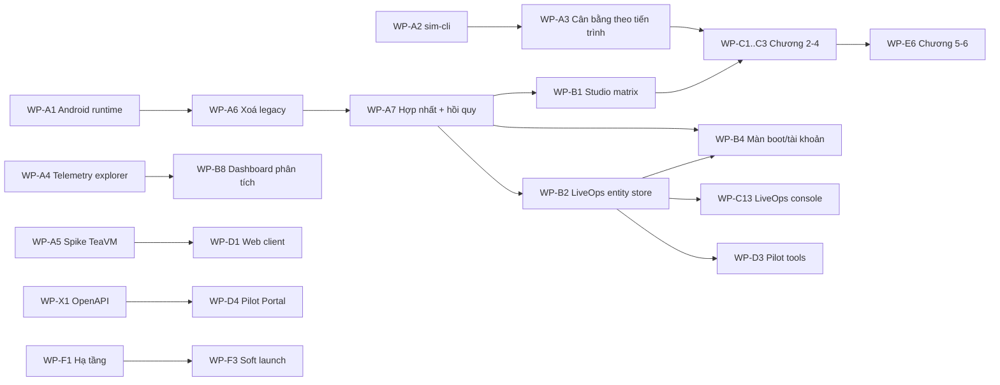

# 05 · Kế hoạch gói việc (Work Packages)

> Cập nhật 2026-09-26 · Nhánh `rewrite` · Nguồn chiến lược: [MASTER_PLAN.md](../MASTER_PLAN.md) · Tiến độ: [PROGRESS.md](../PROGRESS.md)
>
> Tài liệu này dành cho người **nhận việc và kiểm thử**. Mỗi gói việc (WP) tự đủ: mục tiêu, phạm vi, các bước, file chính, tiêu chí nghiệm thu và lệnh test. Người khác phải kiểm tra được kết quả mà không cần hỏi lại người làm.

## 0. Cách dùng tài liệu này

### 0.1 Quy trình nhận một WP
1. Chọn WP có trạng thái **Sẵn sàng** và mọi WP phụ thuộc đã **Xong**.
2. Tạo nhánh từ `rewrite`: `git switch -c rewrite-<wp-id-viết-thường>` (ví dụ `rewrite-b1`).
3. Đọc các mục "Đọc trước" của WP, cùng [02-architecture.md](02-architecture.md) và [03-engineering-rules.md](03-engineering-rules.md).
4. Làm theo "Các bước". Không mở rộng phạm vi. Việc phát sinh thì ghi thành WP mới ở cuối file này (mục 9).
5. Chạy **toàn bộ** "Cách test" của WP và **cổng test chung** ở mục 0.3.
6. Commit theo Conventional Commits, **không tạo git tag**. Merge về `rewrite` khi nghiệm thu đạt.
7. Cập nhật [PROGRESS.md](../PROGRESS.md): tick WP, ghi số liệu mới (số màn, số test).

### 0.2 Trạng thái
| Ký hiệu | Nghĩa |
|---|---|
| **Xong** | Đã merge vào `rewrite`, nghiệm thu đạt |
| **Đang làm** | Có nhánh riêng, chưa merge |
| **Sẵn sàng** | Mọi phụ thuộc đã xong, có thể nhận |
| **Chờ** | Còn phụ thuộc chưa xong |
| **Cần quyết định** | Phải có ADR hoặc chủ dự án chốt trước |

### 0.3 Cổng test chung (bắt buộc trước mọi merge)
```bash
./gradlew --settings-file settings-test.gradle \
  :game:domain:test :game:application:test :game:screens:test :game:content:test \
  :game:infrastructure:test :game:content:compileContent :game:client:test \
  :server:app:test :tools:architecture:test
node tools/screen-catalog/catalog.mjs --check
tools/test-agent/run-desktop.sh "$PWD/agent-reports/scenario"                       # core-loop
SCENARIO=chapter1 tools/test-agent/run-desktop.sh "$PWD/agent-reports/chapter1"
```
Chạy thêm theo phạm vi thay đổi:

| Thay đổi chạm vào | Lệnh bổ sung |
|---|---|
| Cloud, server | `SCENARIO=cloud tools/test-agent/run-desktop.sh "$PWD/agent-reports/cloud"` |
| Thêm hoặc sửa màn game | `MODE=explore tools/test-agent/run-desktop.sh "$PWD/agent-reports/explore"` (0 lỗi, phủ 100% màn đã đăng ký) |
| Web Console | `tools/test-agent/console/run-console.sh --out="$PWD/agent-reports/console"` |
| Android | `./gradlew :game:platform-android:assembleDebug`, và `tools/test-agent/run-android.sh` sau khi WP-A1 xong |

Chi tiết từng lệnh ở [06-testing.md](06-testing.md) và [07-setup-and-environments.md](07-setup-and-environments.md).

### 0.4 Ký hiệu kỹ năng
Mã kỹ năng (`K-…`) được định nghĩa ở [04-skills-and-roles.md](04-skills-and-roles.md). Ước lượng tính bằng **người-ngày** cho một người đã có kỹ năng đó và đã đọc handbook.

---

## 1. Bức tranh tổng

### 1.1 Hiện trạng (2026-09-26)
| Mảng | Đã có | Mục tiêu launch |
|---|---:|---:|
| Màn game chạy thật | 133 | 357 |
| Màn web (Console/Studio/QA) chạy thật | 17 | 672 |
| Anh hùng | 6 | 18 |
| Chương truyện | 1 | 6 |
| Test JVM | domain 35 · application 30 · content 7 · infrastructure 8 · client 2 · screens 3 · server 7 | — |
| Kịch bản test agent | `core-loop`, `chapter1`, `cloud`, explorer, `console` | — |

### 1.2 Mốc phủ màn theo phase (MASTER_PLAN §12)
P2 = 110 (**đạt**) · P4 = 330 · P5 = 620 · P6 = 760 · P7 = 1.029. Bảng "đã làm / tổng" theo module game nằm ở [08-recipes-game-client.md](08-recipes-game-client.md).

### 1.3 Đồ thị phụ thuộc


### 1.4 Thứ tự làm đề xuất
| Đợt | WP | Kết quả đợt |
|---|---|---|
| **A** | A1–A7 | Hàng đợi cũ xong, repo sạch legacy, Android đạt P2 |
| **B** | B1–B9, X2 | Đạt tiêu chí P4: ≥ 330 màn, Studio đẩy content dev→qa |
| **C** | C1–C14, X3 | Đạt P5: chương 2–4, 620 màn, cân bằng trong dải |
| **D** | D1–D5, X1 | Đạt P6: 4 nền tảng smoke, pilot 100 người |
| **E** | E1–E9 | Đạt P7: 1.029 màn, xác thực replay 100% |
| **F** | F1–F4, X4, X5 | Soft launch |

Các WP trong cùng một đợt chạy song song được, trừ khi có mũi tên phụ thuộc.

---

## 2. Đợt A — Đóng hàng đợi hiện tại

### WP-A1 · Android chạy thật và test agent trên emulator
| Trường | Giá trị |
|---|---|
| Phase | P2 (tiêu chí "chơi hết chương 1 trên Android") |
| Trạng thái | **Đang làm** — nhánh `rewrite-android` |
| Kỹ năng | K-AND, K-GDX, K-AUTO, K-CI |
| Phụ thuộc | — |
| Ước lượng | 3 |

**Mục tiêu:** chạy kịch bản `core-loop` và `chapter1` trên Android emulator bằng cùng automation protocol như desktop.

**Các bước**
1. Trong `AndroidLauncher`, khởi động `AutomationServer(47017)` khi `BuildFlavor.automation` bật. Build debug dùng flavor `QA`. Server chỉ bind `127.0.0.1`, dừng ở `onDestroy`.
2. Viết `tools/test-agent/run-android.sh` theo mẫu `run-desktop.sh`:
   - build APK, khởi động emulator nếu chưa có thiết bị, chờ `sys.boot_completed`;
   - `adb install -r`;
   - tắt hộp thoại immersive: `adb shell settings put secure immersive_mode_confirmations confirmed`;
   - xoá dữ liệu app, khởi chạy activity;
   - `adb forward tcp:47117 tcp:47017`;
   - `node tools/test-agent/run.mjs --port=47117 …`;
   - thu `logcat`.
3. Sửa các lỗi chỉ xuất hiện trên Android (đường dẫn, mật độ màn hình, input chạm, thời gian khung hình). Chỉ được sửa client, không được sửa kịch bản để bỏ bước.
4. Thêm job CI `android-agent` dùng `reactivecircus/android-emulator-runner@v2`.

**File chính:**
- `game/platform-android/src/main/java/com/pxworld/android/AndroidLauncher.java`
- `tools/test-agent/run-android.sh`
- `tools/test-agent/ANDROID.md`
- `.github/workflows/ci.yml`

**Nghiệm thu**
- [ ] `tools/test-agent/run-android.sh` in `PASSED scenario` cho `core-loop`.
- [ ] `SCENARIO=chapter1 tools/test-agent/run-android.sh` in `PASSED`.
- [ ] Build release (flavor `PILOT`) không mở cổng ra ngoài `127.0.0.1`.
- [ ] Cổng test chung xanh (desktop không hồi quy).

**Cách test:** khởi động emulator bằng lệnh ở [07-setup-and-environments.md](07-setup-and-environments.md), rồi chạy hai lệnh ở phần nghiệm thu. Báo cáo nằm ở `report.json`, ảnh và `logcat.txt` trong thư mục `--out`.

**Rủi ro:** emulator trên Windows cần `-gpu swiftshader_indirect -feature -Vulkan`. Khi render bằng phần mềm, trận đấu chậm, nên timeout của kịch bản có thể phải nới. Nếu nới, phải ghi lý do.

---

### WP-A2 · `sim-cli` — mô phỏng cân bằng độc lập
| Trường | Giá trị |
|---|---|
| Phase | P1 (nợ) |
| Trạng thái | **Đang làm** — nhánh `rewrite-sim` |
| Kỹ năng | K-KT, K-DOM, K-GD |
| Phụ thuộc | — |
| Ước lượng | 2 |

**Mục tiêu:** có module `:tools:sim-cli` chạy đội hình tuỳ ý trên encounter bất kỳ qua N seed. Kết quả gồm tỉ lệ thắng, hòa và thua; số vòng trung bình và p90; sát thương gây ra, sát thương nhận, hồi máu và số lần tử trận theo từng đơn vị. Có hai định dạng xuất: `table` và `json`.

**Các bước**
1. Tách lõi mô phỏng khỏi `ContentCompilation.simulate` thành lớp có thể tái dùng và test được.
2. Module mới `:tools:sim-cli`, khai báo trong **cả** `settings.gradle` và `settings-test.gradle`.
3. Tham số dòng lệnh: `--encounter <id|all> --heroes id[:level[:stars]],… --lineup <preset> --seeds N --seed-start S --format table|json --content <dir>`.
4. Viết unit test cho phần đọc tham số, phần tổng hợp và tính tất định (cùng seed thì ra cùng kết quả).
5. Thêm `:tools:sim-cli:test` vào job `jvm` của CI.

**Nghiệm thu**
- [ ] `./gradlew --settings-file settings-test.gradle :tools:sim-cli:run --args="--encounter encounter.dawnvillage_01.e1 --heroes hero.aldric:1:1 --seeds 200"` in bảng có tỉ lệ thắng.
- [ ] Chạy hai lần với cùng tham số cho output giống hệt từng byte.
- [ ] ID không tồn tại thì mã thoát ≠ 0 và có thông báo rõ.
- [ ] Không có lời gọi `Random()` hoặc `System.currentTimeMillis` trong lõi mô phỏng (test kiến trúc xanh).

---

### WP-A3 · Cân bằng theo tiến trình chương
| Trường | Giá trị |
|---|---|
| Phase | P1/P5 |
| Trạng thái | **Đang làm** — nhánh `rewrite-sim` |
| Kỹ năng | K-GD, K-DOM, K-KT |
| Phụ thuộc | WP-A2 |
| Ước lượng | 4 |

**Mục tiêu:** mỗi encounter có một **vai trò** (`tutorial`/`normal`/`gate`/`boss`), một **dải tỉ lệ thắng mục tiêu** và một **đội hình tham chiếu theo tiến trình**. Đội hình tham chiếu là roster, cấp và sao mà người chơi thật có ở thời điểm gặp encounter. Content compiler báo lỗi khi tỉ lệ thắng nằm ngoài dải.

**Các bước**
1. Dò đường chơi chương 1 (quest → dialogue → NPC chiêu mộ → encounter → thưởng XP) và lập preset đội hình dưới dạng **dữ liệu** trong `content/balance/`.
2. Ghi vai trò vào encounter và dải mục tiêu vào balance data. Chính sách ghi trong ADR 0014.
3. `compileContent` hoặc `ContentTest` đánh giá mọi encounter theo dải.
4. Chỉ chỉnh số liệu content (quái, cấp, sao, đội hình), **không** sửa công thức trong `game/domain`. File golden phải giữ nguyên từng byte.
5. Cập nhật `content/BALANCE_NOTES.md`.

**Nghiệm thu**
- [ ] Mọi encounter nằm trong dải của vai trò mình (bảng trong `BALANCE_NOTES.md`).
- [ ] `git diff rewrite -- game/domain/src/test/resources` trống.
- [ ] `core-loop` và `chapter1` vẫn PASSED. Kịch bản phản ánh cách chơi thật, nên nếu lệch thì chỉnh preset, không chỉnh kịch bản.

---

### WP-A4 · Telemetry explorer trong Console
| Trường | Giá trị |
|---|---|
| Phase | P4 |
| Trạng thái | **Đang làm** — nhánh `rewrite-telemetry` |
| Kỹ năng | K-KTOR, K-WEB, K-CDP |
| Phụ thuộc | — |
| Ước lượng | 3 |

**Mục tiêu:** staff lọc telemetry theo khoảng thời gian (preset 1h/24h/7d/30d hoặc tuỳ chọn), theo tên sự kiện và theo phiên bản client. Trang hiển thị biểu đồ theo bucket, bảng tổng và bảng sự kiện thô có phân trang.

**API:**
- `GET /admin/telemetry/summary?from&to&bucket&name&clientVersion`
- `GET /admin/telemetry/events?from&to&name&accountId&limit&cursor`

**Nghiệm thu**
- [ ] Test server gồm: lọc khoảng thời gian, bucket có điền 0, lọc tên, phân trang, lỗi 400 khi tham số sai, 403 khi sai vai trò.
- [ ] Trang Console dùng `WebScreenId` có sẵn trong catalog; bộ lọc nằm trong URL hash (tải lại trang vẫn giữ).
- [ ] Console agent có bước telemetry, toàn kịch bản PASSED.

---

### WP-A5 · Spike TeaVM (web client)
| Trường | Giá trị |
|---|---|
| Phase | P6 (spike sớm) |
| Trạng thái | **Đang làm** — nhánh `rewrite-web` |
| Kỹ năng | K-TEAVM, K-GDX, K-CDP |
| Phụ thuộc | — |
| Ước lượng | 3 (time-box) |

**Mục tiêu:** trả lời **go/no-go** có bằng chứng cho câu hỏi: game client thật có chạy trong trình duyệt qua gdx-teavm không? Bằng chứng gồm: build được, smoke test headless tới `boot.legal_notice`, kích thước bundle, thời gian tới màn đầu, và danh sách chặn cụ thể nếu có.

**Nghiệm thu**
- [ ] ADR 0009 ghi kết quả (phiên bản, số đo, quyết định).
- [ ] Nếu **go**: `:game:platform-web:buildWeb` và `tools/test-agent/web/web-smoke.mjs` PASSED; có job CI `web-client`.
- [ ] Nếu **no-go**: module chỉ được bật khi truyền `-Ppxworld.web=true`, không làm hỏng build mặc định; ADR liệt kê lớp/hàm chặn.

---

### WP-A6 · Xoá module legacy
| Trường | Giá trị |
|---|---|
| Phase | P2 (chuyển đổi) |
| Trạng thái | **Chờ** WP-A1 |
| Kỹ năng | K-CI, K-KT |
| Phụ thuộc | WP-A1 (Android đạt P2) |
| Ước lượng | 1 |

**Mục tiêu:** một commit riêng có tiêu đề `chore: remove legacy core` xoá `core/`, `lwjgl3/`, `android/`, `ios/`, `html/`. Ba module sau phụ thuộc `core` nên phải xoá cùng.

**Các bước**
1. Chuyển `lwjgl3/src/main/resources/libgdx{16,32,64,128}.png` sang `game/platform-desktop/src/main/resources/`, rồi bỏ dòng `resources.srcDir(... "lwjgl3/src/main/resources")` trong `game/platform-desktop/build.gradle.kts`.
2. Chuyển icon ứng dụng có giá trị (`lwjgl3/icons/*`, `android/res/drawable-*/ic_launcher.png`, `ios/data/Media.xcassets/AppIcon.appiconset/*`) sang `art/platform-icons/{desktop,android,ios}/`. Ghi nguồn vào `art/LICENSES.md`.
3. `settings.gradle`: bỏ `include 'lwjgl3', 'core', 'android', 'ios', 'html'`. `settings-test.gradle`: bỏ `include 'core', 'lwjgl3'`.
4. `build.gradle`: bỏ khối `legacyModules`, `eclipse`/`idea` và các repo snapshot. Giữ `buildscript` AGP vì `game/platform-android` cần.
5. `gradle.properties`: bỏ `graalHelperVersion`, `enableGraalNative`, `robovmVersion`, `gwtFrameworkVersion`, `gwtPluginVersion`, `ashleyVersion`, `projectVersion` (chỉ bỏ khi không còn nơi nào dùng — kiểm tra bằng `git grep`).
6. `.github/workflows/ci.yml`: bỏ `:core:test :lwjgl3:compileJava` và `core/build/reports/tests`.
7. `.gitignore`: bỏ các dòng của module đã xoá.
8. Viết lại `README.md` theo cấu trúc mới (trỏ tới `docs/handbook/README.md`). Chuyển `INTERNAL_README.md` sang `docs/legacy/INTERNAL_README.md` hoặc xoá.
9. **Giữ** `dashboard/` cho tới khi WP-B1 chuyển xong trình sửa lưới encounter 3×3. **Giữ** `assets/` vì đây là nguồn của asset pipeline. **Giữ** đường dẫn `lwjgl3/data` trong `LegacySaveMigration` vì đó là vị trí save cũ trên máy người chơi, không phải module.

**Nghiệm thu**
- [ ] `git grep -n -E "':core'|:core:|lwjgl3:|project\(':android'\)"` không còn kết quả ngoài `docs/`.
- [ ] Cổng test chung xanh. Explorer PASSED. `assembleDebug` build được.
- [ ] Cửa sổ desktop vẫn có icon (chụp ảnh kiểm tra).
- [ ] Số test JVM chỉ giảm đúng 46 test legacy `core`. Ghi vào PROGRESS.

---

### WP-A7 · Hợp nhất đợt A và hồi quy toàn phần
| Trường | Giá trị |
|---|---|
| Trạng thái | **Chờ** A1–A6 |
| Kỹ năng | K-CI, K-QA |
| Ước lượng | 1 |

**Các bước**
1. Merge lần lượt `rewrite-android`, `rewrite-sim`, `rewrite-telemetry`, `rewrite-web` vào `rewrite` bằng `--no-ff`, giải xung đột ở `ci.yml` và `settings*.gradle`.
2. Chạy cổng test chung, thêm `cloud`, explorer, console agent và Android agent.
3. Cập nhật `PROGRESS.md` (số màn, số test, trạng thái P2/P4/P6) và `MASTER_PLAN.md` nếu có quyết định thay đổi (ví dụ go/no-go TeaVM).

**Nghiệm thu:** mọi lệnh ở bước 2 PASSED, ghi đầu ra vào `PROGRESS.md`.

---

## 3. Đợt B — Đạt tiêu chí P4 (≥ 330 màn, Studio đẩy content dev→qa)

> Tính số màn sau đợt B: game 133 + 16 (B4) + 8 (B5) + 11 (B6) = **168**. Web 17 + 2 (A4) + 102 (B1) + 55 (B2) + 10 (B3) + 6 (B7) + 6 (B8) + 2 (B9) = **200**. Tổng **≈ 368**.

### WP-B1 · Studio "matrix" — màn thực thể nội dung sinh từ schema
| Trường | Giá trị |
|---|---|
| Phase | P4 |
| Trạng thái | **Chờ** A7 |
| Kỹ năng | K-WEB, K-KTOR, K-SER |
| Ước lượng | 8 |

**Mục tiêu:** 17 loại content đang có × 6 view = **102 màn**, dùng chung một bộ component. Screen ID lấy từ catalog: `studio.content_entities.<kind>.{list,detail,editor,history,bulk,promote}`.

Ánh xạ thư mục content → thực thể trong catalog:

| Thư mục `content/` | Thực thể catalog | Ghi chú |
|---|---|---|
| hero_classes, heroes, skills, statuses, items, equipment, enemies, encounters, maps, npcs, dialogues, quests, achievements, checkin_tables, currencies, audio_cues | trùng tên | |
| localization | `loc_keys` | view `editor` sửa từng key cho vi/en |

**Các bước**
1. Server:
   - `GET /studio/kinds/{kind}/records/{id}/history`: lấy lịch sử bản ghi từ các release đã đóng gói, dùng `ContentDiff` theo từng bản ghi.
   - `POST /studio/kinds/{kind}/bulk`: nhận JSON Patch hoặc danh sách bản ghi, luôn có `dryRun`, trả về validation theo từng bản ghi.
   - `POST /studio/kinds/{kind}/records/{id}/promote`: đẩy release chứa bản ghi sang kênh kế tiếp `dev→qa→staging→pilot→prod`, ghi audit kèm lý do.
2. Console:
   - Component `EntityListPage`, `EntityDetailPage`, `EntityEditorPage` (dùng `SchemaForm`), `EntityHistoryPage`, `EntityBulkPage`, `EntityPromotePage`.
   - Nhận `kind` từ route `#/studio/<kind>/<view>/<id?>`.
   - Screen ID ghép từ `kind` và `view` và phải thuộc union `WebScreenId`. Viết hàm `entityScreenId(kind, view)` trả về `WebScreenId`, có test kiểu.
3. List có tìm kiếm theo ID/tên, lọc theo trường enum, sắp xếp, phân trang phía client.
4. Detail hiển thị bản ghi, các bản ghi tham chiếu tới nó (reverse refs) và bản ghi nó tham chiếu. Tất cả là link sang detail tương ứng.
5. Chuyển **trình sửa lưới encounter 3×3** từ `dashboard/` sang `studio.editors.encounter_grid`, dùng chung API. Việc này mở khoá bước "xoá `dashboard/`" (ghi WP mới khi xong).
6. Console agent: một bước lặp qua **mọi** `kind` × `view`, xác nhận màn render không lỗi (`pageErrors` rỗng) và có `data-screen-id` đúng. Thêm ba bước sâu: sửa `item` qua form → dry-run → lưu; bulk sửa giá 3 item; promote dev→qa.

**Nghiệm thu**
- [ ] 102 screen ID được console agent ghé, `pageErrors = []`.
- [ ] Sửa bản ghi sai schema thì thấy lỗi 422 hiển thị theo trường; bản ghi không bị ghi.
- [ ] Promote ghi `audit_log` có lý do; `/content/channels` phản ánh kênh mới.
- [ ] Tiêu chí P4 "Studio đẩy content pack dev→qa" chứng minh bằng ảnh chụp và bước agent.

---

### WP-B2 · LiveOps entity store + 11 thực thể vận hành
| Trường | Giá trị |
|---|---|
| Phase | P4 |
| Trạng thái | **Chờ** A7 |
| Kỹ năng | K-KTOR, K-WEB, K-SEC |
| Ước lượng | 8 |

**Mục tiêu:** một kho thực thể vận hành **chung** ở server, gồm bảng `liveops_entities(kind, id, body JSON, revision, updated_by, updated_at)` và `liveops_entity_history`. Mỗi `kind` khai báo JSON Schema trong code server. Console dùng lại bộ component của B1 (5 view: `list, detail, editor, history, bulk`).

**Đợt đầu (11 thực thể × 5 = 55 màn)**

| Thực thể | Dùng bởi | Ghi chú |
|---|---|---|
| `feature_flags` | client, server | Tắt/bật tính năng theo mùa (D12 trong MASTER_PLAN) |
| `maintenance_windows` | WP-B4 `game.boot.maintenance` | Server trả 503 kèm lịch |
| `announcements` | client (thông báo), site | |
| `news_posts`, `patch_notes` | site, client | |
| `mail_templates` | gửi thư hàng loạt | Tham số `{player}`, `{amount}` |
| `promo_codes` | đổi mã | Redeem ở WP-B5 |
| `word_filters` | tên, chat | Áp khi đặt tên |
| `staff_users` | có sẵn (`/admin/staff`) | Chuyển sang giao diện chung |
| `roles` | RBAC | Đọc từ `Roles`; sửa quyền cần ADR |
| `content_releases` | có sẵn | Chuyển sang giao diện chung |

**Các bước**
1. Migration `V<n>__liveops_entities.sql`.
2. Route `/liveops/{kind}` CRUD, có `revision` (409 khi lệch, giống saves), lịch sử, bulk có dry-run. Mọi thao tác ghi đều vào audit kèm lý do.
3. Viết `LiveopsSchemas.kt` khai báo schema theo kind. Dùng kotlinx.serialization để sinh schema, giống `ContentSchema`.
4. Endpoint công khai chỉ đọc cho client: `GET /liveops/public` trả về flag, bảo trì và thông báo đang hiệu lực, có ETag.
5. Console agent: vòng qua 55 màn, cộng thêm luồng tạo flag → client đọc thấy flag.

**Nghiệm thu:** test server cho CRUD, 409, bulk dry-run và phân quyền; console agent ghé đủ 55 màn; `feature_flags` bật và tắt được một màn game (ví dụ ẩn nút `event_hub`), chứng minh bằng test agent desktop.

---

### WP-B3 · Hoàn thiện module Players trong Console (10 màn)
| Trường | Giá trị |
|---|---|
| Trạng thái | **Chờ** A7 |
| Kỹ năng | K-KTOR, K-WEB |
| Ước lượng | 5 |

**Màn:**
- Đọc từ save JSON: `console.players.player_heroes`, `player_inventory`, `player_ledger` (đọc `ledgerTail`).
- Đọc từ `battle_validations`: `player_battles`.
- Đọc từ telemetry: `player_sessions`, `player_devices`.
- Ghi: `player_mail_send`, `player_notes` (bảng mới `player_notes`), `player_gdpr_export` (zip JSON gồm tài khoản, save, telemetry, audit), `player_gdpr_delete` (xoá mềm và ẩn danh, bắt buộc lý do, ghi audit, cần vai trò `staff_admin`).

**Nghiệm thu:** mỗi màn có một bước console agent; test server cho export và delete, kiểm tra dữ liệu thật sự bị ẩn danh; sau delete, token cũ trả 401.

---

### WP-B4 · Màn boot và tài khoản trong game (16 màn)
| Trường | Giá trị |
|---|---|
| Trạng thái | **Chờ** A7, B2 |
| Kỹ năng | K-GDX, K-KTOR, K-SEC |
| Ước lượng | 7 |

**Màn:** `game.boot.{age_gate, tos_accept, content_download, maintenance, force_update, server_select, login_hub, register_email, verify_email, forgot_password, reset_password, guest_warning, account_link, account_switch, ban_notice, reconnect}`

**Hợp đồng server cần thêm**
- Header `X-Client-Version` trên mọi request. Server trả **426** khi client nhỏ hơn `minClientVersion` → `force_update`.
- `503` có `Retry-After` và lịch từ `maintenance_windows` → `maintenance`.
- `403` có `{"sanction": {...}}` → `ban_notice`.
- `POST /auth/password/forgot` và `POST /auth/password/reset` bằng mã 6 số. Ở dev, mail ghi vào log hoặc bảng `outbox`. **Không** gửi mail thật.
- `POST /auth/link` nâng tài khoản khách lên email.

**Client:**
- Ghi đồng ý (tuổi, điều khoản) vào `GameState.settings` kèm phiên bản điều khoản.
- `content_download` so manifest (`/content/manifest`) với pack đang có. P4 chỉ cần hiển thị và tải pack mới vào `Gdx.files.local`.

**Nghiệm thu:** kịch bản test agent mới `boot-flows.mjs`, cần `WITH_SERVER=1`, đi qua: tuổi → điều khoản → login_hub → đăng ký → đăng xuất → quên mật khẩu → đổi mật khẩu → đăng nhập → bảo trì (bật bằng API) → force update (đặt min version) → bị khoá → gỡ khoá. Explorer vẫn 0 lỗi.

---

### WP-B5 · Xã hội mức nhẹ trong game (8 màn)
| Trường | Giá trị |
|---|---|
| Trạng thái | **Chờ** A7 |
| Kỹ năng | K-GDX, K-KT |
| Ước lượng | 4 |

**Màn:** `game.social.{mail_detail, mail_claim_all, notification_center, notification_detail, profile_self, profile_edit, avatar_select, frame_select}`

Avatar và khung là content mới (`content/avatars`, `content/frames`). Đăng ký kind mới trong `ContentKinds`, xuất schema.

**Nghiệm thu:** thêm bước vào kịch bản `cloud` (nhận tất cả thư); explorer phủ đủ 8 màn; `ClientTextTest` xanh.

---

### WP-B6 · Giao diện tiến trình (11 màn)
| Trường | Giá trị |
|---|---|
| Trạng thái | **Chờ** A7 |
| Kỹ năng | K-GDX, K-GD, K-NARR |
| Ước lượng | 5 |

**Màn:** `game.progression.{quest_main, quest_daily, quest_weekly, quest_accept, quest_complete, chapter_select, chapter_intro, story_recap, codex_lore, jukebox, title_collection}`

Content mới:
- Quest ngày và tuần: `content/quests/daily.json` và `weekly.json`, reset theo `GameClock.epochDay()`.
- `content/titles`, `content/lore_entries`.

Luật reset ngày/tuần nằm trong `application`, có unit test với đồng hồ giả.

**Nghiệm thu:** unit test cho reset theo ngày và tuần; explorer phủ đủ; chạy lại `chapter1` để xác nhận `quest_main` hiển thị đúng quest hiện tại.

---

### WP-B7 · QA Hub (6 màn) và đẩy báo cáo agent từ CI
| Trường | Giá trị |
|---|---|
| Trạng thái | **Chờ** A7 |
| Kỹ năng | K-WEB, K-AUTO, K-CI |
| Ước lượng | 4 |

**Màn:** `qa.quality.{agent_coverage, agent_scenarios, smoke_checklist, save_fixtures, known_issues}`, `qa.insights.agent_failure_clusters` (nhóm lỗi theo chữ ký stack đầu tiên)

**CI:** các job agent chạy `run.mjs --upload=$PXWORLD_QA_API --token=$PXWORLD_QA_TOKEN` khi có secret. Không có secret thì bỏ qua, không làm fail job.

**Nghiệm thu:** trang `agent_coverage` hiển thị % màn đã phủ theo catalog và khớp với `report.json` của explorer.

---

### WP-B8 · Dashboard phân tích từ dữ liệu có sẵn (6 màn)
| Trường | Giá trị |
|---|---|
| Trạng thái | **Chờ** A4 |
| Kỹ năng | K-KTOR, K-WEB, K-DATA |
| Ước lượng | 4 |

**Màn:**
- `console.dashboards.{realtime, battle_balance}`
- `console.analytics.{encounter_winrates, hero_pickrates, item_usage, funnels}`

Nguồn dữ liệu:
- `battle_validations`: tỉ lệ thắng thật theo encounter, so với dải mục tiêu của WP-A3.
- Telemetry: funnel theo danh sách tên sự kiện do người dùng chọn.

**Nghiệm thu:** test server cho từng truy vấn tổng hợp; console agent seed dữ liệu và kiểm tra số liệu hiển thị.

---

### WP-B9 · Anti-cheat cơ bản (2 màn)
| Trường | Giá trị |
|---|---|
| Trạng thái | **Chờ** A7 |
| Kỹ năng | K-KTOR, K-DOM |
| Ước lượng | 2 |

**Màn:** `console.anticheat.{battle_validation_failures, anticheat_flags}`

Mỗi lần `/battles/validate` bị từ chối thì tự tạo flag cho tài khoản. Staff xử lý flag (bỏ qua hoặc khoá) và mọi xử lý được ghi audit.

**Nghiệm thu:** test server: replay giả mạo tạo flag; console agent xử lý một flag.

---

## 4. Đợt C — Đạt tiêu chí P5 (nội dung, chế độ chơi, 620 màn)

> Nguyên tắc: mọi nội dung là **dữ liệu** trong `content/`, được compiler kiểm và cân bằng theo dải (WP-A3). Art chưa có thì đánh dấu `art_pending` và dùng placeholder (MASTER_PLAN §16). Không được chặn tiến độ chờ art.

### WP-C1 · Chương 2 — Vườn Sương (`mistgarden`)
| Trường | Giá trị |
|---|---|
| Kỹ năng | K-GD, K-NARR, K-GDX, K-ART |
| Phụ thuộc | A3, B1 |
| Ước lượng | 10 |

- **Map:** `map.mistgarden_01..06` đã có trong `content/maps`; thêm object `npc`/`enemies`/`teleport` trong Tiled.
- **Cơ chế vùng:** sương mù. Quái có `evasion` cao, người chơi có kỹ năng tăng `accuracy`. Đây là dữ liệu, không phải code: dùng status sẵn có hoặc thêm status mới vào `content/statuses`.
- **Truyện:** 5 quest chính `quest.main.ch2_01..05`, 2 quest phụ, 6–8 hội thoại, 3 NPC, 1 anh hùng chiêu mộ được (mảnh cổ vật thứ 2).
- **Trận:** 8 encounter (có vai trò), 1 boss nhiều pha, dùng `boss_phases` nếu domain hỗ trợ, nếu không thì ghi WP domain mới.
- **Test:** kịch bản `chapter2.mjs` chơi từ đầu chương 2 bằng save fixture cuối chương 1; `compileContent` đạt mọi dải.

### WP-C2 · Chương 3 — Hoang Mạc Tro (`ashwaste`)
Giống C1. Cơ chế "Bỏng" do bão cát: status `burn` gắn theo map qua `encounter.environment`. Boss Bọ Cạp Tro. Kịch bản `chapter3.mjs`. Ước lượng 10.

### WP-C3 · Chương 4 — Rừng Thạch Anh (`crystalwood`)
Cần map mới (Tiled) và tileset mới (K-ART). Cơ chế: tinh thể phản sát thương, dùng status `reflect`. Kịch bản `chapter4.mjs`. Ước lượng 14, trong đó 6 ngày art.

### WP-C4 · Roster 18 anh hùng
12 anh hùng mới, mỗi lớp 3 người. Cần skill riêng (3 skill mỗi anh hùng), passive, atlas (`art_pending` cho tới khi có art). Cân bằng bằng `sim-cli`: cùng lớp thì tỉ lệ thắng trong đội chuẩn lệch không quá ±5%. Ước lượng 12 (content và cân bằng), art tính riêng.

### WP-C5 · Làng (`game.village.*`, 10 màn) · WP-C6 Thu thập (`game.gathering.*`, 6) · WP-C7 Lò rèn (`game.smithy.*`, 8) · WP-C8 Thú cưng (`game.companions.*`, 6) · WP-C9 Thân thiết (`game.bonds.*`, 7)
Mỗi WP theo cùng một khung:

| Bước | Nội dung |
|---|---|
| 1 | Domain: model và luật thuần trong `game/domain` hoặc `game/application`, có unit test (sản xuất theo thời gian dùng `GameClock`, không dùng đồng hồ hệ thống) |
| 2 | Content kind mới (`buildings`, `recipes`, `gems`, `pets`, `bond_levels`…), đăng ký `ContentKinds`, xuất schema, validator kiểm tham chiếu |
| 3 | Save: thêm trường vào `GameState` **tương thích tiến**, bản save cũ vẫn đọc được (thêm fixture vào `SaveAndImportTest`) |
| 4 | Màn client theo công thức ở [08-recipes-game-client.md](08-recipes-game-client.md) |
| 5 | Cheat debug để explorer có dữ liệu |
| 6 | Kịch bản test agent ngắn cho luồng chính (ví dụ `smithy.mjs`: chế đồ → khảm ngọc → kiểm chỉ số tăng) |

Ước lượng: C5 8 · C6 5 · C7 7 · C8 6 · C9 6.

### WP-C10 · Chế độ chơi PvE (≈ 14 màn trong `game.modes.*`)
`tower_home, tower_floor, dungeon_list, dungeon_detail, world_boss, event_hub, event_detail, event_shop, event_ranking, limited_tasks, expedition_send, expedition_result` (cùng `boss_phase` và `revive_prompt` trong `game.battle`). Tháp và hầm ngục là chuỗi encounter do content định nghĩa. Sự kiện đọc từ LiveOps (B2, C13). Ước lượng 12.

### WP-C11 · Kinh tế còn lại (11 màn)
`game.economy.{shop_rotating, iap_store, iap_receipt, iap_restore, banner_detail, recruit_animation, recruit_result_multi, monthly_pass, battle_pass, battle_pass_rewards, energy_refill}`. IAP chỉ ở chế độ **sandbox**: server có module `economy` xác nhận biên lai giả ở dev. Google và Apple thật thuộc WP-E7. Pity của chiêu mộ nằm trong domain, có test phân phối qua 100.000 lần quay bằng seed. Ước lượng 10.

### WP-C12 · Lấp màn còn thiếu ở các module đã có
| Module | Màn còn thiếu |
|---|---|
| battle | battle_intro, lineup_confirm, item_select, auto_battle, battle_speed, ultimate_cutin, boss_phase, revive_prompt, replay_share |
| heroes | hero_skill_upgrade, hero_awaken |
| inventory | equipment_refine, set_bonus, bag_expand |
| world | inn_rest, chest_open, encounter_locked, day_night_info, weather_info, photo_mode, emote_wheel, interaction_prompt, puzzle_switch, puzzle_sequence, signpost_read, lore_book, save_point, hud_customize |
| onboarding | hero_create_look, prologue, tutorial_interact, tutorial_skill, tutorial_equip, tutorial_shop |
| settings | settings_keybind, settings_notifications, parental_controls, spending_limit, contact_support, ticket_list, ticket_detail, feedback_survey |
| progression | cutscene_player, cutscene_skip, ending_select, ending_credits, new_game_plus, cg_album |
| debug | debug_network |

Chia theo module thành các nhánh nhỏ, mỗi nhánh ≤ 10 màn. Ước lượng tổng 20.

### WP-C13 · LiveOps console
`console.liveops.{liveops_calendar, remote_config, segment_builder, ab_test_results, store_pricing_matrix, promo_redemptions, economy_simulator, drop_rate_audit}`, cùng các thực thể `events, banners, offers, bundles, segments, ab_tests, leaderboard_seasons, battle_pass_seasons` trên entity store của B2 (8 × 5 = 40 màn). Ước lượng 12.

### WP-C14 · Explorer nightly và mục tiêu phủ 95%
Thêm workflow `nightly.yml` (cron) chạy explorer trên desktop và Android, console agent đầy đủ, `sim-cli --encounter all --seeds 5000`, rồi đẩy báo cáo lên QA Hub. Nghiệm thu: `agent_coverage` ≥ 95% màn game đã phát hành. Ước lượng 3.

---

## 5. Đợt D — Đạt tiêu chí P6 (đa nền tảng và pilot)

| WP | Nội dung | Phụ thuộc | Kỹ năng | Ước lượng | Nghiệm thu |
|---|---|---|---|---:|---|
| **D1** Web client | Hoàn thiện `game/platform-web` sau spike go: save qua IndexedDB/`localStorage`, cloud qua fetch, âm thanh WebAudio, tải asset theo màn | A5 = go | K-TEAVM, K-GDX | 10 | `web-smoke.mjs` và kịch bản `core-loop` chạy qua cầu `postMessage` (MASTER_PLAN §13.2) |
| **D2** iOS | `game/platform-ios` bằng RoboVM. **Cần quyết định:** Fleks phát bytecode Java 17 (ADR 0001 ghi rủi ro RoboVM). Spike 3 ngày trên macOS trước | máy macOS | K-IOS | 3 spike + 10 | Smoke tới `boot.legal_notice` trên simulator |
| **D3** Pilot tools trong client | `game.pilot.*` (10 màn): nhiệm vụ test, góp ý nhanh, chụp lỗi kèm log/save/seed, khảo sát, known issues, changelog | B2 | K-GDX, K-KTOR | 8 | Bug gửi từ client hiện ở `qa.quality.bug_detail` kèm file đính kèm |
| **D4** Pilot Portal | App web mới `web/apps/pilot` (27 màn `pilot.*`), đăng nhập role `pilot` | X1, B2 | K-WEB | 12 | Agent CDP cho pilot portal PASSED |
| **D5** Môi trường `pilot` | Cấu hình env, phát build (APK/desktop zip) theo cohort, `pilot_builds`/`pilot_cohorts` trên entity store | F1 | K-OPS | 5 | Cohort thử 5 người cài được build và gửi được góp ý |

---

## 6. Đợt E — Đạt tiêu chí P7 (online mở rộng, 1.029 màn)

| WP | Phạm vi màn | Ghi chú kiến trúc | Ước lượng |
|---|---|---|---:|
| **E1** Bạn bè, hồ sơ, chat | `game.social.*` còn lại (friend_*, chat_*, report_player, block_list, leaderboard_*) | WebSocket cho chat; lọc từ bằng `word_filters` (B2); moderation queue | 15 |
| **E2** Bang hội | `guild_*` (9) + `game.guild_war.*` (6) | Server tính kết quả chiến tranh bang bằng `BattleEngine` dùng chung | 20 |
| **E3** Đấu trường, giải đấu | `arena_*`, `tournament_*`, `spectate_*`, `coop_*` | PvP bất đồng bộ: đội phòng thủ là snapshot; server xác thực replay | 20 |
| **E4** Chợ | `game.market.*` (5) | Ledger phía server, chống nhân bản vật phẩm bằng transaction | 10 |
| **E5** UGC | `game.ugc.*` (15) + `console.moderation.ugc_review` | Level là **dữ liệu** (D13), qua content-compiler, có solver thắng được mới cho đăng | 20 |
| **E6** Chương 5–6 + 3 kết thúc | `echomines`, `duskcitadel`, `ending_*` | Biến `karma_mercy`/`karma_order` trong `GameState` | 25 |
| **E7** Tài chính, IAP thật | `console.finance.*` (6), `iap_*` thật | Xác minh Google Play Billing và StoreKit ở server | 12 |
| **E8** Moderation, support, tuân thủ | `console.moderation.*`, `console.support.*`, `console.compliance.*` | Mọi thao tác ghi đều audit | 15 |
| **E9** Vực Thẳm | `game.abyss.*` (7) | Roguelite, seed tất định, relic là content | 12 |

Nghiệm thu chung đợt E: 1.029 màn launch được explorer (game) và console/pilot agent (web) ghé; 100% trận có thưởng được server chạy lại để xác thực.

---

## 7. Đợt F — Soft launch (P8)

| WP | Nội dung | Kỹ năng | Ước lượng | Nghiệm thu |
|---|---|---|---:|---|
| **F1** Hạ tầng | `infra/docker-compose.yml` (Postgres 16, server, console); Helm chart; PostgreSQL thật trong CI (Testcontainers hoặc service container) | K-OPS | 8 | `:server:app:test` chạy trên Postgres thật và xanh |
| **F2** Quan sát | OpenTelemetry → Grafana; crash client → Sentry; `/metrics` Prometheus | K-OPS | 6 | Dashboard lỗi và độ trễ; crash test hiện trên Sentry |
| **F3** Phát hành theo giai đoạn | staging → pilot → prod 5%/25%/100%; runbook sự cố `docs/runbooks/` | K-OPS, K-QA | 6 | Diễn tập rollback content và rollback server |
| **F4** Hiệu năng | Benchmark trên Android tầm trung: 60 FPS, tải màn < 1,5 s, RAM < 400 MB | K-AND, K-GDX | 6 | Báo cáo benchmark trong `devtools.engineering.perf_benchmarks` |

---

## 8. WP xuyên suốt (làm được bất kỳ lúc nào)

| WP | Nội dung | Vì sao | Ước lượng |
|---|---|---|---:|
| **X1** OpenAPI | Sinh spec OpenAPI 3.1 từ route Ktor (hoặc viết tay kèm test so khớp), sinh client TS cho web | MASTER_PLAN §10; tránh lệch hợp đồng giữa Console và server | 5 |
| **X2** Lint | ktlint + detekt trong `build-logic`: chặn comment trong `game/**` và `server/**` (trừ license header), chặn `!!`, chặn `println` | Luật "không comment" hiện chỉ dựa vào review | 3 |
| **X3** Design tokens | `web/packages/design-tokens/tokens.json` → CSS variables của Console và skin libGDX | Một nguồn màu và kiểu chữ (MASTER_PLAN §9.6) | 5 |
| **X4** Giấy phép asset | Hoàn thiện `art/LICENSES.md`; thay gói không rõ nguồn (Knight sprites, LaserSprites, `bubble_*`, nhạc, tileset) | **Bắt buộc trước phát hành thương mại** (§9.5) | 4 + art |
| **X5** SSO staff | Keycloak hoặc OIDC cho Console (ADR 0007 đang hoãn) | Yêu cầu trước khi mở Console cho người ngoài đội | 6 |
| **X6** Git LFS cho `art/` | `.gitattributes` LFS cho `*.aseprite *.psd *.wav *.png` trong `art/` | Repo sẽ phình khi thêm art mới | 1 |
| **X7** Viewport 3 tỉ lệ | Kiểm tra 16:9, 19.5:9, 4:3 bằng explorer với `PXWORLD_WIDTH/HEIGHT`, chụp ảnh so sánh | MASTER_PLAN §9.6 | 3 |

---

## 9. WP phát sinh
Thêm WP mới vào đây theo [templates/work-package.md](templates/work-package.md), rồi đưa vào đợt phù hợp khi chủ dự án duyệt.

| ID | Tiêu đề | Người đề xuất | Ngày | Trạng thái |
|---|---|---|---|---|
| | | | | |
